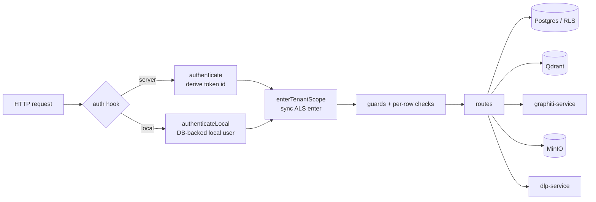

# API — persistent-memory-api

The Fastify HTTP service that is the system's **single authorization choke-point**: every memory/document/graph/investigation operation and the dashboard control plane pass through it. The MCP's 25 tools mostly map onto these endpoints; `recall_context` is a composed read over memory + graph endpoints.

## Role in the system

The MCP (and the dashboard webapp) hold no business logic — they are thin clients over this API. The API is the only tier that:

- derives **identity from the bearer credential** (the client never asserts its team/user/role),
- enforces the access model ([access-model.md](../stack-architecture/access-model.md)) as coarse pre-handler guards **plus** per-row checks,
- opens the **RLS tenant scope** (`runInTenant` in `@pm/db`) so Postgres policies are the final backstop,
- runs the memory **write protocol** (Shape gate → DLP/PII gate → LLM verdict) and the **provenance rerank** on reads,
- owns the Qdrant client and the live embedding pin (and drives the no-blackout model switch).

It runs as `pm_app` (a `NOSUPERUSER`/`NOBYPASSRLS` Postgres role) for all data, and as `ownerPrisma` (pmuser, superuser) only for control tables + migrate/seed — see `packages/db/README.md`.

## Key pieces

### App assembly — deny-by-default scopes (`apps/api/src/app.ts`)

`buildApp()` installs Zod validator/serializer compilers and one central error handler, then registers three groups:

- **Public** (no auth): `/health`, `/config`, `/auth/login/password`, and `/internal/usage` (its own shared-secret gate `USAGE_INGEST_TOKEN`, used by graphiti-service).
- **Secured data scope** (encapsulated): the auth hooks run first, then the data routes (`whoami`, `ingest`, `memories`, `graph`, `documents`, `investigations`, `projects`) plus the non-admin connector-token minting route.
- **Control scope** (separate, registered after): the same auth hooks derive `req.identity`, then the dashboard control routes apply `requireAdmin` to the inner control surface. The canonical external route family is `/dashboard/*`; `/admin/*` is accepted as a one-release compatibility alias.

A route is public **only** if registered outside the secured scope. There is no default-allow path.

### The two-hook auth spine (`apps/api/src/auth/`)

Identity derivation is split across **two `onRequest` hooks** because of a load-bearing Fastify+Node gotcha:

1. **`authenticate` (async)** — `deriveIdentity(Authorization)` (`token-service.ts`): accepts either a signed dashboard session token (`pm_session...`) or a PM wire token (`<tokenId>.<secret>`). Dashboard sessions are HMAC-signed with `TOKEN_PEPPER`, expire after the dashboard session TTL, and are invalidated by password changes/resets. Wire tokens split on the first `.`, look the user up by indexed `@unique tokenId`, then do a **single** argon2id verify of `secret + TOKEN_PEPPER` (never scan rows — that is a DoS + timing oracle). Failure throws `AuthError` → 401. It stashes `req.identity` and does **not** touch the ALS store.
2. **`enterTenantScope` (sync)** — reads `req.identity` and calls `tenantStore.enterWith(ctx)` with **no preceding `await`**, so the store survives to the guards and handler.

`enterWith()` cannot live in `authenticate`: that hook already awaited, and calling `enterWith()` in a post-`await` continuation does not propagate the store under Fastify (the remaining pipeline was scheduled on the pre-`await` context → `getStore()` is `undefined` in the handler, a "No tenant context" 500). The token-lookup tables (`app_user`) live outside RLS, so derivation reads `ownerPrisma`.

The error handler (`app.ts`) maps domain errors to status codes and **redacts the token** from logs/bodies: `AuthError`→401, `ForbiddenError`→403, the Shape `ValidationError`→**422** (distinct from a Zod 400 so the MCP can tell "malformed" from "failed the gate"), `PiiDetectedError`→**422** (`error: 'pii_detected'`), `NotFound`/`Conflict`→404/409, `GraphitiError`→502, else 500.

### Guards — coarse gate, per-row decisions (`apps/api/src/authz/guards.ts`)

The pre-handlers do only the coarse gate (`requireTeamMember` / `requireAdmin` / `requireSuperuser`); the fine-grained decisions need the **target row's** team + author, so handlers call the pure decision functions **after** a `findUnique`, with RLS as the DB-level backstop:

- `decideDataPlane` — MCP memory: reads are universal; **writes are current-team only for everyone** (even super-admins — cross-team is dashboard-only); a member edits/deletes own-created rows only, a team-admin/super-admin any author in their team; team-less callers rejected.
- `allowUniversalRead` — the all-teams fan-out for `POST /memories/search` is admin-only; a member's `universal:true` is ignored (falls back to own ∪ mounted).
- `decideDashboard` — dashboard memory routes (`/dashboard/memories/*` canonical path, with `/admin/memories/*` as a compatibility alias): super-admin = any team CRUD; team-admin = own-team CRUD (other teams read-only); member denied.
- `decideAdmin` / `decideSuperuser` — control plane. Assigning `admin_level` is superuser-only (privilege-escalation guard).

Guards and handlers **must never** read a team/teamId from the request body.

### The memory write protocol (`apps/api/src/protocol/`)

`validateAndRoute(content, metadata)` (`validation.ts`) is the Shape A–E gate, cheap-deterministic-first:

- **Stage 1 — deterministic pre-gate** (`preGate`): collects the full `missing[]` (no short-circuit) — content length, a verbatim entity-in-content check (strict case-sensitive substring, OR over the set), valid `category`/`source`, required PRD fields — then rejects once with the actionable 422 payload (rewrite templates + entity-format guidance + valid enums + your-submission echo).
- **Stage 1.5 — the DLP/PII gate** (`assertNoPii` → `dlpGate` in `@pm/shared`): one call to the dlp sidecar, between the pre-gate and the LLM (don't spend a Haiku call if PII is present). **Fail-closed** — an unreachable/erroring scanner blocks the write. Throws `PiiDetectedError` with a **redaction-safe** findings list (detector + type + severity only, never the value).
- **Stage 2 — LLM verdict** (`EXTRACTION_PROVIDER` via `protocol/llm/`): entity-quality judgment + accept/restructure/reject. Returns the content to store, the derived `MemoryShape`, and an optional `confidence`.

### Model-dependency health (`apps/api/src/services/model-dependency-health.ts`)

Fact extraction, embeddings, and host Ollama are observed capabilities, not Docker
services. Their control-plane records are keyed by **`(capability, observerScope)`**
in `model_dependency_health`: fact extraction uses `server`, host Ollama uses
`host`, and embeddings use `server` or an API-derived `client:<user-id>` scope.
The last form matters in client-managed embeddings: an MCP bridge can report its
own successful or failed local operation, but cannot choose another client's
scope, and the dashboard reads only the current user's scope. One laptop's local
failure therefore cannot declare every client unhealthy.

The four states are `healthy`, `degraded`, `unhealthy`, and `unknown` (no
observation yet). The table retains only a canonical failure code, safe message,
retryability, provider/model, count, and timestamps. It never stores an API key,
provider response body, prompt, or memory content. A newer successful **real
operation** clears the active failure and makes the matching record healthy; an
older observation cannot overwrite a newer one. Telemetry persistence is
best-effort, so it never changes the original write, probe, or embedding result.

Fact-extraction provider errors are normalized before they reach the app error
handler. Token/credit/quota exhaustion is the non-retryable
`fact_extraction_quota_exhausted`; overload, rate limiting, unavailability, and
timeout remain distinct safe conditions. The Settings fact-extraction probe passes
an abort signal to the provider adapter and has a fixed 15-second deadline, so it
always returns a completed `TestResult` rather than leaving the dashboard in a
testing state. The seeded probe does not create a memory.

### Read-path services — merge + rerank

`searchMemoriesMerged` (`apps/api/src/services/merge.ts`) is the `POST /memories/search` fan-out:

1. Qdrant fan-out (`searchVectors`, no team filter, or `readableTeamIds = own ∪ mounted`),
2. Postgres hydrate **under RLS** (`runInTenant`) by row id, applying the requested project, category, and confidence bounds,
3. compute the composite **rerank** score, then a **hard own-team-first partition** (every own hit ranks ahead of every other-team hit), then
4. fire-and-forget **reinforce-on-access** (bump `lastAccessedAt`/`accessCount`, RLS-scoped so only own-team rows are bumped).

`rerankScore` (`layers/memory-vector/src/search/rerank.ts`) is pure: `score = (α·relevance + β·recency-decay + γ·importance) · trust`, where `trust` is the **strict-provenance gate** `provenance × confidence`; confidence is never used alone (memory-injection safety). `confidence` is stamped on write from extraction or its provenance baseline, while the query-specific composite changes on each recall: a returned own-team memory refreshes `lastAccessedAt` and increments `accessCount`, resetting its 30-day recency decay. Graph relations remain temporal context and do not alter this numeric score. Weights are env (`RERANK_ALPHA/BETA/GAMMA/HALFLIFE_DAYS`).

### Embedding pin + the model switch (`apps/api/src/services/`)

`embedding.ts` holds the boot singletons: `qdrant`, `activePin`, and (server-managed embeddings) `embedder`. `activePin` and `embedder` are exported **`let` live bindings** — `applyActivePin(model, dim)` flips them in-process. `model-switch.ts` (`runModelSwitch`) is the background driver kicked off by `PUT /dashboard/settings` on a model/dim change: **two passes** (add target vector → backfill → flip pin → backfill again → drop old), status tracked in `SystemSettings.embeddingSwitch` (running→done|failed), concurrent switch refused 409 (a >30-min run treated as crashed). No restart for this api; the worker polls SystemSettings to refresh. Cross-team re-embed reads use the global-admin RLS path (`withSystemTenant` + `runInTenant({globalAdmin})`), never `ownerPrisma` on data tables.

### Boot (`apps/api/src/server.ts`)

`initDb` (before any request) → `buildApp` → in local mode `ensureLocalIdentity()` + a loud warning → best-effort `ensureCollection` → `listen` on `0.0.0.0:API_PORT`.

## Public surface / interfaces

### Data plane (secured scope) — endpoints map 1:1 to MCP tools

| Method + path | Purpose (MCP tool) |
|---|---|
| `GET /whoami` | server-derived identity + role booleans (`whoami`) |
| `POST /memories` | write through the Shape/DLP/LLM protocol (`add_memory`) |
| `POST /memories/search` | vector search + merge + rerank (`search_memories`) |
| `POST /memories/search-by-entities` | entity-filtered list (`search_memories_by_entities`) |
| `GET /memories` | list (`get_memories`) |
| `GET /memories/:id` | fetch one (`get_memory`) |
| `PATCH /memories/:id` | edit (`update_memory`) |
| `DELETE /memories/:id` | delete one (`delete_memory`) |
| `DELETE /memories` | bulk delete (`delete_all_memories`) |
| `POST /memories/bulk-delete-preview`, `DELETE /memories/bulk` | dashboard-only scoped batch preview and one-time confirmation; the API rechecks every row and graph episode |
| `GET /entities` | distinct entities (`list_entities`) |
| `POST /ingest`, `GET /ingest/:jobId` | upload + status (`ingest_document`, `get_ingest_status`) |
| `POST /graph/search`, `GET /graph/entity/:name`, `GET /graph/timeline`, `GET /graph/contradictions` | Graphiti proxy (`search_graph`, `get_entity`, `get_timeline`, `get_contradictions`) |
| `GET /graph/snapshot`, `GET /graph/facets`, `GET /graph/activity` | Metadata-safe Memory Graph read model, recent/searchable facets, and coalesced create/update/read pulses; all cursors are signed and filter/scope-bound |
| `POST /documents/search`, `GET /documents/:id`, `DELETE /documents/:id` | document corpus (`search_documents`, `get_document`, `delete_document`) |
| `POST /investigations`, `GET /investigations/:id`, `POST /investigations/:id/links` | investigations (`create_investigation`, `get_investigation`, `link_investigation`) |
| `GET /projects` | distinct projects (`list_projects`) |
| `POST /embedding-health/observation` | authenticated client-bridge outcome; API derives the observer scope from the caller |

(`list_readable_teams` is served from the grants/mounts surface.) Multipart upload for `POST /ingest` is **stream-only** (no `attachFieldsToBody`), one file, capped at `INGEST_MAX_FILE_BYTES`.

`PATCH /memories/:id` classifies changes before invoking any model. Empty patches,
exact-content writes, the current project/session, and identical persisted metadata
return the existing row with zero extraction, embedding, or graph work. A real
session-only or project-only change also skips content validation. Persisted
metadata changes still run fact validation but do not re-embed or post a Graphiti
episode; real content changes retain the full validation, embedding, and graph-sync
path.

Project-scoped semantic search is enforced twice: Qdrant narrows candidates and
PostgreSQL reapplies the project during hydration. A permitted project move updates
the Qdrant payload before the database row, with best-effort payload rollback if the
database write fails; the relational hydrate filter prevents the transition from
leaking the point into either project. Existing graph-history rules still reject a
move that would cross an immutable Graphiti project boundary.

Memory responses expose `createdAt` and `recordUpdatedAt`. The latter advances
only for a user-visible memory change; `updatedAt` remains internal row state and
`lastAccessedAt` remains reinforced-read activity. Memory Graph endpoints select
metadata only (project, category, entities, state, and bounded identities), never
memory content, authors, credentials, or raw Graphiti group ids. Snapshot pages
default to 100 memories / 250 facts and declare partial state rather than implying
an unbounded graph is complete. Fact pages use temporal-key/UUID continuation;
activity pages retain a fixed window while draining a burst. Activity reads have
a 60-second maximum lookback and a 100-event default / 250-event maximum.

### Public (no auth)

| Method + path | Purpose |
|---|---|
| `GET /health` | liveness |
| `GET /config` | effective embedding mode + active pin + `deploymentMode` + `dashboardLoginMode` (the MCP/wizard reads this at startup; the API is the source of truth) |
| `POST /auth/login/password` | server-mode dashboard email/password login; returns a signed dashboard session token |
| `POST /internal/usage` | usage ingest, gated by `USAGE_INGEST_TOKEN` (graphiti-service) |

### Control plane (`/dashboard/*` canonical routes, `apps/api/src/routes/dashboard/`)

`/admin/*` remains registered as a one-release compatibility alias that reuses the same handlers.

`requireAdmin` baseline on the control surface (overview, teams, users, grants/mounts, settings, memories, security-alerts, notify-settings); `requireSuperuser` layered per-route on escalations (`PATCH …/admin-level`, `POST …/password-reset`, token issue/rotate/revoke, `PUT /dashboard/settings`, and `PUT /dashboard/settings/dashboard-login`). `GET /dashboard/overview` composes control counts, memory totals through the dashboard RLS path, services/workers state, 24h usage, the current fact-extraction + embedding models, and `capabilityHealth`. The same safe capability-health DTO is returned by `/dashboard/services`, `/dashboard/settings`, and `/dashboard/usage`; Usage metrics remain valid even when a companion capability health record is failing. **Operational reads** — `/dashboard/services` (Docker-socket monitor), `/dashboard/usage` (metrics), `/dashboard/workers` (scheduled-worker control) — are registered **outside** `requireAdmin` so any authenticated user can view them; their mutations keep their own `requireSuperuser`. `/dashboard/update` is also outside the baseline admin scope but every route is `requireSuperuser` because status/logs expose host update state and start mutates the stack. `/dashboard/memories/graph/rebuild` is admin+ and enqueues one `pm.memory-graph-rebuild` worker job with team/project/author filters (team-admins are forced to their own team; superusers may select all teams). `/dashboard/settings` includes the embedding pin, fact-extraction model/key state, dashboard login mode, and `capabilityHealth`; `POST /dashboard/settings/embedding/test` runs a backend embedding probe, and `POST /dashboard/settings/fact-extraction/test` runs the seeded fact-extraction probe without storing memory. `/dashboard/shared-connection` is local-mode only; it stores/tests the connector token used by a local personal dashboard to reach one shared server and is not part of the shared server operator dashboard. `/dashboard/usage` returns per-service/model rows, trend totals, per-user request totals from the actor-aware `model_usage_rollup`, and companion health. `/dashboard/services` enriches the sidecar's rows with known service UI links (Qdrant, FalkorDB, Neo4j, MinIO, Graphiti docs), adds read-only non-loggable Fact extraction and Embeddings capability rows, and includes Qdrant/FalkorDB/MinIO/Neo4j login credentials only when `req.identity.adminLevel` is `admin` or `superuser`; the dashboard renders those credentials behind a masked modal. Control-table handlers use `ownerPrisma`; the dashboard memory plane uses `runInTenant` with the global-admin RLS path.

### Deployment mode (`apps/api/src/auth/local-mode.ts`)

`DEPLOYMENT_MODE=local` is a **boot-time** Zod config pin (never a DB-flippable `SystemSettings` row). At boot, `app.ts` picks `authenticateLocal` (reads the real local user/team ids from `local_identity`, creating generated rows through `ensureLocalIdentity()` when absent) instead of `authenticate`, for both scopes. Server mode (default) is byte-identical. `/whoami` returns those stored DB ids and the seeded local team/user profile fields for human-readable dashboard and MCP output. Never set local on a shared/networked host.

## Invariants & gotchas

Load-bearing rules (from repo documentation, Invariants 1–5):

- **Identity is server-derived from the bearer credential** — never trust a team/user/role from the request body (Inv. 1).
- **Two orthogonal dimensions** — `admin_level` × team membership (nullable). Reads differ by surface (MCP = own ∪ mounted; dashboard = universal); writes are current-team-bound; a super-admin writes cross-team only via the dashboard, never the MCP (Inv. 2).
- **RLS is the backstop** — every data-plane query runs inside `runInTenant`, which sets the GUCs the policies read; widening is always a policy reading a GUC, never a role bypass. `ownerPrisma` is for control tables + migrate/seed only (Inv. 3).
- **Writes stamp `team_id` (and `created_by_id`) server-side**; cross-team writes go only through the global-admin path (Inv. 4).
- **One embedder model+dim per Qdrant collection** — switching is a re-embed migration, wired here as a dashboard-driven, no-blackout, no-restart two-pass switch (Inv. 5).
- **The two-hook split is mandatory** — `enterWith()` after an `await` does not propagate under Fastify; keep `enterTenantScope` synchronous (`apps/api/src/auth/authenticate.ts`).
- **The DLP gate is fail-closed and redaction-safe** — Stage 1.5, before the LLM; an unreachable scanner blocks the write; findings echo types only (see the committed documentation DLP gotcha).

## Related docs

- Architecture overview: [./architecture.md](../stack-architecture/architecture.md)
- Access model: [access-model.md](../stack-architecture/access-model.md)
- Security: [./security.md](../stack-architecture/security.md)
- Ingest pipeline: [./ingest.md](../stack-architecture/ingest.md)
- Embedding + the model switch: [./embedding.md](../stack-architecture/embedding.md)
- Operations: [./operations.md](../stack-architecture/operations.md)
- Sibling components: [db](./db.md) · [mcp](./mcp.md) · [worker](./worker.md) · [shared](./shared.md) · [dashboard](./dashboard.md) · [graphiti-service](./graphiti-service.md) · [dlp-service](./dlp-service.md)
- Package README: `apps/api/README.md`
