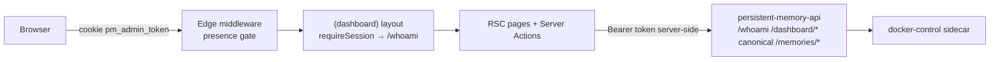

# Dashboard — the Web QA Management App

The standalone Next.js 15 dashboard for managing persistent-memory's access entities and memory data, talking to the API only over HTTP.

## Role in the system

`apps/dashboard/` is the **Web QA Management App**: the human-facing control surface for the
platform. It is deliberately **not** an npm-workspace member and imports only
source helpers from `layers/dashboard`, not compiled `@pm/*` workspace packages:
no Postgres, no Prisma, no native `argon2` build. Every read and write
goes to `persistent-memory-api` over HTTP, attaching a Bearer token **server-side only**
(`apps/dashboard/src/lib/api.ts` is `import 'server-only'`). The API stays the single
authorization choke-point; the dashboard app mirrors its role gates for UX but is never the
real barrier (`apps/dashboard/src/lib/authz.ts`).

It covers the personal/local surface plus the shared/server planes:

- **Personal surface** (local owner): Personal Memories, local import/export,
  local settings, update notifications, and optional Shared Memories connection.
  The dashboard does not show team columns, team filters, team badges, or
  super-admin badges in this local personal space; personal exports omit team
  fields.
- **Shared surface**: on a local personal dashboard, Shared Memories calls are
  proxied to the saved remote API with the local connector token. On a shared
  server dashboard, Shared Memories calls use the server's own API directly;
  there is no connector indirection.
- **Control plane** (server admin+): teams, users + roles, tokens, mounts, system
  settings, security/DLP findings, notification routing.
- **Memory data plane** (any member): the Memories page — centered Memory List /
  Memory Graph / Memory Tools tabs (Memory Graph appears when
  `PM_MEMORY_GRAPH_UI_ENABLED=true`, the released default). Memory List contains live search / filters / table /
  edit / delete, with project, badge, and confidence filters. Dashboard search exact-matches text,
  project, category, and entities before falling back to semantic search. Memory Tools
  is available to members for their scoped bulk-delete flow; team admins and super-admins additionally see export, import, and graph-rebuild cards. Export/import support
  personal project scope or shared team/project scope, secure encrypted `.pm` files by default, standard JSON, and
  import scope auto-fill from file metadata. Import is staged: the user first loads and
  verifies/decrypts the package, reviews the parsed memory count + target scope, then
  runs the actual import and re-embed step. File verification errors and per-row backend
  failures render inside the card. Import is reinstall-safe: stale team/user UUIDs from
  an exported file are resolved against the current control plane and fall back to the
  current local team/user when the original rows no longer exist. Graph rebuild queues a
  one-time worker job for selected team/project/author filters; it is not a scheduled
  worker and exists to replay existing Memory rows through Graphiti when an operator
  needs to populate or repair FalkorDB. The current list/search
  silently refreshes every 10s so agent/API writes show up without a browser reload.
  Token usage uses Recharts for responsive vertical token-bucket bar charts,
  polls the selected window every 10s, and keeps Live visible with a moving
  baseline even before multiple backend trend buckets exist.

## Key pieces

**Auth = password/SSO in server mode; optional soft lock in local mode**
(`apps/dashboard/README.md`, `apps/dashboard/src/app/login/`).
Server-mode human login uses email/password and stores a signed dashboard session
token in the `httpOnly` `pm_admin_token` compatibility cookie (`apps/dashboard/src/lib/session.ts`, 8h
max-age, `secure` in production). PM wire tokens (`tokenId.secret`) remain for
MCP/API automation and recovery login; the recovery token path validates against
`GET /whoami`. Super-admins can switch the dashboard login page to SSO mode in
System Settings; the login page then shows an SSO card plus recovery-token fallback.
When a super-admin changes the first temporary password, the profile flow rotates
and shows a recovery/MCP token once.
The browser never sees credentials after submit and never calls the API directly.

When `DEPLOYMENT_MODE=local`, no wire token exists: the API uses the DB-backed
`local_identity` row. If the optional dashboard password is set, `/login` renders
**Unlock dashboard** and posts to `/local/auth`; otherwise the dashboard opens directly.
Use `bash deploy/scripts/dev-redeploy.sh clear-local-password` or `set-local-password` to
recover the local soft lock without touching memories or tokens.

**Two-layer session gating:**

1. `apps/dashboard/src/middleware.ts` — a cheap **presence-only** Edge gate. If the cookie is
   absent on a protected path it redirects to `/login`; if present on `/login` it
   bounces to `/`. It must **not** call the API (Edge runtime, no secrets) — it is
   purely a UX short-circuit.
2. `requireSession()` (`apps/dashboard/src/lib/session.ts`) — the **authoritative** gate, run by
   the `(dashboard)` layout on **every** navigation. It re-validates the cookie's
   token/session against `/whoami`, so a revoked / expired / demoted token or a
   password-reset-invalidated session is caught immediately.
   `requireControlPlane()` layers on top (admin+ only; a plain member is redirected to
   `/memories`).

**Server-side API client** (`apps/dashboard/src/lib/api.ts`). A single `call<T>()` helper reads
the cookie, attaches `Authorization: Bearer <token>`, sets `cache: 'no-store'`, and maps
`401 → UnauthorizedError`, `403 → ForbiddenError`, other non-2xx → `ApiError`. It exposes
the full `/dashboard/*` surface plus the **data-plane** memory routes (`dpListMemories`
etc.) used for a plain member — those force `universal: true` (dashboard reads are
universal per the access model) and normalize the data-plane `sourceTeam` field to
`teamId`. The memory surface router sends `personal` to the local API, sends
`shared` to the local API on shared-only server stacks, and only uses the saved
connector proxy on local personal dashboards that have connected Shared Memories.
The API keeps `/admin/*` aliases for one release, but dashboard app calls use the
canonical `/dashboard/*` paths.

**Pages** (App Router, under `apps/dashboard/src/app/(dashboard)/`). Each page calls
`requireSession()` or `requireControlPlane()`, fetches via `api`, and role-gates its
controls; mutations live in colocated `actions.ts` Server Actions, interactive bits in
`*Client.tsx` Client Components:

- `/memories` — Memory Graph tab: a bounded, metadata-only read model of the same
  authorized corpus, rendered as a rotatable 3D sphere of memory nodes with their
  entity subnodes. The mode follows the selection rather than a switch: selecting a
  node isolates its connected memories and entities as a flat 2D map, and clearing
  that focus returns to 3D at the rotation, zoom, and pan held before the selection.
  **Reset view** and the rail's **Clear** re-frame the corpus instead. Filters,
  fact-history validity, live activity, and the accessible node list stay shared
  across both modes.
- `/memories` — universal Memory List tab with live search filters, server-backed
  project, dynamic category-badge, and confidence-score-range filters. The search
  field fills the remaining filter-row width while compact controls align right; the
  count lives in the Memory List tab. Cursor-based incremental loading starts as the internal-scroll table
  approaches its end. The badge list is derived from the currently scoped corpus, so
  newly introduced categories appear without a dashboard release. The table uses shared fixed-width
  metadata/action tracks so headers and rows stay aligned while memory content
  keeps the flexible width; Personal Memories hides the team
  column/details badge and routes import/export without team metadata, while
  Shared Memories shows team context and remote-role permissions. Edit/delete own (member) or team/any
  (admin); clicking content opens a full-text details modal with category, project,
  user, score, provenance, graph-role, and entity badges; the edit modal keeps
  content/project/category editable for re-embed while showing the same read-only
  detail badges for context. Every team member can open Memory Tools for the
  scoped Bulk delete card; Export memory, Import memory, and Rebuild memory graph
  remain admin-only. Personal Memories exposes no team selector, while Shared
  Memories shows the fixed current-team name: a member's batch is limited to
  their own authored records and a team admin's batch can include any author in
  that team. Import has visible Select file -> Load & verify
  -> Import rows -> Re-embed progress, remaps stale exported team/author ids during
  fresh-install restores, and reports all-error batches plus row details inside the card.
  Rebuild memory graph queues one filtered, one-time `pm.memory-graph-rebuild` worker
  job; team admins are scoped to their own team and superusers can choose all teams or
  a selected team. The scheduled `memory-graph-backfill` worker separately retries
  normal memory graph sync rows left `pending|failed`; it never deletes older
  timeline episodes. Deleting a memory first retrieves a live graph impact preview:
  a batch token records every selected row and episode, expires after five
  minutes, and is rejected if the scope or graph changes. A graph-primary record
  uses an explicit cascade warning; a Personal owner or authorized team/global
  administrator can self-confirm it, while a Shared member must ask a team admin.
  The tools also include
  pending-embedding counts + Run-backfill (superuser). Category, graph-primary,
  pending-embedding, and confidence badges; 10s live refresh for
  external MCP/API writes.
- `/` — control-plane overview (admin+); clickable dashboard cards summarize
  team/user counts, services, active MCP sessions, workers, 24h token usage,
  saved memories, and the current fact-extraction and embedding models. Fact
  extraction and Embeddings are capability cards: `degraded`/`unhealthy` states
  have a red treatment plus visible state text, canonical safe explanation, and
  observed time (never color alone). They deep-link to their exact System Settings
  section; MCP sessions opens Services with its MCP sessions tab selected. Members
  are redirected to `/memories`.
- `/services` — local stack monitor (state/health/logs any-auth; service names link
  to consoles/docs when available; live log tails use the shared log viewer with
  local/server time display in the modal; Qdrant/FalkorDB/MinIO/Neo4j credentials
  open only for admin/super-admin sessions in a masked read-only modal; stack
  start/stop/restart is superuser-only) via the API → the `docker-control`
  sidecar. The MCP application-service row filters out session traffic so it shows
  only daemon/internal logs. The MCP sessions tab shows stream/legacy rows with
  compact fixed-width connection/time columns, shared log previews/modals filtered
  to each stream session's agent communication, and a Terminates at countdown for
  stream clients based on the configured idle timeout and the last real MCP request. The
  Graphiti link is API docs, not a graph visualization UI; graph records are stored
  in FalkorDB/Neo4j. Fact extraction and Embeddings appear alongside containers as
  logical read-only capability rows; they are intentionally non-loggable and have
  no start/stop controls. Host Ollama is also a read-only non-container row: it
  reports `/api/tags` reachability and, when Ollama is the active embedding
  provider, the configured model's presence; it has no Docker logs.
- `/workers` — managed scheduled-job monitor with row-level schedule, status, and
  live log tails (view any-auth; run-now / pause / resume / edit-cron superuser).
- `/usage` — Token usage metrics, org-wide read-only: per-service, per-model, and
  per-user request totals over the selected window. A non-healthy Fact extraction
  or Embeddings capability adds a safe health row even when its usage is zero and
  puts a keyboard-focusable error icon on matching usage rows. Its accessible
  tooltip gives the safe error, observed time, and recovery state.
- `/security` — DLP findings (Presidio PII + gitleaks secrets); admin+, team-scoped by
  server RLS; values never stored, only type + redacted location.
- `/notifications` — personal space manages Chrome/browser Web Push registration
  and event-type preferences for releases, personal memory changes, and security
  alerts. On a fresh browser, it waits for `/pm-sw.js` to become active before
  calling `PushManager.subscribe`, so enabling notifications does not race the
  service-worker activation. Shared/server space keeps per-team alert routing, and
  super-admins also edit the global row.
- `/teams`, `/users`, `/grants` (Mounts) — control plane, admin+.
- `/tokens` — super-admin-only recovery/MCP token issuance, rotation, and revoke.
- `/settings` — Embeddings card (pinned model/dim, live re-embed switch, backend
  test probe), Fact extraction card (Claude/OpenAI model, masked provider key,
  backend test probe, save-with-test), Stream service session timeout, dashboard
  login mode; superuser. The Fact extraction test has
  a 15-second server deadline and always replaces `Testing…` with a success or
  safe inline failure. A green applicable Settings test makes the matching
  capability healthy; an error notice exposes the same safe health state without
  provider bodies or secrets.

**Layout convention:** table-heavy dashboard pages use the fixed-shell pattern:
sidebar/header stay fixed, short tables use their natural height, and the table
region gains its own scrollbar only once it reaches the available viewport height.
Grid-table headers sit outside the row scroll body so labels stay fixed while rows
scroll. Settings-style pages use the reusable left-nav/right-detail settings shell
when a page has multiple settings sections.

**Icon convention:** dashboard chrome and controls use the self-hosted
`material-icons` package through `apps/dashboard/src/components/ui/Icon.tsx`. Prefer that
wrapper for nav links, header actions, dropdown carets, checkmarks, row actions,
and status legends instead of inline SVGs or literal symbol glyphs. Repeated UI
controls should route through shared components under `apps/dashboard/src/components/ui/`
(`Tooltip`, `Checkbox`, `Select`, `Modal`, `StatusToggle`, `Input`, etc.) so
browser-native tooltips, raw checkbox visuals, and one-off local control styling
do not drift across pages.

**Role-gated Nav** (`apps/dashboard/src/components/Nav.tsx`). Links carry `controlPlane` /
`superuserOnly` / `localHidden` flags and are filtered against the live identity using
the shared `authz.ts` predicates — same source of truth as the server gates, so UI and
defence-in-depth can't drift.

## Public surface / interfaces

**Pages → API routes** (selected; full table in `apps/dashboard/README.md`):

| Route | Who | Backing API |
|---|---|---|
| `/login` | anyone | `POST /auth/login/password` or recovery `GET /whoami`; SSO card when enabled |
| `/memories` | members | `/memories/*` (member) · `/dashboard/memories/*` (admin) |
| `/services` | view any-auth; mutate super | `/dashboard/services*` |
| update popup/modal | superuser | `/dashboard/update*` |
| `/workers` | view any-auth; mutate super | `/dashboard/workers*` |
| `/usage` | any-auth (org-wide) | `GET /dashboard/usage` |
| `/security` | admin+ | `/dashboard/security-alerts*` |
| `/notifications` | admin+ (global = super) | `/dashboard/notify-settings[/global]` |
| `/` | admin+ | `GET /dashboard/overview` |
| `/teams` `/users` `/grants` | admin+ | `/dashboard/{teams,users,grants}*` |
| `/tokens` | superuser | `/dashboard/users/:id/token*` |
| `/settings` | superuser | `PUT /dashboard/settings` · `POST /dashboard/settings/embedding/test` · `PUT/POST /dashboard/settings/fact-extraction[*]` · `PUT /dashboard/settings/dashboard-login` |
| `/documentation` | any dashboard user | native dashboard guide for the selected space; opens the stack documentation separately through `/docs/index.html` |
| `/api/memories/export` | admin+ | `GET /dashboard/memories/export` |
| `/api/health` | anyone | unauthenticated liveness |

**Environment** (`apps/dashboard/README.md`, `apps/dashboard/Dockerfile`):

| Var | Side | Purpose |
|---|---|---|
| `API_URL` | server runtime | compose-internal api URL (`http://persistent-memory-api:8090`) — read by `lib/api.ts`; **never baked at build** |
| `NEXT_PUBLIC_API_URL` | browser build | inlined at `next build`; vestigial (browser never calls the api) |
| `DOCUMENTATION_BASE_URL` | server runtime | compose-internal documentation service URL (`http://persistent-memory-documentation:8000`) used by the authenticated `/docs/*` proxy |
| `DEPLOYMENT_MODE` | **build ARG** + runtime | `server` (default) / `local`; must be present at build time for Edge middleware |
| `NODE_ENV` | both | `production` → secure cookie |
| `PORT` / `HOSTNAME` | runtime | `3000` / `0.0.0.0` inside the container; host access is through `persistent-memory-dashboard-gateway` on `127.0.0.1:3200` |

## Invariants & gotchas

- **Standalone boundary — never import compiled `@pm/*` workspace packages here**
  (`apps/dashboard/README.md`, `apps/dashboard/Dockerfile`). The image needs no
  DB, no `prisma generate`, no `argon2`; keep imported helpers dependency-free
  and rooted in `layers/dashboard`.
- **MkDocs output is image-built, never committed.** The dedicated documentation
  Dockerfile builds `documentation/`, copies the locked Mermaid browser runtime,
  and serves `/site` from the internal Node service. `use_directory_urls: false`
  keeps generated links compatible with the authenticated dashboard `/docs/*`
  proxy and avoids runtime CDN code.
- **Dashboard credentials stay server-side.** `lib/api.ts` and `lib/session.ts` are
  `server-only`; the signed session or recovery token lives in an `httpOnly`
  cookie and is attached per request server-side. The browser never holds it
  after login (`apps/dashboard/README.md`).
- **Middleware is presence-only; `requireSession()` is authoritative.** Middleware must
  not call the API (Edge runtime). The `/whoami` re-check on every navigation is what
  actually catches revocation (`apps/dashboard/src/middleware.ts`, `apps/dashboard/src/lib/session.ts`).
- **Reads any-auth / mutate superuser for Services + Token usage + Workers.**
  `/dashboard/services` and `/dashboard/usage` reads are
  open to any authenticated user (registered **outside** the API's `requireAdmin`
  scope), while stack start/stop/restart and worker mutations are superuser-only. The Services
  API may enrich rows with UI links; the Services page splits Application services
  from MCP sessions, where MCP rows are client-owned/loggable rows with compact
  connection/time columns and shared log previews filtered to session
  communication, not lifecycle-controlled stack services. Credentials are included only when the
  server-derived identity is admin/superuser, rendered behind a masked modal, and
  the dashboard Server Action strips them for plain members.
  Stream clients are automatically expired after the System Settings idle timeout
  (15 minutes by default); heartbeat re-registration keeps rows visible after API
  restarts but does not extend the activity deadline.
  The browser never talks to the `docker-control` sidecar — only the API does, behind a
  shared-secret bearer.
- **Capability health is one safe DTO, not Docker state.** Overview, Services,
  Settings, and Usage each receive the same `capabilityHealth` response member.
  States are `healthy`, `degraded`, `unhealthy`, or `unknown`; unknown means no
  observation, not healthy. Logical capability rows and host Ollama are read-only
  and must keep `logsAvailable:false`. In client-managed embeddings, the dashboard
  uses only the current authenticated client's scope, never another client's
  failure.
- **Recovery is evidence-based.** A later successful real request/probe clears
  that capability's active failure. A green System Settings test does the same;
  merely revisiting a page or waiting does not.
- **The API is the real gate.** `authz.ts` predicates (`canAccessControlPlane`,
  `isSuperuserLevel`) drive Nav + page redirects, but the server enforces
  `requireAdmin` / `requireSuperuser` + the last-superuser guard on every route. Mirror,
  don't replace.
- **Local mode is a build-time pin, not runtime-flippable** (`apps/dashboard/src/lib/deploymentMode.ts`).
  Next inlines `process.env` into the Edge
  middleware bundle at `next build`, so `DEPLOYMENT_MODE` must be a docker build ARG (the
  onboard full-local flow passes it). When `local`: `middleware.ts` returns `next()`
  (no auth), `requireSession()` normally fetches the live DB-backed local identity from
  `/whoami`, Nav hides the
  multi-tenancy links (`localHidden`: Teams/Users/Tokens/Mounts) + Sign-out, and
  `logoutAction` is a no-op. Switching modes = a rebuild (correct — it's a deploy
  decision). **Never set `local` on a shared/networked host.**
- **Compose must receive `.env.persistent-memory` for rebuilds.** `env_file:` is runtime-only;
  build args like `DEPLOYMENT_MODE` and interpolated passwords need `docker compose
  -f deploy/compose/docker-compose.yml --env-file .env.persistent-memory ...` or
  `bash deploy/scripts/dev-redeploy.sh ...`.
- **DTO types are hand-mirrored** (`apps/dashboard/src/lib/types.ts`) from the api's Zod shapes
  because there is no `@pm/*` import; if an api response shape changes, update here too.

## Related docs

- Package README: `apps/dashboard/README.md`
- [Architecture overview](../stack-architecture/architecture.md) · [Access model](../stack-architecture/access-model.md) ·
  [Security](../stack-architecture/security.md) · [Operations](../stack-architecture/operations.md)
- Components: [api](./api.md) · [dashboard-gateway](./dashboard-gateway.md) · [docker-control](./docker-control.md) ·
  [worker](./worker.md) · [dlp-service](./dlp-service.md) · [onboard](./onboard.md)
- Embedding switch (Settings page): [Embedding](../stack-architecture/embedding.md)
- Access-model source of truth: [access-model.md](../stack-architecture/access-model.md)
