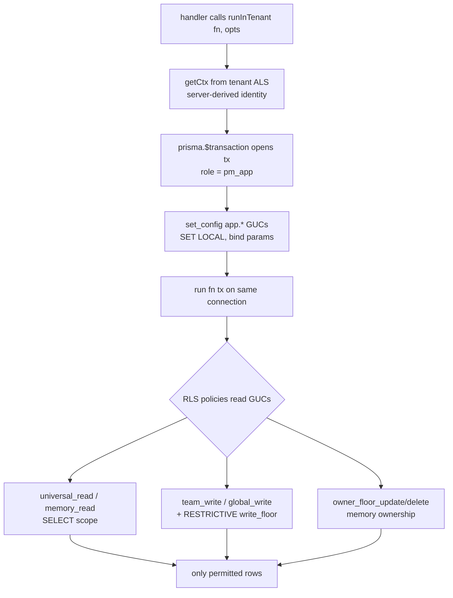

# DB — `@pm/db` (Prisma + RLS wrapper)

The data-layer package that owns the two Prisma clients, the `runInTenant()` transaction wrapper that sets the per-request RLS GUCs, and the audit guard — it is the encapsulation boundary every other workspace imports the database through.

## Role in the system

`@pm/db` is the **only** package that imports the generated Prisma client (`generated/prisma/client.ts`); `api` and `worker` import the clients, the `runInTenant()` wrapper, the tenant context, and all generated enum/model **types** from this barrel and never reach into `generated/prisma` directly (`packages/db/src/index.ts`). It is consumed by `api` AND `worker`.

It implements **Invariant 3 — "RLS is the backstop"**: the runtime connects to Postgres as the `pm_app` role (`NOSUPERUSER`/`NOBYPASSRLS`), and every data-plane query runs inside a tenant-scoped transaction that sets `app.*` session GUCs which the RLS policies in `layers/core/schema/rls.sql` read. The GUCs *encode the access model* ([access-model.md](../stack-architecture/access-model.md)); widening reach is **always** a policy reading a GUC, never a role bypass (`packages/db/src/tenant-context.ts` header; the committed documentation Invariant 3).

`@pm/db` deliberately imports **no app config module**. Each app validates its own Zod env and injects only the two connection strings via `initDb()` at boot, so the package stays app-agnostic (`packages/db/src/config.ts`).

## Key pieces

### Two clients, one job each — the connection-role split is the RLS spine

`packages/db/src/prisma.ts` builds two `PrismaClient`s, each on a different Postgres role (`makeDbClients`):

- **`prisma`** → `databaseUrl` → role `pm_app` (`NOSUPERUSER`/`NOBYPASSRLS`). The RLS *subject*. ALL data-plane work goes through it, ALWAYS inside `runInTenant()` so the per-request GUCs land on the same connection as the queries.
- **`ownerPrisma`** → `databaseMigrateUrl` → role `pmuser` (the table owner, and the image's Postgres **superuser**, so it bypasses even `FORCE`'d RLS). The CONTROL plane ONLY — `team` / `app_user` / `team_grant` / `local_identity` / `system_settings` + migrate/seed. `rls.sql` deliberately grants `pm_app` **no** access to control tables, so token verification, local identity resolution, and `readableTeams` *must* use this client. Touching a data table with `ownerPrisma` would silently defeat RLS isolation (`packages/db/src/prisma.ts` header; the committed documentation "ownerPrisma bypasses RLS" gotcha).

Both are **live-binding `let` exports** assigned by `initDb(cfg)`, called once at boot. ESM live bindings make the assignment visible to every importer; `runInTenant` reads `prisma` at *call* time so the binding resolves after init. `makeDbClients` is idempotent and registers one `beforeExit` pool teardown.

### `runInTenant(fn, opts?)` — the GUC-setting transaction

`packages/db/src/tenant-context.ts` opens **one** interactive `prisma.$transaction`, issues the `set_config(...)` statements **first**, then runs the caller's `fn` against the **same** `tx` client. Each GUC is set via `set_config('app.x', <bind param>, true)` — the third arg `true` == `is_local` == `SET LOCAL`, so it auto-resets at COMMIT/ROLLBACK and never leaks onto the pooled connection; the bind param is injection-proof. The seven GUCs:

| GUC | Source value | Encodes |
|---|---|---|
| `app.user_id` | `ctx.userId` | author — the memory ownership floor compares against it |
| `app.team_id` | `effectiveTeamId ?? ''` | current team (write target); `''` when none |
| `app.can_read_all` | `ctx.isTeamMember \|\| globalAdmin` | universal read of SHARED tables (documents/graph) |
| `app.mounted_team_ids` | `ctx.mountedTeamIds.join(',')` | cross-team MEMORY reads via the MCP (TeamGrant "mounts") |
| `app.read_all_memory` | `opts.readAllMemory \|\| globalAdmin` | universal MEMORY read (the dashboard view) |
| `app.is_global_admin` | `opts.globalAdmin && ctx.isGlobalSuperuser` | super-admin dashboard cross-team write path |
| `app.bypass_owner_floor` | `ctx.isTeamAdmin \|\| ctx.isGlobalSuperuser \|\| globalAdmin` | team-admin/super-admin may edit any author's row |

`TenantRunOpts` widens the default (data-plane, current-team) scope: `globalAdmin` (re-checked against `ctx.isGlobalSuperuser` so a handler can't self-elevate), `teamIdOverride` (the team a cross-team op targets), `readOnly` (a cross-team READ), and `readAllMemory` (span all teams for memory reads — the dashboard). **Fail-closed:** a team-scoped write with no `effectiveTeamId` and no global-admin path throws loudly rather than writing untargeted.

`runInTenant` is split from identity derivation by design (the committed documentation gotcha): `AsyncLocalStorage.enterWith()` after an `await` does not propagate under Fastify, so the api derives identity in an async `authenticate` hook then enters the ALS scope in a **sync** `enterTenantScope` hook.

### `TenantCtx` + the tenant ALS

Identity is **server-derived from the bearer credential** and carried for the whole request in an `AsyncLocalStorage<TenantCtx>` (`tenantStore`) so deep handler code can call `runInTenant()` with no plumbing. `getCtx()` reads it and throws if called unscoped. The client never asserts `teamId`/`userId`/`adminLevel`/`mountedTeamIds` — these are populated by the auth layer (the committed documentation Invariant 1).

### `guardedPrisma` — the "forgot to wrap" guard

The same physical client as `prisma`, wrapped in a Prisma `$extends` query audit. It does **not** set GUCs (a Prisma 7 query extension gets no tx handle and runs on a pooled connection, so any `set_config` there would land on the wrong connection — the confirmed gotcha that forced the wrapper design). It only **throws** when an op on one of the 10 RLS-bound `DATA_MODELS` (`Source`, `Document`, `Chunk`, `Entity`, `Claim`, `Relationship`, `Investigation`, `InvestigationLink`, `IngestJob`, `Memory`) runs while the ALS context reports `insideTenantTx === false`. This turns a fail-closed *empty result set* into a loud throw at the call site. `runInTenant` flips `ctx.insideTenantTx` for the duration of `fn` so legitimate work doesn't false-positive.

### Memory time fields

`Memory.createdAt` is the record's creation time. `recordUpdatedAt` is the
user-visible modification clock and is indexed with team/project for graph
activity reads; migration `0030_memory_record_updated_at` backfills it from the
existing row timestamp. Explicit memory edits advance it. Embedding/vector,
Graphiti sync, PII, lifecycle, and reinforced-access bookkeeping may advance the
internal Prisma `updatedAt` or `lastAccessedAt`, but must not advance
`recordUpdatedAt`.

### `usage.ts` — model-usage recorder

`recordUsage` / `recordUsageFireAndForget` increment the hourly `model_usage_rollup` **control** table via `ownerPrisma` (no RLS, owner-only). Buckets are keyed by hour, service, model, and `actor_id`: a real `AppUser.id` when the request tenant context is present, or `system` for worker/internal/background usage. `currentHourBucket` floors a `Date` to the UTC-hour bucket key. Increments are atomic; only the first insert per bucket can race a `P2002`, caught and retried once. The fire-and-forget wrapper guarantees recording never blocks or fails a request.

### `model_dependency_health` — safe capability diagnostics

`model_dependency_health` is another owner-only **control** table. Its composite
identity is `(capability, observer_scope)`, allowing the stack to distinguish
fact extraction (`server`), server-managed embeddings (`server`), host Ollama
(`host`), and client-managed embedding observations (`client:<authenticated-user-id>`).
It stores only canonical safe diagnostics, provider/model, counters, and timing.
`pm_app` has no access; `rls.sql` explicitly revokes it. It is not a replacement
for `IngestJob` or `model_usage_rollup` data.

## How `runInTenant` reaches the RLS policies

## Public surface / interfaces

From `packages/db/src/index.ts`:

| Export | Kind | Purpose |
|---|---|---|
| `prisma` | client | data plane (`pm_app`); use inside `runInTenant` |
| `ownerPrisma` | client | control plane (`pmuser`); control tables + migrate/seed only |
| `guardedPrisma` | client | audit-guarded `prisma`; throws on un-wrapped data ops |
| `makeDbClients(cfg)` | fn | build the clients (idempotent) |
| `initDb(cfg)` | fn | assign the live-binding exports once at boot |
| `runInTenant(fn, opts?)` | fn | the RLS-scoped transaction wrapper |
| `tenantStore` / `getCtx()` | ALS | the per-request `TenantCtx` |
| `recordUsage` / `recordUsageFireAndForget` / `currentHourBucket` | fn | model-usage rollup |
| `modelDependencyHealth` | Prisma control-table delegate | canonical safe fact-extraction / embedding / Ollama capability observations |
| `TenantCtx` / `Tx` / `TenantRunOpts` / `DbConfig` / `UsageEvent` | type | core types |
| `Prisma` (+ re-exported enums & model types) | value/type | so callers never import `generated/prisma` |

**`DbConfig`** (the entire injected contract): `databaseUrl` (`pm_app`) and `databaseMigrateUrl` (`pmuser`).

The corresponding RLS objects in `layers/core/schema/rls.sql`: GUC helper functions `pm_current_user_id()`, `pm_current_team_id()`, `pm_can_read_all()`, `pm_mounted_team_ids()`, `pm_read_all_memory()`, `pm_is_global_admin()`, `pm_bypass_owner_floor()`; the 9 SHARED tables get `universal_read` / `team_write` / `global_write` / `write_floor`; `memory` gets `memory_read` (own ∪ mounted ∪ dashboard-universal ∪ global) + `owner_floor_update`/`owner_floor_delete`; `security_alert` gets non-universal `alert_read`.

## Invariants & gotchas

- **Every data-plane query runs inside `runInTenant`** so the GUCs apply (the committed documentation Invariant 3). Outside a tenant scope the GUCs are unset → helper functions COALESCE to NULL/false → **zero rows** (fail-closed); `guardedPrisma` turns that silent emptiness into a throw.
- **`ownerPrisma` is for control tables + migrate/seed ONLY.** Because `pmuser` is the Postgres superuser it bypasses `FORCE`'d RLS entirely, so it sees all teams' data. Cross-team admin **data** ops go through `pm_app` + the global-admin RLS path (`runInTenant(fn, { globalAdmin, teamIdOverride })`), **not** `ownerPrisma` — keeping RLS the backstop (the committed documentation gotcha).
- **Widening is always a POLICY reading a GUC, never a role bypass** (`packages/db/src/tenant-context.ts` header; `rls.sql` §3). `pm_app` stays `NOSUPERUSER`/`NOBYPASSRLS`.
- **A handler cannot self-elevate.** `globalAdmin` only takes effect when `ctx.isGlobalSuperuser` (server-derived) is also true.
- **GUCs use `SET LOCAL` semantics** (`set_config(..., true)`) so they auto-reset at transaction end and never leak onto the pooled connection.
- **Why a wrapper, not a `$extends` hook:** a Prisma 7 query extension's callback runs on an already-chosen pooled connection with no tx handle, so a `set_config` issued there lands on a *different* connection than the query. The transaction must own the GUC statements (`packages/db/src/prisma.ts` / `tenant-context.ts` headers).
- **A NEW control table must REVOKE `pm_app` in `rls.sql`**, not the migration — `rls.sql`'s `ALTER DEFAULT PRIVILEGES … GRANT … TO pm_app` auto-grants owner-created tables, so `model_usage_rollup`, `scheduled_job`, and `notify_settings` each get a guarded `REVOKE` (the committed documentation gotcha; `rls.sql` §2). New DATA tables instead keep the grant and get RLS policies (see `security_alert` §5b).
- **Capability health is deliberately control-plane-only.** Store no provider body, prompt, API key, memory text, or user-selected client id in `model_dependency_health`; client scope comes from the authenticated API identity.
- **Prisma 7 emit specifics** (the committed documentation): the generator is `prisma-client` emitting TypeScript to `generated/prisma/`; `Tx` is `typeof prisma` (not `Prisma.TransactionClient`) because the mapped form degrades delegate inference; the `$transaction` callback is cast once to `Tx`.

## Related docs

- [Architecture overview](../stack-architecture/architecture.md) · [Access model](../stack-architecture/access-model.md) · [Security](../stack-architecture/security.md)
- Consumers: [API](./api.md) · [Worker](./worker.md) · [Shared](./shared.md)
- [Documentation index](../index.md)
- Package README: `packages/db/README.md`; access-model source of truth [access-model.md](../stack-architecture/access-model.md).
