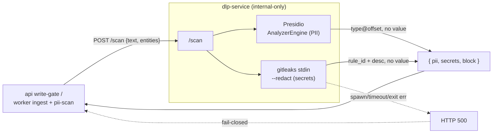

# dlp-service — PII + secret scanning

A small Python/FastAPI sidecar that detects PII and secrets in text, so the platform can fail-closed on any write or document that would persist sensitive data.

## Role in the system

`dlp-service` is the **detection backend** for the DLP/PII layer. It mirrors `graphiti-service`: a thin FastAPI wrapper around **official** detectors — detection is never hand-rolled. Two callers reach it over the private compose network:

- the **api** memory write-gate (`validateAndRoute` Stage 1.5, the dashboard edit + import path), and
- the **worker** document-ingest pipeline (post-extract, before persist) plus the periodic **`pii-scan`** scheduled job.

Both call it through a single shared client in `@pm/security-dlp` (`layers/security-dlp/src/dlp-gate/index.ts` — `makeDlpClient` / `dlpGate`). The sidecar itself makes no policy decisions about *who* may write; the api is the authorization choke-point. The sidecar only answers "does this text contain PII or secrets?" — redaction-safe, and 500s loudly on any operational failure so the caller blocks.

## Key pieces

The service is four small files (`apps/dlp-service/`):

- **`main.py`** — the FastAPI app and the two detectors.
  - **PII** → Microsoft **Presidio** `AnalyzerEngine`, built once at startup in the `lifespan` hook (loads the spaCy `en_core_web_lg` pipeline, which is slow — covered by a generous healthcheck `start_period`). `POST /scan` calls `analyzer.analyze(text, language, entities, score_threshold)` and maps each result to `entity_type + start/end + score` — never the matched substring.
  - **Secrets** → the official **gitleaks** static binary via `scan_secrets()`: `gitleaks stdin … --redact --exit-code=7 --report-format=json --report-path=-`, fed the text on stdin. **Exit code is the pivot**: `0` = clean, `7` = leak(s) found (the configured `--exit-code`), anything else = operational error.
- **`models.py`** — the **redaction-safe** `/scan` contract. `PiiFinding` carries `entity_type + start/end + score` (offset, no value); `SecretFinding` carries `rule_id + description` only (gitleaks ran with `--redact`). The caller stores these on `SecurityAlert`.
- **`config.py`** — env → `Settings` (pydantic-settings, `env_file=None` on purpose: in the container the env is compose-injected and authoritative).
- **`Dockerfile`** — two-stage build. The builder installs `presidio-analyzer`, downloads the spaCy model, and fetches the **pinned, sha256-verified** gitleaks static binary (`GITLEAKS_VERSION` build arg, default `8.30.1`); the runtime stage copies the venv + binary onto a fresh slim base and runs as a **non-root** `app` user. CMD pins `--port 8200`.

**Fail-closed is the load-bearing behavior, and it lives in two places:**

1. **In the sidecar** — `scan_secrets()` raises `HTTPException(500)` on any gitleaks spawn (`FileNotFoundError`), timeout (`subprocess.TimeoutExpired`), unexpected exit code, or unparseable JSON. So unscanned text never returns as "clean".
2. **In the security layer client** — `dlpGate` (`layers/security-dlp/src/dlp-gate/index.ts`) treats any scanner error / timeout / unreachable as **`{ blocked: true }`** with a synthetic `scanner_unavailable` finding (`severity: 'high'`, redaction-safe excerpt). Never a silent allow.

The `/healthcheck` probe is intentionally asymmetric: it is ready once the **analyzer** is built (the core service); gitleaks availability is *reported* but does **not** fail the probe — a gitleaks hiccup blocks individual writes per-request, it does not take the whole stack down at startup.





## Public surface

Two endpoints, no inbound auth.

| Method | Path | Auth | Purpose |
|--------|------|------|---------|
| `GET` | `/healthcheck` | none | Liveness — `analyzer_ready` + gitleaks version. |
| `POST` | `/scan` | none | Detect PII + secrets in `text`. |

`POST /scan` request (`models.py` `ScanRequest`):

```json
{ "text": "...", "language": "en", "entities": ["US_SSN","EMAIL_ADDRESS"], "score_threshold": 0.5 }
```

`entities` restricts PII detection to the caller's deny-list (omit ⇒ all default recognizers). Response (`ScanResponse`):

```json
{ "pii": [{ "entity_type": "US_SSN", "start": 49, "end": 60, "score": 0.85 }],
  "secrets": [{ "rule_id": "aws-access-token", "description": "AWS Access Token" }],
  "block": true }
```

`block` = any PII (already filtered to `entities`) **OR** any secret.

### Config (env)

| Var | Default | Meaning |
|-----|---------|---------|
| `HOST` / `PORT` | `0.0.0.0` / `8200` | bind (real bind pinned in the Dockerfile CMD) |
| `GITLEAKS_BIN` | `gitleaks` | binary name/path |
| `GITLEAKS_TIMEOUT_S` | `10` | per-scan timeout (fail-closed past it) |
| `DEFAULT_SCORE_THRESHOLD` | `0.5` | PII confidence floor (server-side filter) |

The PII **deny-list** is the *caller's* policy, not the sidecar's: the api/worker pass `entities` per request, defaulting to `DEFAULT_PII_ENTITIES` in `@pm/security-dlp` (`US_SSN`, `CREDIT_CARD`, `EMAIL_ADDRESS`, `IBAN`, `CRYPTO`, `PHONE`, `IP`, `US_PASSPORT`, `US_ITIN` — deliberately **not** noisy `PERSON`/`LOCATION`/`DATE_TIME`), env-tunable via `PII_ENTITIES`.

## Invariants & gotchas

Pulled from the committed documentation (the DLP/PII gotcha) — these are load-bearing:

- **Internal-only, no inbound auth.** No published host port; reachable only by the api/worker on `persistent_memory_network`. The api is the choke-point that derives identity. Unlike `docker-control`, this sidecar holds **no privileged resource** (no Docker socket), so internal-network trust is sufficient — it needs no bearer token. (`config.py` scope note.)
- **Fail-closed end-to-end.** The sidecar 500s on any gitleaks spawn/exit/parse error; `dlpGate` blocks the write on **any** scanner error/timeout/unreachable with a `scanner_unavailable` finding. Never a silent allow. The `pii-scan` scheduled job similarly **aborts the run** when the scanner is down rather than false-flagging clean rows.
- **Redaction-safe.** The raw secret/PII value is **never** stored or returned — Presidio returns type+offset (no value), gitleaks runs `--redact`. Findings are `TYPE@start-end` / `rule_id` + description only; the api's `422 pii_detected` payload and the MCP render echo **types only**.
- **Whole-system coverage.** The gate covers memory writes (sync, `validateAndRoute` Stage 1.5 + dashboard edit/import) **and** documents (worker scans post-extract, before persist; on detection ⇒ job `failed`/`pii_detected`, blob purged, no chunks/vectors/graph, `SecurityAlert` raised).
- **`SecurityAlert` is a DATA table with NON-universal RLS** (own-team OR global-admin read — a finding reveals a team holds sensitive data, so it must not be universal like documents/graph). The fail-soft notify path (`NotifySettings` + `notify.ts`) is separate and never blocks.

See `apps/dlp-service/README.md` for low-level run/build detail (local `uvicorn` run, spaCy download, the "why one sidecar" rationale).

## Related docs

- [Documentation home](../index.md) · [ARCHITECTURE](../stack-architecture/architecture.md) · [SECURITY](../stack-architecture/security.md) · [INGEST](../stack-architecture/ingest.md) · [ACCESS-MODEL](../stack-architecture/access-model.md) · [OPERATIONS](../stack-architecture/operations.md)
- Callers: [api](./api.md) · [worker](./worker.md) · the shared client [shared](./shared.md)
- Sibling sidecars: [graphiti-service](./graphiti-service.md) · [docker-control](./docker-control.md)
- Package README: `apps/dlp-service/README.md`
