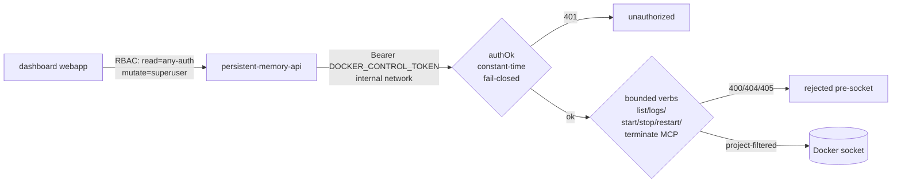

# docker-control — the security-gated sidecar

The tiny, zero-dependency TypeScript sidecar that is the **only** container in the stack with the Docker socket — it builds with `tsc` and runs emitted JavaScript behind a shared-secret bearer and a hard verb boundary.

## Role in the system

The dashboard **Services** page needs to list stack containers and MCP session rows, tail logs, start/stop/restart real stack services, and terminate exact stale legacy MCP client rows. The naive way is to mount `/var/run/docker.sock` into the API. But the Docker socket is **host-root-equivalent**, and the API (`persistent-memory-api`) is a large, network-exposed, auth-handling surface — exactly the wrong place to put root-equivalent access (`apps/docker-control/README.md`).

Instead the socket is isolated in this minimal, single-purpose process and put behind a security gate. The call chain is `dashboard → API → docker-control → Docker socket`. The browser **never** talks to the sidecar directly; the API is the choke-point that holds RBAC (read = any authenticated user for the Services monitor, mutate = superuser), and the sidecar is the choke-point that holds the socket. The sidecar returns only Docker state/log data; the API later enriches Services rows with UI links and admin/superuser-only service credentials. The compose file (`deploy/compose/docker-compose.yml`) even comments that the api "intentionally has NO Docker socket".

To disable service control entirely, comment out the socket volume on `docker-control` in `deploy/compose/docker-compose.yml`.

## Key pieces

The sidecar is four small files under `apps/docker-control/src/`, with **zero runtime dependencies** — `node:http` + `node:crypto` only. Its Docker build stage runs `tsc -p tsconfig.build.json`, and its minimal runtime image starts `node dist/index.js`; invalid TypeScript therefore fails the image build before deployment.

- **`server.ts` — the gate + the router.** `createServer` wires two halves:
  - `authOk(header, token)` — a **constant-time** `Authorization: Bearer <token>` compare via `timingSafeEqual`. It **fails closed**: `if (!token) return false`, so an empty `DOCKER_CONTROL_TOKEN` rejects every request rather than becoming an open socket proxy.
  - `route(...)` — a pure dispatcher over a **bounded verb set**: `GET /services`, `GET /services/:s/logs`, `POST /services/:s/{start|stop|restart}`, and `POST /services/:s/terminate`. Anything else is `400`/`404`/`405` and never reaches the socket. The `logs` `tail` param is clamped to `1..2000` (default `200`); a malformed `%`-escape in the service segment is rejected `400` before any socket touch. `terminate` is separate from stack actions and exists for exact stale legacy MCP rows only.
  - `GET /health` is the one unauthenticated route (no info leak) — it backs the compose healthcheck.
  - On `DockerError` the response is `503 { error: 'docker_unavailable' }` — the UI degrades gracefully, never crashes.

- **`docker.ts` — the socket I/O + project/container-kind filter.** `makeDockerOps` talks the Docker Engine API directly over the UNIX socket (no docker CLI in the image). List/log calls are filtered to **this persistent-memory project**, so stack services and project-labeled MCP session rows can be shown in Services. Stack lifecycle actions additionally require runtime Compose labels (`com.docker.compose.config-hash` + `com.docker.compose.oneoff=False`), so legacy client-owned MCP rows cannot be start/stop/restart-controlled as services. `terminateMcpService` is the narrow exception: it accepts only one exact MCP container id/name from the project-filtered list, then stops that legacy client row. `resolveId(service)` maps a service name to a container id **only within that filtered list**, so a caller can't pass an arbitrary container name and have the sidecar act on it. There is no code path that can `create`, `exec`, or mount the host. Docker `204` (done) and `304` (already in desired state) are treated as success.

- **`parse.ts` — pure parsers.** `parseContainers` maps `/containers/json` → the sorted `ServiceInfo[]` (service/name/id/state/status/health/controllable); `parseHealth` reads `(healthy)`/`(unhealthy)`/`health: starting` out of the status string; `demuxDockerLog` de-multiplexes Docker's 8-byte-framed log stream into plain text (falling back to the raw string for TTY containers). These were moved out of the api when the sidecar took over socket ownership.

- **`index.ts`** — the entrypoint; calls `start()` which reads config from the environment and listens on `0.0.0.0:9090` (internal network only).

## How a Services-page action flows

## Public surface / interfaces

Internal HTTP only — no published host port; reachable solely on the compose network (`apps/docker-control/README.md`).

| Method | Path | Auth | Returns |
|---|---|---|---|
| `GET` | `/health` | none | `{ ok: true }` (compose healthcheck) |
| `GET` | `/services` | Bearer | `{ services: ServiceInfo[] }` (this project only) |
| `GET` | `/services/:service/logs?tail=N` | Bearer | `{ service, logs }` (tail clamped `1..2000`) |
| `POST` | `/services/:service/{start\|stop\|restart}` | Bearer | `{ ok: true }` |
| `POST` | `/services/:container/terminate` | Bearer | `{ ok: true }` for an exact legacy MCP container id/name |

Environment (`apps/docker-control/README.md`):

| Var | Default | Purpose |
|---|---|---|
| `DOCKER_CONTROL_TOKEN` | empty ⇒ fails closed | the shared secret the API must present |
| `DOCKER_SOCKET` | `/var/run/docker.sock` | the mounted socket path |
| `DOCKER_COMPOSE_PROJECT` | `persistent-memory` | the project label the sidecar is scoped to |
| `PORT` | `9090` | internal listen port (no host mapping) |
| `DOCKER_GID` | `0` | supplementary group the container joins to read the socket |

## Invariants & gotchas

These are load-bearing — breaking them silently breaks the security model. See the long "Docker socket" gotcha in the the committed documentation.

- **The socket is mounted into `docker-control` ONLY — never the `api`** (`deploy/compose/docker-compose.yml`). It lives in a minimal, single-purpose process precisely because it is host-root-equivalent.
- **Three layers of isolation:** (1) a shared-secret bearer (`DOCKER_CONTROL_TOKEN`, constant-time, **fails closed** when empty); (2) **no published host port** (internal compose network only); (3) a hard **verb boundary** (list/logs scoped to persistent-memory project containers; start/stop/restart restricted to real Compose services by config-hash + oneoff labels; terminate restricted to exact legacy MCP container ids/names — no code path can create/exec/mount).
- **Token scope** (the committed documentation): `.env.persistent-memory` is also loaded by `worker` + the dashboard via `env_file`, so both **null the token explicitly** in their `environment:` block (`DOCKER_CONTROL_TOKEN: ""`, which overrides `env_file`). Only the `api` (caller) and `docker-control` (verifier) actually hold it, so a worker/dashboard compromise can't drive the sidecar.
- **Container hardening** (all validated live, in `deploy/compose/docker-compose.yml`): `no-new-privileges:true`, `cap_drop: [ALL]`, `read_only: true` (+ `tmpfs: [/tmp]` — it writes nothing to disk), and `user: "node"` (uid 1000, non-root).
- **The `DOCKER_GID` knob:** gid `0` works on Docker Desktop (the in-container socket is `root:root` 660), but **native Linux must set `DOCKER_GID`** to the host docker-group gid (`stat -c '%g' /var/run/docker.sock`) via `group_add`, or the sidecar can't reach the socket — Services degrades to `503 docker_unavailable` (fail-closed, never a crash).
- **Sidecar down / token empty / unreachable → `503 docker_unavailable`** at the API; the UI degrades, no crash. `stop`/`restart` of the `api` itself still drops the dashboard mid-request — the UI warns and refreshes (the committed documentation).
- **RBAC stays in the API.** The sidecar has no per-user authorization; `/dashboard/services` reads are any-authenticated-user and mutations are superuser, enforced in the api and registered outside the `requireAdmin` scope (the committed documentation). UI links and login credentials are not sidecar data; the API adds them after the sidecar response and includes credentials only for admin/superuser identities.

## Related docs

- Package detail: `apps/docker-control/README.md`
- Siblings: [API](./api.md) · [dashboard webapp](./dashboard.md) · [worker](./worker.md)
- Cross-cutting: [Architecture](../stack-architecture/architecture.md) · [Security](../stack-architecture/security.md) · [Operations](../stack-architecture/operations.md) · [Access model](../stack-architecture/access-model.md)
- Component index: [documentation home](../index.md)
