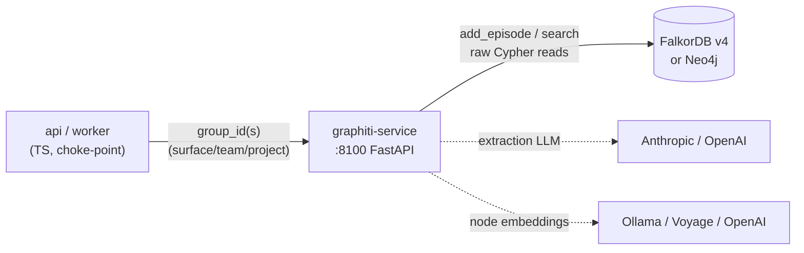

# graphiti-service — the temporal knowledge graph

A Python/FastAPI microservice wrapping `graphiti-core[falkordb]` to give the platform a bi-temporal knowledge graph of entities and relations — facts that carry *when they were true* and *when the system learned them*.

## Role in the system

The graphiti-service owns one of the platform's four storage backends: the **temporal knowledge graph** (entities, relations, and their `valid_at`/`invalid_at` windows), persisted in **FalkorDB** (primary) or **Neo4j** (alternative). It is the graph layer behind the MCP graph tools (`search_graph`, `get_timeline`, `get_contradictions`, `get_entity`, `list_entities`) and behind the document-ingest pipeline's graph step.

It is a thin, API-trusted wrapper: the TypeScript `api`/`worker` are the real choke-point for user identity and supply the right `group_id`(s). The service itself does **no authentication**. For local operations, Compose publishes its OpenAPI docs and health port on `PM_HOST_BIND` (default `127.0.0.1:8100`) so the Services page can link to `/docs`; do not set `PM_HOST_BIND=0.0.0.0` unless the host is behind a trusted firewall/proxy. `apps/graphiti-service/main.py` lifespan note and `apps/graphiti-service/README.md` "trust model" make this explicit. Compare the `dlp-service` Python sidecar, which stays private-network-only.

## Key pieces

The app is **flat** (no package): `main.py`, `config.py`, `graph.py`, `models.py` at the service root, run as `uvicorn main:app` over a flat `COPY . /app`. This is *this* service's app, not the upstream `graph_service.main:app` (see `apps/graphiti-service/README.md`).

- **`main.py`** — the FastAPI app, the singleton lifespan, and all six endpoints. The `Graphiti` client (driver + extraction LLM + server-side embedder) is built **once** in the lifespan and held on `app.state.graphiti`; `build_indices_and_constraints()` runs on startup (idempotent) and `close()` on shutdown. It is never rebuilt per request — the driver holds a live connection.
- **`graph.py`** — the driver/LLM/embedder factory (`build_graphiti`) plus the backend-agnostic temporal Cypher reads. `build_driver` selects a FalkorDB-compatible `FalkorDriver` wrapper or `Neo4jDriver` from `GRAPH_BACKEND`. The FalkorDB compatibility layer applies the same alphanumeric-term allow-list to the base driver (including Graphiti's per-project clones) and the episode-extraction path, turning punctuation from arbitrary memory content into whitespace before it reaches RediSearch. The LLM and embedder clients are wrapped (`UsageTrackingAnthropicClient` / `UsageTrackingOpenAIClient`) to fire-and-forget token usage to the API's `/internal/usage` — best-effort, never able to break an extraction.
- **`models.py`** — stable Pydantic request/response shapes the TS side codes against, independent of the graph backend and of graphiti-core internals. The central type is `FactEdge` (a serialized entity-relation edge; `fact_embedding` is deliberately dropped).

### The tenancy contract — opaque surface/team/project partitions

This is the only isolation boundary at this layer, and it is **structural**, enforced by the request shapes in `models.py`:

- **Writes** (`POST /episodes`, `DELETE /episodes`) take exactly **one** opaque `group_id` (`Field(min_length=1)`, no array). The API derives it from the memory surface, team binding, and named project. There is no request shape that can write across partitions.
- **Reads** (`POST /search`, `GET /timeline`, `GET /contradictions`) take `group_ids: list[str]` with `min_length=1`. The API maps explicitly named project partitions that are authorized for the caller (own partition first, then mounted-team partitions when applicable). The empty list — which would otherwise match everything — is rejected.

The service does **not** decide visibility; it trusts the API-derived list. Direct graph API calls must name one or more projects; only the MCP context resolver may choose Personal `general` for a regular chat.

With FalkorDB, graphiti-core uses the opaque `group_id` as the graph/database name. The Browser may open on `default_db`, which can show labels/index metadata but no records; use an operator-obtained partition key only for debugging and never expose it to agents or reports.

### The bi-temporal model

Every entity "fact" edge (`FactEdge` in `models.py`) carries two independent time axes:

| Axis | Fields | Meaning |
|---|---|---|
| **Event / validity time** | `valid_at`, `invalid_at` | When the fact was true *in the world*. `invalid_at IS NULL` ⇒ still true; `NOT NULL` ⇒ superseded/expired. |
| **System / ingestion time** | `created_at`, `expired_at` | When Graphiti *learned / un-learned* the fact. |

`/timeline` and `/contradictions` filter on **`invalid_at`** (event-time), **not** `expired_at`. There is **no `invalidate` endpoint** — invalidation is a *side effect* of a later, contradicting `add_episode`: graphiti-core stamps the older edge's `invalid_at` from the new episode's `reference_time` and opens a new edge. The old edge is kept (not deleted), which is what lets timelines and contradiction history survive. `reference_time` is the lever — a contradicting episode supersedes only if its `reference_time` is strictly later (see `apps/graphiti-service/README.md`).

### Why the temporal reads use raw Cypher

`/timeline` and `/contradictions` are temporal *oracles* — they must be complete and deterministically ordered, which `graphiti.search()` (hybrid relevance search, capped by `num_results`) cannot be. So `graph.py` `MATCH`es the `:RELATES_TO` edges directly via `graphiti.driver.execute_query` and orders by `coalesce(valid_at, created_at)`. Both FalkorDB and Neo4j speak Cypher, so one query string serves both. `/contradictions` reuses the timeline fetch, then pairs each superseded edge with its successor (same node pair, `successor.valid_at == superseded.invalid_at`) in-service.

### Provenance-aware `DELETE /episodes`

Graph v2 uses `DELETE /episodes {group_id, episode_uuid}` and the supported
`Graphiti.remove_episode(episode_uuid)` operation. The authoritative Memory or
Document stores this UUID after a successful graph write, allowing the lifecycle
worker to remove the exact episode rather than guessing by name. Removal
cascades the episode's primary derived facts and any newly orphaned entities.
The prior
`{group_id, name}` raw-Cypher route remains only as a temporary compatibility
bridge for rows created before provenance exists; Graph v2 writers cannot use
it. The subsequent Graph v2 lifecycle adds the durable outbox/reconciliation proof that deletion does not
leave a deleted-only fact searchable.

## Architecture

## Public surface

The service has no inbound auth. Treat the API routes below as internal API/worker calls; the host-published local docs URL exists for operators and binds to loopback by default. See `apps/graphiti-service/README.md` for request/response examples.

| Method & path | Purpose | Tenancy |
|---|---|---|
| `GET /healthcheck` | Liveness; reports backend + embedder + dim. Matches the compose probe on `:8100/healthcheck`. | — |
| `POST /episodes` | `add_episode` — extract entities/facts, store, supersede contradicted facts. Returns `202` + episode/nodes/edges + diagnostic `invalidated_edges`. | one `group_id` (write) |
| `DELETE /episodes` | Remove an episode by `{group_id, episode_uuid}` through Graphiti provenance; episode-primary facts and orphaned entities cascade away, while legacy `{group_id, name}` is temporary compatibility only. | one `group_id` (write) |
| `POST /search` | Hybrid relevance search across one or more teams in a single call (`valid_only` filters to currently-true facts). | `group_ids[]` (read) |
| `GET /timeline` | Deterministic chronological fact stream ordered by `valid_at`, with validity windows. | `group_ids[]` (read) |
| `GET /contradictions` | Superseded facts (`invalid_at NOT NULL`) paired with the successor that replaced each. | `group_ids[]` (read) |

### Configuration (selected env)

Compose-injected; full table in `apps/graphiti-service/README.md`.

| Env var | Default | Purpose |
|---|---|---|
| `GRAPH_BACKEND` | `falkordb` | `falkordb` (primary) \| `neo4j` (compose `--profile neo4j`) |
| `FALKORDB_HOST` / `FALKORDB_PORT` / `FALKORDB_PASSWORD` | container / `6379` / generated | **internal** port (host map 6380 — never use 6380 container-to-container); password also unlocks FalkorDB Browser as user `default` |
| `FALKORDB_QUERY_TIMEOUT_MS` | `5000` | bounded FalkorDB read-query budget. Graphiti caps each full-text candidate query to 12 unique terms and treats only a resulting full-text timeout as an optional hybrid-search miss; vector/BFS/exact-node resolution still runs |
| `EXTRACTION_PROVIDER` / `EXTRACTION_MODEL` | `anthropic` / `claude-haiku-4-5-20251001` | same extraction LLM provider/model used by fact extraction |
| `ANTHROPIC_API_KEY` / `OPENAI_API_KEY` | — | same extraction LLM credentials used by fact extraction; Anthropic `sk-ant-oat...` tokens use OAuth Bearer + `oauth-2025-04-20` |
| `EMBED_PROVIDER` / `EMBED_MODEL` / `EMBED_DIM` | `ollama` / `qwen3-embedding:4b` / `2560` | **server-side** graph-node embedder |
| `OLLAMA_URL` | `http://host.docker.internal:11434` | host Ollama; the service appends `/v1` |
| `SEMAPHORE_LIMIT` | `10` | concurrent LLM/embed cap; read by graphiti-core at import — set before app start, restart to change |

The embedder here is **always server-side** (it embeds the graph's own nodes/edges) and is **independent of** the server-managed/client-managed embeddings client-bridge toggle (`EMBEDDING_MODE`) that governs Qdrant chunk vectors — `EMBEDDING_MODE` is intentionally not read by this service.

## Invariants & gotchas

- **API-trusted, no user auth (Invariant 6).** The service trusts every opaque partition key the API passes. The API is the single choke-point — Graphiti never sees a user token. The host OpenAPI docs and health port is loopback-only by default; do not expose it on a public interface.
- **Flat modules.** The Dockerfile `CMD` runs `uvicorn main:app` over a flat layout — *not* upstream `graph_service.main:app`. Don't reorganize into a package without fixing the CMD.
- **Port 8100, not 8000.** Upstream uvicorn defaults to 8000; the Dockerfile `CMD` pins `--port 8100` and the compose healthcheck probes 8100.
- **FalkorDB image is v4.x** (`v4.18.10`), not the `1.1.2` module version graphiti's docs cite.
- **`OPENAI_BASE_URL` is honored**, so the OpenAI provider path can hit a local Ollama (`/v1`) or any OpenAI-compatible endpoint. When pointing at Ollama, `small_model` is pinned to `extraction_model` so a sub-step doesn't 404 on the default `gpt-4.1-mini`.
- **Graphiti uses the same extraction token/model as fact extraction.** The service reads `EXTRACTION_PROVIDER`, `EXTRACTION_MODEL`, and the matching provider key from the shared env. Anthropic OAT credentials use the same Bearer + `oauth-2025-04-20` path as the TypeScript fact-extraction client.
- **`invalidated_edges` is derived, diagnostic, best-effort.** graphiti-core 0.29.2 `AddEpisodeResults` has no such field, so `main.py` re-fetches edges between touched node pairs; a driver hiccup never fails the write.
- **`reference_time` is coerced to tz-aware UTC** before `add_episode` — graphiti-core compares datetimes and naive ones misbehave.
- **Do not send `uuid` on create.** graphiti-core 0.29.2 treats `uuid` as an existing episode lookup, not as a deterministic create/upsert id; sending a new UUID raises `node ... not found` and leaves FalkorDB empty.
- **`source_name` / `target_name` from `search_graph` edges serialize as `null`** today — a graph-search follow-up. The underlying data is correct: raw timeline Cypher in `graph.py` populates them, so `/timeline` and `/contradictions` carry the names.

## Related docs

- `apps/graphiti-service/README.md` — full endpoint examples, env reference, bi-temporal deep dive, backend-switching.
- Siblings: [ARCHITECTURE](./../stack-architecture/architecture.md) · [ACCESS-MODEL](./../stack-architecture/access-model.md) · [SECURITY](./../stack-architecture/security.md) · [INGEST](./../stack-architecture/ingest.md) · [EMBEDDING](./../stack-architecture/embedding.md) · [OPERATIONS](./../stack-architecture/operations.md)
- Component docs: [api](./api.md) · [worker](./worker.md) · [mcp](./mcp.md) · [dlp-service](./dlp-service.md) · [shared](./shared.md)
