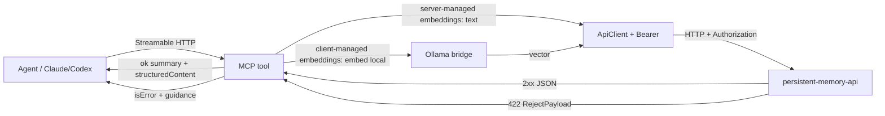

# MCP — persistent-memory-mcp

The MCP server (25 tools) that Claude/Codex use to reach the platform. Most tools map 1:1 to API endpoints; `recall_context` composes memory + graph endpoints into the task-start recall picture. The MCP attaches a connector token only when routing to Shared Memories and does **no** authorization itself.

The supported runtime is the **stream MCP service** (`PM_MCP_RUNTIME=stream`): one user-side Docker-managed `persistent-memory-mcp` service serves Streamable HTTP at `http://localhost:8091/mcp`. Full installs create it through the Compose `mcp-stream` profile. Claude/Codex config entries carry only this local HTTP endpoint; Shared Memories credentials are stored and rotated in the local dashboard. Legacy command-based entries are migration aliases and setup/update rewrites persistent-memory entries to the stream URL.

## Role in the system

`persistent-memory-mcp` is the agent's doorway into the platform. Codex plus Claude Code / Claude Desktop folder sessions talk to the same Streamable HTTP service, and active connections report through the MCP session registry. The Services dashboard shows the Docker-managed stream service under Application services with daemon/internal logs only, while active stream clients appear under MCP sessions with a live Terminates at countdown and session-scoped communication logs. Legacy client-owned stdio rows can appear after upgrade only as loggable cleanup context; they are not a supported new runtime.

The MCP is a **pass-through, not a policy layer.** It performs **zero** authorization or RLS — the API is the single authorization choke-point (see `apps/mcp/src/api-client.ts`, `apps/mcp/README.md`). Identity (user / team / `admin_level`) is 100% server-derived from the token; the MCP asserts nothing about who the caller is. Consequently:

- **Reads** of memory = own team (primary) ∪ MOUNTED teams (additional); documents/graph are universally shared. The MCP just forwards an optional `scope` that can only narrow.
- **Writes** are current-team + per-author bounded by the API. A team-less super-admin cannot use the MCP at all (the data plane requires team membership) — they manage memories on the dashboard instead.

This is the boundary partner of the API: the MCP makes the platform *usable* by an agent without ever being *trusted* by it.

## Key pieces

The runtime source lives in `layers/mcp-runtime/src/`, with compatibility exports
left under `apps/mcp/src/` for the runnable app package:

- **`index.ts`** — entry point. Boots in order: `loadConfig()` (fail-fast env validation, exit 1 to stderr) → personal `ApiClient` → stored Shared Memories connection lookup from the local API → per-surface `resolveRuntime()` (GET `/config` for deployment mode, effective embedding mode/pin, builds the client-managed bridge) → `registerAllTools()` → `StreamableHTTPServerTransport`. Handles SIGINT/SIGTERM for clean session close.
- **`config.ts`** — Zod env schema. `API_URL` is required; `PM_USER_TOKEN` is required only after `/config` proves the API is a server deployment. `OLLAMA_URL`/`EMBED_*` are **client-managed hints only**. It deliberately does **not** read `EMBEDDING_MODE` — the effective mode comes from the API.
- **`api-client.ts`** — the typed API client and the **only** place `PM_USER_TOKEN` is used: requests get `Authorization: Bearer <token>` only when a token is present, injected as a header only (never a URL, never logged). Non-2xx → throws `ApiError`; a fetch throw → `ApiError.transport`. Logs only `method + path + status` to **stderr**.
- **`request-context.ts`** — AsyncLocalStorage context for one Streamable HTTP request. It adds the MCP session id, client name, JSON-RPC method, and tool name to outbound API log lines so the dashboard can show per-session communication logs without leaking request bodies or headers.
- **`runtime.ts`** — reads `{embeddingMode, activeModel, activeDim, activeVectorName}` from GET `/config` once at startup. server-managed embeddings → no local embedder. client-managed embeddings → builds an `@pm/shared` `makeEmbedder` from the **server pin** (`activeModel`/`activeDim`), not the laptop's `EMBED_*` env (mismatched models poison the shared corpus; the env is a hint, warned on stderr).
- **`bridge.ts`** — `bridgeEmbed()` / `addVectorFields()`. In server-managed embeddings returns `{vector:null}` (text path kept); in client-managed embeddings embeds locally and returns the vector. A local-embedding failure becomes an actionable `ToolError` (it surfaces the `OllamaEmbedder`'s `ollama pull <model>` guidance verbatim), not a throw. Every local result is also reported best-effort to the API as a canonical success/failure code; the API derives a client-scoped observer identity from the authenticated caller, so one MCP's local failure never poisons another client's dashboard health.
- **`schemas.ts`** — shared Zod fragments (`Scope`, `ProjectField`, `Metadata`, `ResultRowShape`, `FactEdge`), the `ok()`/`toolError()`/`fromApiError()` result helpers, the `projectNudge()` ToolError, and the annotation presets (`RO_ANNOTATIONS`, `WRITE_ANNOTATIONS`, `DESTRUCTIVE_ANNOTATIONS`, …; every tool is `openWorldHint:true`).
- **`errors.ts`** — `ApiError`, the single place every API HTTP failure becomes actionable agent text. Each status maps to specific guidance (401 re-issue token, 403 `no_team`/`not_owner`/`cross_team_denied`/`scope_not_readable`, 404, 409 `upload_conflict`, 413, 502, 5xx). The **422 paths are special** (see below).
- **`server.ts` + `tools/`** — `registerAllTools()` fans out to five modules: `identity.ts`, `memories.ts`, `graph.ts`, `documents.ts`, `investigations.ts`. Each tool catches `ApiError` and returns `fromApiError(e)` (a tool result with `isError:true`) rather than throwing, so the agent sees the guidance and can self-correct in the same turn.

> **stdout is sacred** — it carries the JSON-RPC frames. Every diagnostic goes to stderr via `log.ts`; there is no `console.log` anywhere in `src/`.

### The project nudge

`add_memory`, `ingest_document`, and `create_investigation` make `project` a **required** input (`ProjectField` in `schemas.ts`). If omitted/blank, the tool returns `projectNudge(toolName)` *before* any API call, telling the agent to infer the project from cwd/git or pass `"general"`. The API itself defaults to `"general"`, but the MCP forces a deliberate classification so memories stay findable.

### Self-correcting writes (422)

When the API's Shape A–E gate rejects a memory write (HTTP 422 `validation_failed`), `errors.ts` renders the full `RejectPayload` verbatim — `reason`, `missing`, `rewrite_templates`, `entity_format`, `valid_categories`/`valid_sources`, `your_submission` — and also attaches it under `structuredContent.reject`. The agent rewrites and retries in one turn. The DLP/PII reject (422 `pii_detected`) renders redaction-safe findings (type only — the value is never echoed). **Neither is ever auto-retried.**

### Server-managed vs client-managed embeddings

The MCP reads the **effective** embedding mode from the API's `/config` at startup — it never trusts its own env. The agent-facing input is always natural-language text; vectors are entirely internal to the MCP.

- **server-managed embeddings (`server`):** the tool sends `query`/`content` text; the server embeds.
- **client-managed embeddings (`client-bridge`):** the MCP embeds locally at the **server-pinned** model/dim and sends a precomputed vector (`queryVector` for searches; `queryVector`+`embeddingModelId`+`embeddingDim` for `add_memory`). A pin mismatch surfaces as 422 `embedding_pin_mismatch`, whose guidance tells the agent to re-pull the model and restart the session. Note: `ingest_document` sends **no** vector in either mode — the worker extracts/chunks server-side.

Local embedding failures are normalized as quota exhaustion, rate limiting,
provider unavailable, configured-model unavailable, or timeout before the bridge
reports them. The report is diagnostic only: it does not delay the tool result or
change the existing actionable bridge error.

### Fact-extraction quota failure

Memory writes pass through fact extraction before any memory persistence. If its
provider reports token/credit/quota exhaustion, the API returns 503 with the
canonical `fact_extraction_quota_exhausted` code and the MCP returns this exact
agent-facing message:

> Fact extraction is out of tokens. The memory was not saved.

This condition is non-retryable until the provider quota is restored. It does not
create a memory, and it is distinct from retryable overload/rate-limit/provider
unavailable conditions. The Dashboard records only a canonical safe diagnosis;
the MCP never receives or logs upstream response bodies or credentials.

## Tool call flow

## Public surface — the 25 tools

| Group | Tools |
|---|---|
| Identity & scope | `whoami`, `list_readable_teams`, `list_projects` |
| Graph-first memory recall | `recall_context` |
| Memory writes | `add_memory`, `update_memory`, `delete_memory`, `delete_all_memories` |
| Memory reads | `search_memories`, `search_memories_by_entities`, `get_memories`, `get_memory`, `list_entities` |
| Knowledge graph | `search_graph`, `get_entity`, `get_timeline`, `get_contradictions` |
| Documents | `ingest_document`, `get_ingest_status`, `search_documents`, `get_document`, `delete_document` |
| Investigations | `create_investigation`, `link_investigation`, `get_investigation` |

Read/search/get tools carry `readOnlyHint`; `delete*` carry `destructiveHint`; `delete_all_memories` and `delete_document` additionally require an explicit confirm/own-team guard server-side. Graph and `list_projects` reads take an optional `scope` (`own` | `granted` | explicit team ids) that only narrows. Writes never accept a team — it is server-derived.

### Graph-first recall

`recall_context(query, project)` is the required first memory read for non-trivial
agent work. It runs semantic memory search and graph retrieval together, returning
closest memories, graph facts, entity expansions, a timeline for the most connected
node, contradictions/superseded facts, and a compact `contextSummary`. Agents use
low-level `search_memories` only as a follow-up when more semantic hits are needed.

The schema-v2 response stores each unique fact once in a canonical `facts`
registry. Graph, entity, timeline, and contradiction planes refer to it by UUID,
which keeps every relationship visible without paying repeatedly for its text.
Packing targets 16 KiB and enforces a 24 KiB hard ceiling. Explicit included and
omitted counts, preview flags, and follow-up identifiers tell the agent when a
deeper read is appropriate; atomic packing guarantees that no returned reference
points to an omitted fact.

The server initialize instructions name `recall_context` as mandatory. Only that
tool carries provider always-load metadata; the installer keeps the rest of the
Persistent Memory server deferred. The generated Codex/Claude rules include the
fallback to `ToolSearch` / `tool_search` when a deeper schema is needed.

### Stream session recovery

The Streamable HTTP transport sessions live in the MCP process. During an
application update the service can restart while a Codex/Claude client still holds
the previous `Mcp-Session-Id`. The fresh process treats that id as stale and
returns a standards-compliant JSON-RPC `Session not found` response with HTTP 404,
which lets the client initialize a new stream session. A non-initialize request
with no session id remains a JSON-RPC bad request with HTTP 400.

The dashboard's MCP sessions table is backed by API process memory. When an API
restart clears that registry but the MCP service is still alive, the API heartbeat
response marks the id as `registered:false`; the MCP then re-sends its full
registration so the Services page row comes back on the next heartbeat.

Stream sessions also have a configurable idle timeout from System Settings
(15 minutes by default). The deadline is based on the last real `/mcp` request,
not on the 10-second heartbeat. If a stale client talks after the timeout, the
transport closes the old session and returns the same HTTP 404 `Session not
found` response so the agent can reinitialize.

### Environment

| Var | Required | Notes |
|---|---|---|
| `PM_USER_TOKEN` | server deployments | `<tokenId>.<secret>`; omitted for full-local `deploymentMode: local` |
| `API_URL` | yes | full URL of `persistent-memory-api` |
| `PM_API_TIMEOUT_MS` | no | default `60000` |
| `OLLAMA_URL` | client-managed embeddings | default `http://host.docker.internal:11434` |
| `EMBED_PROVIDER` / `EMBED_MODEL` / `EMBED_DIM` | client-managed embeddings | hints only — the **server pin always wins** |

Build/run/registration detail for the stream service lives in the package README and `apps/mcp/CLAUDE_MCP_SETUP.md` — not duplicated here. Capability ownership is documented in `layers/mcp-runtime/README.md`.

## Invariants & gotchas

- **The MCP does ZERO authorization.** Per the repo documentation (mcp row + invariant #1), identity is server-derived from the token; the API is the single choke-point. Never add a code path where the MCP trusts a team/user/role.
- **A super-admin writes cross-team only via the dashboard, never the MCP** (the committed documentation invariant #2). The MCP write plane is current-team-only — `cross_team_denied` is expected, not a bug.
- **Output-schema ↔ API lock-step.** The SDK validates `structuredContent` with `additionalProperties:false`, so any field the API returns must be declared in the tool's `outputSchema`, or the tool errors `-32602`. The MCP eval found and fixed four such drifts (`whoami`, `search_memories`, `search_documents`, `get_document`) as API fields were added (see `apps/mcp/eval_report.md`). `apps/mcp/test/local-mode-and-schema.test.ts` now pins those structured outputs against their schemas, and `apps/mcp/test/recall-context.test.ts` pins graph-first recall. **Re-run the eval after ANY change to an API response shape**. Trust fields in `ResultRowShape` are `optional` precisely because semantic search returns them and the list/get endpoints omit them.
- **Graph provenance failures are explicit, never repaired client-side.** The API derives `project`, `surface`, and `relation` from an allowed graph partition and drops any unknown group. The MCP checks those labels again before emitting `structuredContent`. A malformed response becomes the actionable `graph_response_contract_invalid` ToolError: retry the identical call once; if it repeats, do not treat required recall as complete or silently replace it with bare semantic search. This boundary intentionally never manufactures provenance labels.
- **The pin is read once at startup and cached for the process** (`runtime.ts`). A mid-session pin change surfaces as a 422 telling the agent to restart — deliberately cheaper than a `/config` round-trip per call.
- **A bridge health observation is client-scoped.** The MCP supplies a provider, pinned model, and canonical outcome only; the API derives the observer scope from the authenticated identity. Do not send a client id or make bridge failures global.
- **Stream session timeout is read at startup too.** Saving the timeout in System Settings restarts the Stream MCP service so the new idle policy applies. Heartbeats only maintain the Services registry row; they do not extend the last-activity deadline.
- **stdout carries JSON-RPC; all logs go to stderr.** The presigned `originalUrl` from `get_document` is returned to the agent but never logged (it embeds the MinIO credential signature).
- **Tool gap:** no `list_investigations`/search-investigations tool — `get_investigation` is by-id only, so an agent can't discover an investigation by content. Tracked in `apps/mcp/README.md`.

## Related docs

- Package detail: `apps/mcp/README.md` · setup: `apps/mcp/CLAUDE_MCP_SETUP.md`
- Eval report: `apps/mcp/eval_report.md`
- [Architecture](../stack-architecture/architecture.md) · [Access model](../stack-architecture/access-model.md) · [Security](../stack-architecture/security.md) · [Embedding](../stack-architecture/embedding.md) · [Ingest](../stack-architecture/ingest.md)
- Sibling components: [api](./api.md) · [worker](./worker.md) · [shared](./shared.md) · [dashboard](./dashboard.md) · [onboard](./onboard.md)
