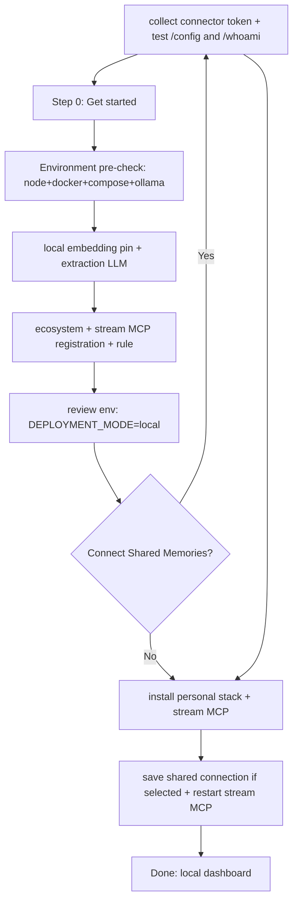

# Onboard — the one-command installer

A host-only, flow-routed web wizard (`npm run install-persistent-memory`) that detects the machine, generates every secret, runs the install with live progress, registers the MCP into your agent apps, writes a top memory block into CLAUDE.md / AGENTS.md, and writes the detailed memory-usage rule.

## Role in the system

`apps/onboard/` is the single user-facing entry point for *getting set up* — the counterpart to `update-persistent-memory` for *staying current*. It runs **before** the stack exists, so it is deliberately **standalone**: its own `package.json`, no `@pm/*` workspace deps, talking to the live API only over HTTP (`apps/onboard/package.json` — deps are just `fastify` + `@fastify/static`). It is **never containerized or shipped** to the server (`server/index.ts` header; `apps/onboard/README.md` "Security / boundaries").

The wizard installs one client shape: a local **Personal Memories** stack, local
dashboard, local embeddings, and the stream MCP service. After personal setup it
can optionally connect **Shared Memories** with a server-issued connector token.
It is the only place the local stack's secrets and the per-agent MCP config are
generated, so it is also where the security-sensitive defaults (auto-generated
passwords, `0o600` config files, loopback-only binding) live.

## Key pieces

The launcher and server:

- **`scripts/host-lifecycle.mjs`** — the host launcher behind `npm run install-persistent-memory`. It prepares onboarding dependencies, builds the SPA and server, starts the emitted JavaScript, waits for `/healthz`, and opens the browser. It uses `http://localhost:3200` as the default final dashboard handoff and stays attached until the server exits. On Windows, native Node runs the wizard and Git for Windows Bash executes its shell helpers; macOS uses system Bash. `deploy/scripts/onboard.sh` remains a compatibility entry point.
- **`server/index.ts`** — Fastify bound to **`127.0.0.1` only**. Endpoints: `/api/prereqs` (probes Homebrew/docker/compose/node/ollama/models and returns manual Homebrew commands when needed), `/api/prereqs/install` (streamed macOS prerequisite actions and native Windows Ollama install/start actions), `/api/specs` + `/api/apps` (detection), `/api/rule/default`, `/api/remote/test` (client flows), `/api/extraction/test` (provider/API-key probe for the Extraction LLM step), `/api/ollama/pull` (NDJSON), `/api/env` (generate + write `.env.persistent-memory`), `/api/install` (NDJSON, flow-gated), `/api/finish`, `/api/shutdown`. Serves the built SPA from `web/dist` with an SPA fallback. The server exits after 30 minutes of inactivity, but stays alive during prerequisite installation, model pulls, and stack installation. The idle countdown restarts when active work finishes.
- **`layers/onboarding/src/server/guard.ts`** — a **DNS-rebinding guard** applied to `/api/*` through the app compatibility export: rejects any request whose `Host` is not `127.0.0.1:<PORT>`/`localhost:<PORT>`, and any `POST` carrying a foreign `Origin`. GETs and absent Origins are allowed (read-only probes / non-browser clients).

The pure, unit-tested logic (each module separates pure builders from thin IO writers):

- **`server/env.ts`** — `genSecrets()` auto-generates the secrets a user must never invent (`TOKEN_PEPPER`, DB/MinIO/FalkorDB passwords, `QDRANT_API_KEY`, plus `DOCKER_CONTROL_TOKEN` and `USAGE_INGEST_TOKEN`). `renderEnv()` builds `.env.persistent-memory` deterministically, deriving `DATABASE_URL` (password = `PM_APP_PASSWORD`) and `DATABASE_MIGRATE_URL` (password = `POSTGRES_PASSWORD`) **from** the generated secrets so they can't drift, and sets `PM_HOST_BIND=127.0.0.1` for loopback-only local ports. `maskEnv()` masks secret values for the review preview.
- **`server/detect.ts`** — `recommendModel()` (RAM tier → `qwen3-embedding:8b`/`4b`/`0.6b`, the full flow's default pin) and `detectApps()` (path-existence probes → which agent apps are installed: Claude CLI/Desktop and Codex CLI/Desktop).
- **`server/prereq.ts`** — parsers and install-plan builders for Homebrew, Docker Desktop/Compose, Node, Ollama, and pulled-model probes. Windows provides Ollama **Install**/**Start** actions; Node, Git for Windows Bash, and a Linux Docker engine are prepared manually. On macOS, missing Homebrew is a manual prerequisite: the wizard shows the official installer command plus `brew shellenv` zsh commands, then the fixed Environment pre-check cards unlock brew-backed Node/Docker/Ollama actions after the user returns to the step. Both hosts require Node 22.12+ or a newer supported LTS version.
- **`layers/onboarding/src/server/steps.ts`** — `buildSteps(flow)` returns the ordered `InstallStep[]`, re-exported through the app compatibility path. The visible flow always runs the proven personal-stack commands (`npm run setup` → `ollama pull` if the selected model is missing → `compose up` with `COMPOSE_PROFILES=mcp-stream` → wait-postgres → `migrate:deploy` → container-applied `rls` → `seed` → restart api+worker → wait-stream-mcp → `verify`). If Shared Memories are selected, the shared connection step runs **after** local verify so the dashboard/API exist before the connector is stored. The `compose up --build` step sets `COMPOSE_PARALLEL_LIMIT=1` to avoid concurrent npm registry/TLS failures on fresh laptops. `hostRewriteUrl()` rewrites the container DB host to `localhost:5433` for host-run Prisma/seed; RLS itself runs through `deploy/scripts/apply-rls.sh` inside the Postgres container so the host needs no `psql`.
- **`server/install.ts`** — the orchestrator: spawns each step **without a shell** (argv arrays, no interpolation), streams stdout/stderr as NDJSON, skips the selected-model pull when Ollama already has it, and polls `docker inspect …Health.Status` for the wait step. Personal installation does not mint a bootstrap token. Stops on first failure.
- **`server/register.ts`** — idempotent MCP-config mergers. Builds a Streamable HTTP entry (`type: "http"`, `url: PM_MCP_STREAM_URL`; Claude Code config names this transport `http`) and never writes connector secrets into agent config. Shared Memories tokens live in the local dashboard/API. Writers deep-merge `~/.claude.json` (global or `projects.<path>`) for Claude Code / Claude Desktop folder sessions, skip `claude_desktop_config.json` because standalone Claude Desktop local config is command-shaped, and surgically splice `[mcp_servers.persistent-memory]` into `~/.codex/config.toml` (preserving neighbor tables). Codex CLI and Codex Desktop are separate wizard choices but share the same Codex config target. All configs written `0o600`. Legacy command/stdio entries are migration aliases and are upgraded to the stream URL by setup/update helpers.
- **`server/rule.ts`** — writes the editable memory-usage rule (from `templates/persistent-memory-rule.md`) to `.claude/rules/` / `.codex/rules/` and replaces/inserts a top `## Persistent Memory Usage (MANDATORY)` block under the matching `CLAUDE.md` / `AGENTS.md` title. It removes previous generated persistent-memory blocks, legacy `## Memory Save Triggers (MANDATORY)` blocks, and legacy one-line refs before insertion, and rewrites the rule reference per Claude/Codex/global/project target.

The visible wizard has 12 steps. Public release checks are built in, so there is
no update-source configuration or connection-test step.

The frontend (`web/src/`) is a React + Vite SPA. `flow.ts` is the pure flow graph (`FLOW_PHASES`, `nextPhase`/`prevPhase`); `App.tsx` renders one component per phase. Legacy flow ids still exist as migration aliases, but all visible paths normalize to the personal-first sequence and generate `.env.persistent-memory` with **`deploymentMode: 'local'`**.

The Windows Ollama action downloads the official `OllamaSetup.exe`, validates its
Windows signature before execution, and runs a per-user installation. It then
starts or reuses native Ollama and waits for the host API. Existing installs and
models are preserved; PATH discovery is refreshed for the running wizard.
This action needs no `winget` installation. It follows the native installer
approach documented in [Ollama's Windows install script](https://github.com/ollama/ollama/blob/main/scripts/install.ps1).

Choosing **Install** or **Start** hides the previous prerequisite warning while
the action runs. A failed action shows its error afterward; **Next** remains
disabled until the required checks pass.

Ollama downloads show a progress bar, transferred bytes, and a percentage when
the download size is known. Verification, installation, startup, and readiness
checks show their current stage without an estimated percentage. Unknown-size
downloads and macOS prerequisite actions also show an activity indicator; macOS
uses the actual Homebrew step name. The terminal log remains available below.

A visible wizard tab sends a lightweight keepalive so the server stays available
while you fill in the form. It does not change form values. Keep the launch
terminal open; active installation and model downloads also prevent idle shutdown.
The desktop sidebar separates steps and scrolls independently in shorter windows.

If the browser reports **Failed to fetch** or a lost installer connection, check
the launch terminal and restart the wizard if its process exited, then choose
**Check again**. A failed prerequisite request shows **Not checked** instead of
continuing to verify. An interrupted progress stream is an error until completion
is confirmed. Never run a partial or unverified installer download manually;
retry through the wizard so signature verification runs before execution.

## Flows

## Public surface / interfaces

The launcher is the only user-facing command; everything else is internal HTTP the SPA calls.

| Surface | What |
|---|---|
| `npm run install-persistent-memory` | The command (root `package.json` → `scripts/host-lifecycle.mjs`) — opens `http://127.0.0.1:4319`; use `npm.cmd` in Windows PowerShell |
| `GET /api/prereqs` | Homebrew / docker / compose / node / ollama probes + pulled models |
| `POST /api/prereqs/install` | NDJSON macOS prerequisite actions and Windows Ollama install/start actions; Windows Node/Docker setup and Homebrew itself remain manual |
| `GET /api/specs` · `/api/apps` | system RAM/CPU + recommended model · detected agent apps |
| `GET /api/rule/default` | the editable detailed rule body + top memory block + path |
| `POST /api/remote/test` | Shared Memories connector test: hits remote `GET /config` (the pin/topology) + `GET /whoami` (token identity) |
| `POST /api/extraction/test` | Extraction LLM provider probe. The wizard enables this once the selected provider has a typed or existing API key, then keeps Next disabled until the probe passes |
| `POST /api/ollama/pull` | NDJSON `ollama pull` progress |
| `POST /api/env` | generate secrets + write `.env.persistent-memory` (`0o600`), return masked preview |
| `POST /api/install` | NDJSON install stream (full flow requires the `.env`; client flows don't) |
| `GET /api/finish` · `POST /api/shutdown` | dashboard URL for final redirect (`http://localhost:3200` by default, overridable with `DASHBOARD_URL`; `ADMIN_URL` remains a fallback) · self-terminate |

The visible flow is **Personal Memories first**. `full`, `engine`, and `mcp` ids
remain in tests/types only as migration aliases. The installer always writes a
local personal `.env.persistent-memory`, starts the stream MCP service, and then
optionally saves one Shared Memories connection. The shared connector step
validates token identity, remote role, embedding topology, model, and dimension.
For client-managed shared servers, the local selected embedding model/dim must
match or the connection blocks with an actionable error.

Env vars the server reads: `ONBOARD_PORT`/`--port` (default `4319`), `PM_ROOT` (repo root, default `cwd`), `API_URL`, `DASHBOARD_URL` (default `http://localhost:3200`; `ADMIN_URL` fallback), `OLLAMA_URL` (`server/index.ts`).

## Invariants & gotchas

- **Host-only, never shipped.** It binds loopback only, runs privileged install commands on *your* machine, is single-use + self-terminating, and is excluded from images + gitignored build output. **Never containerize it** (`server/index.ts` header; the committed documentation onboard row).
- **Compile-first runtime** — `npm run build:server` emits the installer server and its onboarding helpers, then the launcher runs `node dist/apps/onboard/server/index.js`. This follows the stack-wide rule that first-party Node services never execute TypeScript directly in production or installer flows.
- **The installer writes `DEPLOYMENT_MODE=local`** — a single-user local stack whose dashboard user has local superuser rights. The API creates or reuses the internal Personal Memories `Team`/`AppUser` identity from the onboarding profile; the database generates its ids. `/whoami` and MCP `whoami` display this local identity. It is separate from an optional Shared Memories server connection, which never flips the local stack into server mode.
- **Personal seed initializes settings only.** It creates embedding and extraction settings when the settings row is missing and preserves an existing row, including saved provider keys. The API manages the personal identity after migration; seed does not create demo teams, sample access grants, or a local bootstrap token. Existing records are not deleted.
- **The MCP entry never carries `EMBEDDING_MODE` or connector tokens.** The MCP learns topology from each surface's `GET /config`; Stream entries carry the local MCP URL only (`server/register.ts`; the committed documentation). The local dashboard/API store the Shared Memories connector token as a masked secret.
- **DB URL passwords are derived, not user-set.** `DATABASE_URL`'s password must equal `PM_APP_PASSWORD` (rls.sql injects it into the `pm_app` role) and `DATABASE_MIGRATE_URL`'s must equal `POSTGRES_PASSWORD`; `renderEnv` builds both from the generated secrets so drift is impossible (`server/env.ts`).
- **The connector token is dashboard-owned.** It is tested during install or Settings, stored locally as a write-only masked secret, and can be rotated/disconnected without reinstall (`server/index.ts` `buildWizardPayload`; API `/dashboard/shared-connection`).
- **Config writers are idempotent + `0o600`.** Claude JSON merges preserve sibling servers; the Codex splice touches only our `[mcp_servers.persistent-memory]` table. Memory blocks use explicit ownership markers so repeated writes preserve surrounding instructions, including unheaded prose and code examples. Legacy cleanup removes recognized generated lines only; malformed ownership markers stop the write before either rule file changes (`server/register.ts`, `server/rule.ts`).
- **Windows registration uses the Windows user home.** The wizard runs under native Windows Node, so global files target the Windows account's `.claude`/`.codex` locations, and project registration targets the Windows checkout. A WSL distribution's home directory is a separate registration target. File mode requests such as `0o600` are POSIX permissions; on Windows, access is governed by the account's filesystem ACLs.
- **Profile overrides apply to MCP and rules together.** The server passes only the selected host profile directories to the writers. `CODEX_HOME` relocates global Codex configuration and guidance. `CLAUDE_CONFIG_DIR` relocates Claude rules and its global `.claude.json`; an existing legacy profile `.config.json` takes precedence. Detection and updates use the same locations. Other profiles are not migrated or removed. Project folders are trimmed, deduplicated, and must be absolute; an empty Project Level selection fails instead of changing to Global Level.
- **Existing configuration is preserved on parse errors.** Claude JSON supports a leading UTF-8 byte-order mark. Malformed or non-object configuration fails without replacing the original, and updates report skipped malformed files. Codex TOML replacement handles quoted or commented target headers while preserving unrelated tables, comments, and multiline text.
- **Codex receives an explicit protocol-reading instruction.** The generated block asks Codex to read the detailed rule; it does not assume Claude-style `@` imports. A nonempty `AGENTS.override.md` is the guidance target when present because Codex loads it ahead of `AGENTS.md`.
- **Memory-surface rules are installed with the MCP.** The generated
  `persistent-memory` rule tells agents to ask for Personal Memories versus
  Shared Memories at the start of each new project when both surfaces are
  configured, park the choice under project-level `.claude`/`.codex` config where
  possible, pass the parked `surface` to tools that support it, and use personal
  `project: "general"` for non-project sessions. The same rule also carries a
  lightweight unknowns pass so agents name material blind spots, use concrete
  repo/runtime evidence, and report what was verified without adding a heavy
  planning ceremony.
- **No host `psql` requirement.** Prisma migrate/seed run on the host with the DB URL rewritten from `persistent-memory-postgres:5432` to `localhost:5433`, but RLS is applied by `deploy/scripts/apply-rls.sh` through the running Postgres container. The helper preserves `PGOPTIONS="-c pm.app_password=..."` for `rls.sql`.
- **Do not source generated env files.** Lifecycle scripts use `deploy/scripts/lib/env.sh` to read specific `.env.persistent-memory` keys literally. This avoids executing user-provided API keys or generated secrets as shell code during migrate/RLS/update paths.
- **DNS-rebinding guard** on `/api/*` (`layers/onboarding/src/server/guard.ts`) — a defense against a malicious browser page rebinding to loopback to drive the privileged install endpoints.

## Related docs

- [Windows preparation and manual installation](../installation/windows-installation.md)

- Package README: `apps/onboard/README.md` (develop/test, full per-flow walkthrough)
- [Architecture](../stack-architecture/architecture.md) · [Access model](../stack-architecture/access-model.md) · [Security](../stack-architecture/security.md) · [Embedding](../stack-architecture/embedding.md) · [Operations](../stack-architecture/operations.md)
- Sibling components: [mcp](./mcp.md) · [dashboard](./dashboard.md) · [api](./api.md) · [shared](./shared.md) · [docker-control](./docker-control.md)
- Access-model source of truth: [access-model.md](../stack-architecture/access-model.md)
