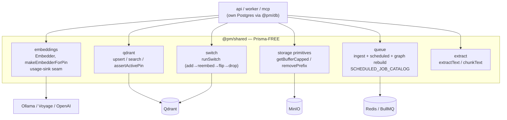

# Shared — `@pm/shared`

The Prisma-free reusable core: embeddings, the Qdrant vector layer, BullMQ queues, and doc extract/chunk — written once and consumed by `api`, `worker`, and `mcp`.

## Role in the system

`@pm/shared` is the platform's **vendor-neutral data-plane toolkit**. It owns shared interactions with Qdrant (vectors), Redis/BullMQ (queues), the embedding providers, and the pure text pipeline (extract + chunk). Capability-specific code that spans apps now lives in `layers/`: MinIO app helpers are in `layers/evidence-files`, and the fail-closed DLP client/gate is in `layers/security-dlp`. Per `packages/shared/README.md`, shared deals in plain bytes/streams, `number[][]` vectors, Qdrant payload objects, and string ids; it **never imports the Prisma client or reads Postgres**.

That boundary is load-bearing. The Prisma clients live only in `@pm/db` (the committed documentation: "`@pm/shared` is Prisma-free; only `@pm/db` imports `generated/prisma`"). Callers own the database: they read rows, pass `{ teamId, project, rowId, text/vector }` (or a stream + key) into shared, and write the returned point ids / object keys / job ids back to Postgres. This is precisely what lets `worker` and `mcp` depend on shared **without** a database dependency.

It is a true npm-workspace member (`@pm/shared`) and the dependency root of the build chain (`build:shared → db → api → worker`).

## Key pieces

The package is a set of independent module groups under `packages/shared/src/`, re-exported from the barrel `packages/shared/src/index.ts` (and each as a subpath export, e.g. `@pm/shared/qdrant`).

### Embeddings (`src/embeddings`)
One `Embedder` interface, `number[][]` in/out, order-preserving, batched, with retry/backoff. Three provider impls — `ollama.ts`, `voyage.ts`, `openai.ts` — selected by `EMBED_PROVIDER`. `registry.ts` validates the `(provider, model, dim)` triple; `factory.ts` builds the instance:
- `makeEmbedderFromEnv()` — resolve `EMBED_*` env then build (app boot).
- `makeEmbedderForPin(model, dim)` — build an embedder for a **specific** model/dim, taking the provider from `MODEL_REGISTRY` (not `EMBED_*`). Used by the live-pin path (api `applyActivePin` / worker refresher) and the model-switch driver's target embedder (`packages/shared/src/embeddings/factory.ts`).

There is **no module-level singleton** — each of api/worker/mcp resolves config at its own boot. `kind: 'document' | 'query'` matters only for Voyage (asymmetric); ollama/openai ignore it.

Usage reporting stays Prisma-free via a DI seam (`usage-sink.ts`): embedders call `emitEmbedUsage(...)`; the host process wires `setEmbedUsageSink(...)` to forward to the `@pm/db` recorder. No sink (e.g. the MCP, which has no DB) → emit is a no-op.

### Qdrant layer (`src/qdrant`)
ONE collection (`memory_vectors`) using **named vectors** keyed `"<slug>__<dim>"`. `team_id` is a payload field with a tenant payload index.
- `ensureCollection(client, pin)` — idempotent create + indexes (`collection.ts`).
- `upsertVectors(client, { teamId, pin, items })` — `team_id` is **server-stamped from identity, never a client arg**; returns `rowId → pointId` for write-back (`upsert.ts`). `upsert.ts` also holds `deleteChunkPointsForDocument`, the payload-filter point cleanup.
- `searchVectors(...)` — `Filter.should` OR over `readableTeamIds`; empty scope → fail-closed, no rows (`search.ts`).
- `assertActivePin(declared, active)` — the **client-managed embeddings guard**: rejects a precomputed vector whose `(modelId, dim)` ≠ the active pin (`ModelDimMismatchError` → 422 at the api) (`guard.ts`).

### Switch tool (`src/switch`)
Zero-downtime named-vector migration (dimension/provider change): add → (dual-write) → re-embed → flip → drop. `runSwitch(client, plan, hooks)` sequences these with `noFlip`/`noDrop`/`onProgress` hooks; each Qdrant step is idempotent (resume-safe). The api drives it from `PUT /dashboard/settings` via `apps/api/src/services/model-switch.ts` as a two-pass, no-live-dual-write migration. `cli.ts` exposes `npm run switch` for proving the Qdrant mechanics (it cannot read Postgres, so the real re-embed-from-text needs a caller-supplied `fetchText`).

### Storage primitives (`src/storage`)
MinIO S3 client + helpers (`store.ts`, `keys.ts`). Object-key scheme is team-first: `team/<teamId>/<project>/<sourceId>/original|extracted/<safeName>`. App-facing API/worker storage helpers live in `layers/evidence-files`. Notable low-level helpers (`packages/shared/src/storage/index.ts`):
- `getBufferCapped` — stream a blob into a buffer with a HARD byte ceiling; aborts + throws `FileTooLargeError` past the cap so the worker can't OOM on an over-limit object.
- `removePrefix` — list + batch-remove every object under a prefix; document DELETE reclaims the original + untracked artifacts via `sourcePrefix`.
- plus `putStream`/`getStream`/`getBuffer`, `statObject`, `presignedGetUrl`, `removeObject`, `ensureBucket`.

### Queues (`src/queue`)
Three BullMQ contracts:
- **Ingest** (`queue.ts`, `worker.ts`, `connection.ts`): `INGEST_QUEUE` name, the `IngestJobData` payload, `makeIngestQueue` + `enqueueIngest` (producer; `jobId === ingestJobId` for idempotency), `makeIngestWorker` (consumer factory — the pipeline processor is injected by `worker/`). `makeIngestConnection` carries `maxRetriesPerRequest: null` (mandatory for BullMQ workers).
- **Scheduled subsystem** (`scheduled.ts`): a second queue `pm.scheduled` driven by BullMQ **job-schedulers** — `makeScheduledQueue`/`makeScheduledWorker`, `upsertSchedule`/`removeSchedule`/`runScheduleNow`/`listSchedules`, and `WORKER_HEARTBEAT_KEY` (worker-liveness key shared by the worker writer + the api reader). Job metadata is single-sourced in `SCHEDULED_JOB_CATALOG` (`{ name, description, defaultCron }`): the six jobs are `usage-sweep`, `embed-backfill`, `memory-graph-backfill`, `graph-lifecycle`, `ingest-reconciler`, and `pii-scan`. `graph-lifecycle` drains durable provenance-aware Graphiti removals and retries a stale in-flight command after a worker crash. The worker registry attaches `run()`; the api reads the catalog for dashboard descriptions (the standalone dashboard app does not import compiled `@pm/*` packages).
- **Memory graph rebuild** (`memory-graph.ts`): a one-time queue `pm.memory-graph-rebuild` for the Memories -> Memory Tools rebuild action. It carries selected `teamId` / `project` / `createdById` filters and a generated job id; it is deliberately not in `SCHEDULED_JOB_CATALOG` and separate from scheduled `memory-graph-backfill`.

### Extract (`src/extract`)
Pure-JS, no native deps. `extractText` (PDF via `unpdf`, docx via `mammoth`, txt/md UTF-8) → `{ text, pages, artifacts, warnings }`, dispatched by mime (`dispatch.ts`), and `chunkText` (`chunker.ts`) — recursive separator split + token-aware greedy pack with overlap (`js-tiktoken` o200k_base, chars/4 fallback).

### DLP boundary

The DLP client and fail-closed gate moved to `layers/security-dlp` and are
imported as `@pm/security-dlp`. `@pm/shared` no longer exports DLP helpers; keep
DLP policy in the security layer so the reusable shared package remains focused
on backend primitives.

## Module map

## Public surface

Subpath exports (each also re-exported from the `@pm/shared` barrel):

| Subpath | Key exports |
|---|---|
| `@pm/shared/embeddings` | `makeEmbedderFromEnv`, `makeEmbedderForPin`, `makeEmbedder`, `MODEL_REGISTRY`, `setEmbedUsageSink`, `estimateTokens` |
| `@pm/shared/qdrant` | `ensureCollection`, `upsertVectors`, `searchVectors`, `assertActivePin`, `deleteChunkPointsForDocument` |
| `@pm/shared/switch` | `runSwitch`, `planSwitch` |
| `@pm/shared/storage` | `makeMinioClient`, `ensureBucket`, `putStream`, `getBuffer`, `getBufferCapped`, `FileTooLargeError`, `removePrefix`, `originalKey`, `sourcePrefix` |
| `@pm/shared/queue` | `makeIngestQueue`, `enqueueIngest`, `makeIngestWorker`, `INGEST_QUEUE`, `makeScheduledQueue`, `makeScheduledWorker`, `upsertSchedule`, `SCHEDULED_JOB_CATALOG`, `WORKER_HEARTBEAT_KEY` |
| `@pm/shared/extract` | `extractText`, `chunkText` |
| `@pm/shared/types` | `ActivePin`, `EmbeddingError`, … |

Primary env consumed: `EMBED_PROVIDER` / `EMBED_MODEL` / `EMBED_DIM` (+ `OLLAMA_URL`, `VOYAGE_API_KEY`, `OPENAI_API_KEY`, `EMBED_BATCH_SIZE` / `EMBED_MAX_RETRIES` / `EMBED_TIMEOUT_MS`) and `MINIO_ENDPOINT`. See `packages/shared/README.md` for the full provider/dim matrix and CLI usage.

## Invariants & gotchas

- **Prisma-free is the contract.** Only `@pm/db` imports `generated/prisma`; shared takes ids/text/streams in and hands point ids / keys / job ids back (the committed documentation gotcha "`@pm/shared` is Prisma-free"). Do not add a Postgres read here.
- **`team_id` is server-stamped.** `upsertVectors` stamps `team_id` from identity — never a client arg (the committed documentation Invariant 4; `packages/shared/src/qdrant/upsert.ts`). Reads fail-closed on an empty team scope.
- **One embedder model+dim per collection** (named vectors). Changing the model/dim is a **re-embed migration** via `src/switch`, never a live meaning-changing toggle; `assertActivePin` rejects vectors whose model/dim ≠ the active pin (the committed documentation Invariant 5).
- **The active vector is config, not Qdrant state** — held in `EMBED_MODEL/DIM` (server-managed embeddings) / the System Settings row (runtime). The collection may hold several named vectors; the active one is `vectorName(activeModel, activeDim)` (`packages/shared/README.md`).
- **The DLP gate lives in `layers/security-dlp`.** Scanner error/timeout/unreachable → blocked, never a silent allow; findings carry type + offset, never the raw value.
- **`getBufferCapped` bounds worker memory** — aborts + throws `FileTooLargeError` past `INGEST_MAX_FILE_BYTES` so a blob slipped past the api upload cap can't OOM the worker.
- **`SCHEDULED_JOB_CATALOG` single-sources job metadata** so the standalone dashboard app can show descriptions without importing the worker (the committed documentation scheduled-worker gotcha). The 15s liveness heartbeat is deliberately NOT a scheduled job — it is a `setInterval` in the worker, surfaced read-only via `WORKER_HEARTBEAT_KEY`.
- **`@qdrant/js-client-rest` v1.18 named-vector args are POSITIONAL** — `createVectorName(collection, name, { dense: { size, distance } })`; `updateCollection` does NOT add a named vector (`packages/shared/README.md`).

## Related docs

- Package README (low-level detail): `../../packages/shared/README.md`
- [Architecture overview](../stack-architecture/architecture.md)
- [Embedding & vector model](../stack-architecture/embedding.md) — providers, the switch, the active pin
- [Ingest pipeline](../stack-architecture/ingest.md) — extract/chunk + the queue contract in context
- [Security](../stack-architecture/security.md) — the DLP gate end-to-end
- Consumers: [api](./api.md) · [worker](./worker.md) · [mcp](./mcp.md) · [db](./db.md) · [dlp-service](./dlp-service.md)
