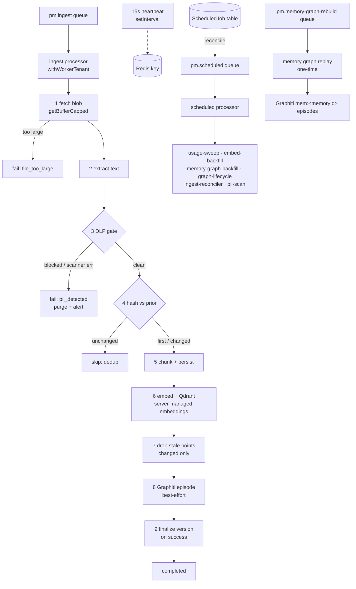

# Worker — persistent-memory-worker

The BullMQ consumer process: it runs the document-ingestion pipeline and the managed scheduled-job subsystem.

## Role in the system

The `apps/worker/` package (`persistent-memory-worker`) is the asynchronous half of the platform. The api accepts an upload, streams the blob to MinIO, commits the `Source`/`Document`/`IngestJob` rows, and enqueues a job — the worker does everything after that: fetch the blob, extract + scan + chunk + embed the text, write the vectors to Qdrant, and post the episode to Graphiti. It is a **data-plane writer** that connects to Postgres as `pm_app` (RLS-subject) and stamps every write with the job's `teamId` through `@pm/db`'s `runInTenant` (`apps/worker/src/config.ts`, `apps/worker/src/tenant.ts`). It also hosts six recurring maintenance jobs, a dedicated one-time memory graph rebuild consumer, and the worker-liveness heartbeat the dashboard reads. It owns no HTTP surface — its inputs are BullMQ queues (`pm.ingest`, `pm.scheduled`, and `pm.memory-graph-rebuild`) and its outputs are Postgres/Qdrant/MinIO/Graphiti writes.

## Key pieces

### Boot (`apps/worker/src/index.ts`)

`main()` wires the process once: `initDb` builds the `@pm/db` clients; `setEmbedUsageSink` routes ingest-pipeline embedding cost to the usage rollup; the embedding pin is derived from `EMBED_*`; Qdrant + MinIO clients are built and the bucket is ensured. In **server-managed embeddings** (`EMBEDDING_MODE=server`) it also builds the server `embedder` and ensures the collection's active vector; in **client-managed embeddings** (`client-bridge`) it builds **no embedder** — the embed step is never reached (the MCP bridge owns embedding). One shared Redis connection backs the ingest worker, the producer `ingestQueue` (the reconciler re-enqueues onto it), the scheduled subsystem, and the one-time memory graph rebuild queue. All of this is bundled into a `WorkerDeps` object the steps read at call time (`apps/worker/src/deps.ts`).

### Ingest pipeline (`apps/worker/src/pipeline.ts`)

The processor runs the **entire body inside `withWorkerTenant(data, …)`** (`apps/worker/src/tenant.ts`) so every nested `runInTenant()` sets `app.team_id = job.teamId` on its own tx connection. This must be `tenantStore.run(...)`, **not** `enterWith` — a BullMQ processor is one self-contained async function and `run()` carries the store across every `await` in that lexical body. Steps:

1. **Fetch original (BOUNDED read).** `getBufferCapped` streams the MinIO blob into a buffer but **aborts past `deps.maxFileBytes`** (`INGEST_MAX_FILE_BYTES`, default 100 MiB) — an over-cap blob can't OOM the worker. A `FileTooLargeError` is **terminal** (no retry): the job is marked `failed/file_too_large` and **returns** (the blob is *not* purged — the api already committed rows pointing at it).
2. **Extract text** (`extractText`, artifacts written back to MinIO).
3. **DLP gate (fail-closed).** When `PII_INGEST_GATE_ENABLED`, the extracted text is scanned **before anything is persisted**. On a finding (or any scanner error — fail-closed): purge the original blob, raise `SecurityAlert`(s) (`steps/security.ts`), notify (best-effort, `notify.ts`), mark the job `failed/pii_detected`, and **return** — terminal, no throw, so no chunks/vectors/graph are ever created for the sensitive document. Findings echo **types only** (redaction-safe). In `DEPLOYMENT_MODE=local`, `notify.ts` suppresses external email/Slack fan-out so personal stacks do not use stale team/server notification rows.
4. **Document-lifecycle decision (`steps/document-version.ts`).** Hash the normalized text (`hashText` → sha256) and compare to the `Document`'s stored `contentHash` via `decideIngestAction`: `unchanged` → **SKIP** the whole chunk/embed/graph churn (pure dedup, return early); `first`/`changed` → proceed.
5. **Chunk** (`chunkText`, `CHUNK_MAX_TOKENS`/`CHUNK_OVERLAP_TOKENS`) and **persist `Chunk` rows** (`steps/persist-chunks.ts`, idempotent on `(documentId, ordinal)`).
 6. **Embed (Mode-aware).** server-managed embeddings: `embedAndUpsert` embeds and upserts team-stamped vectors to Qdrant, sets `embedding_status=embedded`, and records a best-effort server-scoped model-dependency observation. client-managed embeddings: leave rows `pending` for the bridge / `embed-backfill` to fill.
 7. **Stale-point cleanup (server-managed embeddings on `changed`).** `deleteChunkPointsForDocument` **filter-deletes** the prior version's Qdrant points by payload (`document_id = X`, `row_id NOT IN <new chunk ids>`) **after** the new vectors land — no search blackout, retry-robust.
8. **Graphiti `add_episode` (BEST-EFFORT).** Never fails the job; `graphStatus` is stamped `ok`/`failed`/`skipped` so the "in Qdrant but not the graph" partial state stays queryable. Do not send a deterministic episode uuid on create: graphiti-core 0.29.2 treats `uuid` as an existing-episode lookup, not a create/upsert id.
9. **`finalizeDocumentVersion` (ON SUCCESS only).** Stamps `contentHash` + bumps `versionNumber` **in place** on `changed` — written here, not before chunking, so a failed ingest re-processes on retry instead of being skipped as "unchanged". On `changed` it also flags derived memories (`metadata.sourceUpdated`) via the global-admin maintenance path (a ready seam — flags 0 rows today).
10. **`IngestJob → completed`.** On any throw the status is stamped `failed` and the error is **re-thrown** so BullMQ retries; the final attempt stays `failed`.

### Scheduled subsystem (`apps/worker/src/scheduled/`)

A second BullMQ queue (`pm.scheduled`) driven by **Job Schedulers**, reconciled to the durable `ScheduledJob` control table on boot.

- **Catalog → registry.** Static metadata (name / description / `defaultCron`) is single-sourced in `@pm/shared`'s `SCHEDULED_JOB_CATALOG`; `scheduled/registry.ts` attaches each job's `run()` and asserts every catalog entry has a runner. Adding a job = a catalog entry + a runner.
- **Reconcile (`scheduled/reconcile.ts`).** `planReconcile()` is the pure, unit-tested decision: a handler with no row → create at `defaultCron` (enabled) + upsert scheduler; an enabled row → upsert scheduler at the **row's** cron (honours dashboard edits); a disabled row → remove its scheduler. `reconcileSchedules()` applies it on worker boot so the schedule exists even if the dashboard never touched it.
- **Processor (`scheduled/processor.ts`).** Looks the handler up by name, re-reads the row, and **skips a non-manual tick for a disabled job** (the row is authoritative regardless of scheduler-removal timing). It stamps the row through `running → success | failed` with telemetry (duration, `logTail`, `lastError`, `errorCount`); telemetry writes are best-effort and a handler error is re-thrown (queue uses `attempts=1`, no double-run). Handlers touch **control tables only**, so no tenant scope is needed (unlike ingest).

The six jobs (`SCHEDULED_JOB_CATALOG`): **`usage-sweep`** (delete `model_usage_rollup` rows >90d), **`embed-backfill`** (re-embed pending Memory/Chunk, server-managed only), **`memory-graph-backfill`** (retry Memory rows left `graph_status=pending|failed` after normal Graphiti sync), **`graph-lifecycle`** (drain and verify durable Graphiti episode removals after a Memory/Document delete), **`ingest-reconciler`** (re-queue ingest jobs stuck `queued` with no live job, onto `deps.ingestQueue`), and **`pii-scan`** (DLP safety net over stored memories/chunks). The cross-team maintenance jobs (`embed-backfill`, `memory-graph-backfill`, `graph-lifecycle`, `ingest-reconciler`, `pii-scan`) run via `withSystemTenant` + `runInTenant({globalAdmin:true})` — the sanctioned global-admin RLS path, **never** an `ownerPrisma` role bypass on data tables.

`memory-graph-backfill` is the graph analogue of `embed-backfill`: normal memory create/update/import writes mark the row graph-pending, try Graphiti inline, and stamp `ok` on success or `failed` on error. The scheduled job scans only `pending|failed`, posts the current memory content as an additional temporal episode, stamps its exact UUID into append-only provenance, and guards the final status update by the dedicated `graphVersion` so an older retry cannot mark a newer graph edit as synced. Access reinforcement, vector bookkeeping, and other unrelated row updates may still advance `updatedAt` without invalidating an in-flight graph write. It never name-deletes an episode: removal is exclusively the durable lifecycle.

### One-time memory graph rebuild (`pm.memory-graph-rebuild`)

The Memory Tools **Rebuild memory graph** action is deliberately outside the scheduled catalog. The API enqueues one `pm.memory-graph-rebuild` job with selected `teamId` / `project` / `createdById` filters. The worker scans matching `Memory` rows under the system global-admin RLS path and posts their current content through their opaque surface/team/project graph group, stamping every returned UUID into provenance. It does not remove older episodes; graph history remains available until an explicitly confirmed delete. This is an operator repair/populate tool for existing rows; normal memory create/update/import/delete paths still sync memory episodes automatically.

### Heartbeat carve-out (`apps/worker/src/index.ts`)

The **15s liveness heartbeat is deliberately NOT a scheduled job** — it stays a plain `setInterval` that writes `WORKER_HEARTBEAT_KEY` to Redis (TTL 60s). It is process-liveness, not a business schedule: routing a 15s probe through the job queue would make it falsely "unhealthy" under queue backpressure. The compose healthcheck probes the key and the dashboard Workers page reads it. A second `setInterval` polls `SystemSettings` every 10s to live-refresh the embedding pin/embedder after a dashboard model switch — no restart.

## Pipeline + scheduled subsystem

## Public surface / interfaces

The worker exposes **no API** — it consumes queues and produces store writes. Its contract is the queue payloads, the `ScheduledJob`/`SystemSettings` rows, and its environment.

### Embedding health observations

The worker wraps real server-managed embedding calls in the same canonical
observation model as the API: `healthy`, `degraded`, or `unhealthy` with a safe
code for quota exhaustion, rate limiting, provider unavailable, configured model
unavailable, or timeout. The observation is keyed to `embeddings/server` and is
best-effort. It does **not** replace, suppress, or otherwise alter the existing
`IngestJob` failure/retry behavior; that job evidence remains the data-plane
record while model-dependency health is the operator diagnostic.

Selected env (`apps/worker/src/config.ts`):

| Var | Default | Role |
|---|---|---|
| `DATABASE_URL` | — | `pm_app` (RLS-subject) data-plane connection |
| `DATABASE_MIGRATE_URL` | — | `pmuser` owner (parity / control reads) |
| `REDIS_URL` | — | BullMQ connection (ingest, scheduled, memory-graph rebuild queues + heartbeat) |
| `EMBEDDING_MODE` | `server` | server-managed embeddings embeds; client-managed embeddings (`client-bridge`) leaves chunks pending |
| `WORKER_CONCURRENCY` | `2` | in-flight ingest jobs |
| `INGEST_MAX_FILE_BYTES` | `100 MiB` | the worker's own bounded-read ceiling |
| `CHUNK_MAX_TOKENS` / `CHUNK_OVERLAP_TOKENS` | `512` / `64` | chunking |
| `GRAPHITI_URL` / `GRAPHITI_TIMEOUT_MS` | sidecar / `120000` | episode posting (empty URL → `graphStatus=skipped`) |
| `DLP_URL` / `DLP_TIMEOUT_MS` | sidecar / `4000` | DLP sidecar |
| `PII_INGEST_GATE_ENABLED` | `true` | fail-safe ingest gate (off only on literal `"false"`) |
| `PII_ENTITIES` / `PII_SCORE_THRESHOLD` | `''` / `0.5` | deny-list tuning |
| `SMTP_*` / `ALERT_EMAIL_FROM` | empty | best-effort alert relay (recipients from `NotifySettings`) |

Container bounding (docker-compose): `mem_limit` (`${WORKER_MEM_LIMIT:-1g}`) caps the container so a pathological doc OOM-kills + restarts (`restart: unless-stopped`) instead of taking the host down. Tune `mem_limit ≳ INGEST_MAX_FILE_BYTES × WORKER_CONCURRENCY × ~a-few`.

## Invariants & gotchas

- **Tenant entry MUST be `run()`, not `enterWith`** (`apps/worker/src/tenant.ts`). The worker has no HTTP request, so the api's two-hook ALS spine doesn't apply; `tenantStore.run(ctx, fn)` wraps the entire processor body, and the `enterWith-after-await` Fastify failure mode does not bite because the body is lexically inside `run()`. (the committed documentation, Gotchas)
- **`PII_INGEST_GATE_ENABLED` and `SMTP_SECURE` use `z.string().transform(...)`, not `z.coerce.boolean()`** — coercion treats `"false"` as `true`. The gate is fail-safe ON unless the value is literally `"false"`. (`apps/worker/src/config.ts`)
- **DLP is fail-closed.** Any scanner error/timeout/unreachable **blocks** the document — never a silent allow.
- **`file_too_large` is terminal and does NOT purge the blob** (the api owns the row→blob ref); `pii_detected` is terminal and **does** purge. Both `return` rather than throw (no retry). (`apps/worker/src/pipeline.ts`)
- **Version-in-place, not a baseDocumentId chain.** A search corpus wants the current version only; `contentHash`/`versionNumber` are stamped **only on pipeline success** so a failed ingest re-processes instead of being wrongly skipped as "unchanged". Stale-point cleanup is a **payload filter-delete** (retry-robust, server-managed embeddings only). (`apps/worker/src/steps/document-version.ts`)
- **Cross-team maintenance jobs use `withSystemTenant` + `runInTenant({globalAdmin:true})`, never `ownerPrisma` on data tables** — RLS stays the backstop (widen via the GUC the policy reads). The system ctx uses `userId: ''` (NOT `'worker'`) so the memory `owner_floor` policy's uuid cast resolves to NULL. (`apps/worker/src/tenant.ts`; the committed documentation, scheduled-worker section)
- **The disabled-job tick is skipped in the processor**, making the `ScheduledJob` row authoritative regardless of scheduler-removal/reconcile races — no `SELECT … FOR UPDATE` needed. (`apps/worker/src/scheduled/processor.ts`, `reconcile.ts`)
- **The 15s heartbeat stays a `setInterval`** — never a scheduled job. Queueing process-liveness would make it falsely unhealthy under backpressure. (`apps/worker/src/index.ts`; the committed documentation, scheduled-worker section)
- **Embedding health does not rewrite job state.** A health write is best-effort and the original embedding success/failure remains authoritative; do not turn a telemetry failure into a failed job or vice versa.
- **Memory graph rebuild is one-time, not scheduled.** The dashboard queues `pm.memory-graph-rebuild` only when an operator clicks the Memory Tools action; the recurring retry safety net is `memory-graph-backfill` in `pm.scheduled`. (`apps/worker/src/steps/memory-graph-rebuild.ts`, `apps/worker/src/steps/memory-graph-backfill.ts`)
- **No automatic memory archive worker.** Historical memories remain recallable; score affects retrieval ordering only and never archives or deletes graph history.
- The scheduled queue runs `attempts=1` (no double-run retry); a handler error is re-thrown only to record the failure. (`apps/worker/src/scheduled/processor.ts`)

## Related docs

- Architecture overview: [./../stack-architecture/architecture.md](../stack-architecture/architecture.md)
- Ingest deep-dive: [./../stack-architecture/ingest.md](../stack-architecture/ingest.md)
- Embedding modes + the model switch: [./../stack-architecture/embedding.md](../stack-architecture/embedding.md)
- Security / DLP: [./../stack-architecture/security.md](../stack-architecture/security.md)
- Access model + RLS: [./../stack-architecture/access-model.md](../stack-architecture/access-model.md)
- Operations: [./../stack-architecture/operations.md](../stack-architecture/operations.md)
- Adjacent components: [./api.md](./api.md) · [./shared.md](./shared.md) · [./db.md](./db.md) · [./graphiti-service.md](./graphiti-service.md) · [./dlp-service.md](./dlp-service.md) · [./mcp.md](./mcp.md)

> The worker package README lives at `../../apps/worker/README.md`; canonical low-level implementation detail remains under `apps/worker/src/`.
