# Install Persistent Memory

The installer creates a local Personal Memories stack first: local embeddings,
the local dashboard, and stream MCP. Shared Memories is optional and can be
connected later from the dashboard. Public release checks are automatic after
installation; no update-source account, token, or setup step is required.

For Windows, complete [Windows preparation](windows-installation.md) first and
launch with `npm.cmd run install-persistent-memory` from PowerShell. On macOS,
run `npm run check:host` followed by `npm run install-persistent-memory` from the
repository root. Both platforms run the wizard on the host and the services in
Linux containers.

These screenshots are a **sandbox simulation of the installer flow** using safe
demonstration values. They did not create real user-home files, Docker
containers, or data. Your screen may show different detected tools or optional
choices.

## 1. Get started

Choose **Get started** to begin a local Personal Memories installation.

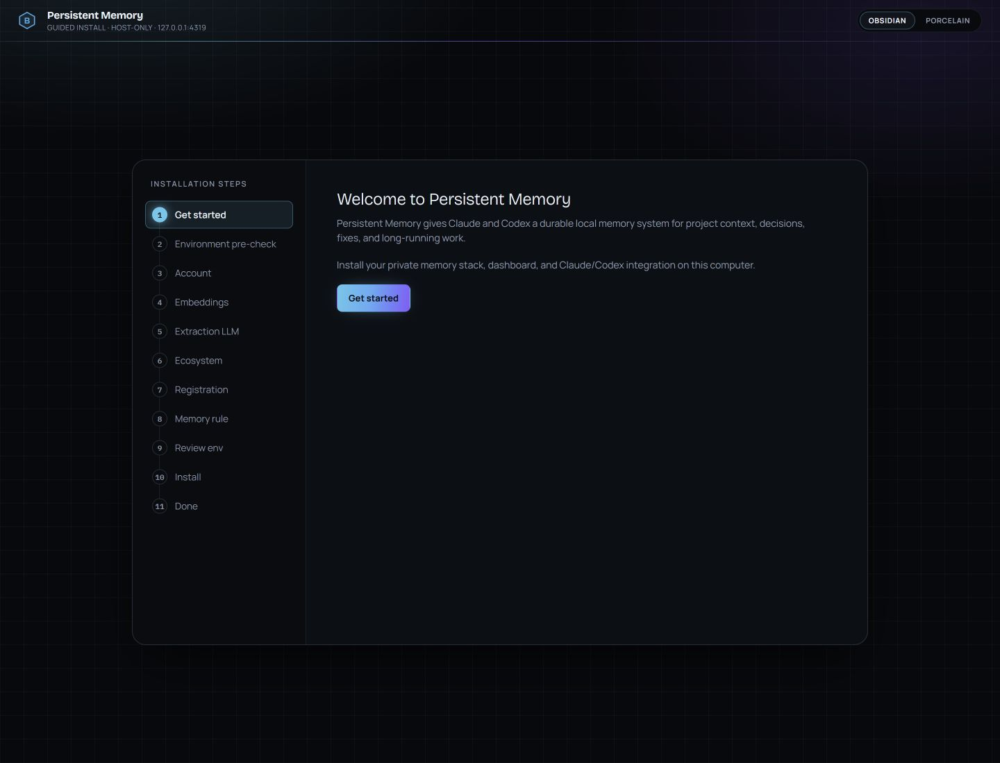

## 2. Check your environment

Confirm Node 24 LTS or Node 22.12+ in the Node 22 line, Docker, Docker Compose,
and Ollama are ready. Windows also requires Git for Windows. On Windows, prepare
Node, Git, and Docker manually; use **Install** or **Start** in the Ollama card
to prepare local embeddings. Resolve failed prerequisites before proceeding to
the next wizard step. Missing Ollama does not prevent launching the wizard.

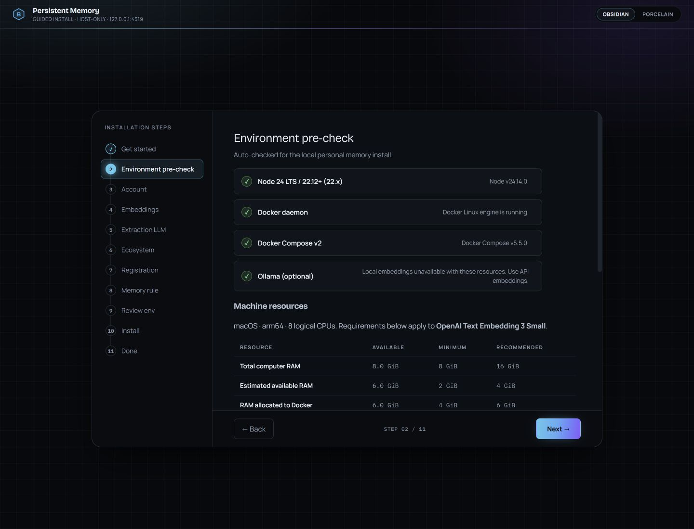

## 3. Set up the local dashboard

An optional dashboard password sends **Go to dashboard** through the local login
screen. Leave it blank to open Personal Overview directly after installation.

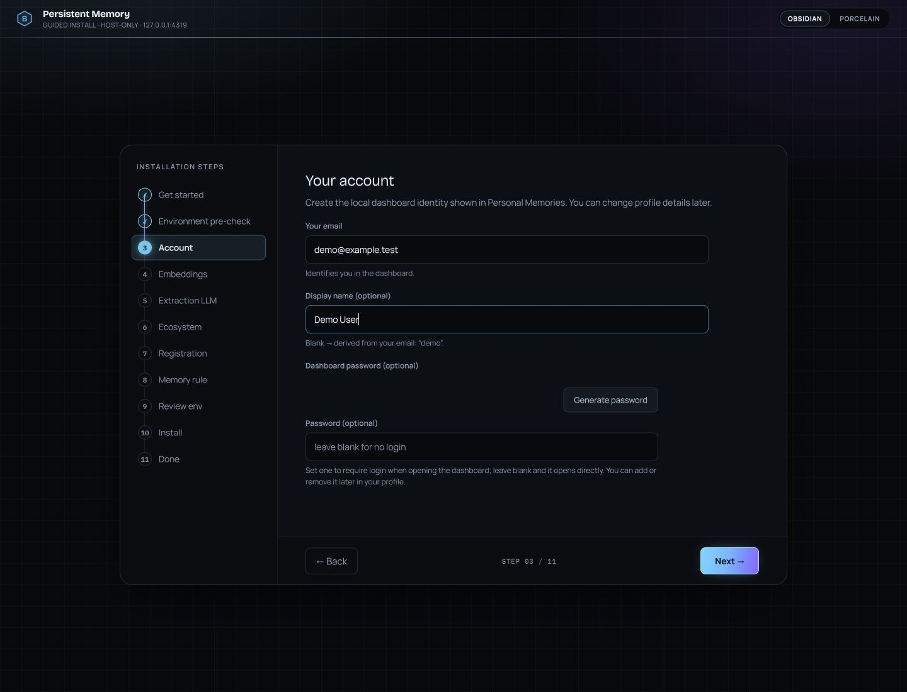

## 4. Choose embeddings

Pick the local embedding model appropriate for your available memory and
performance requirements.

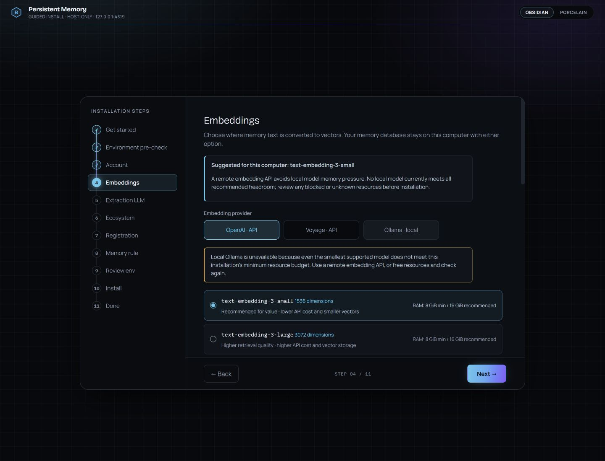

## 5. Configure fact extraction

Choose your extraction provider and model, then run **Test fact extraction**.
The installer keeps Next disabled until that test succeeds for the current key
and model.

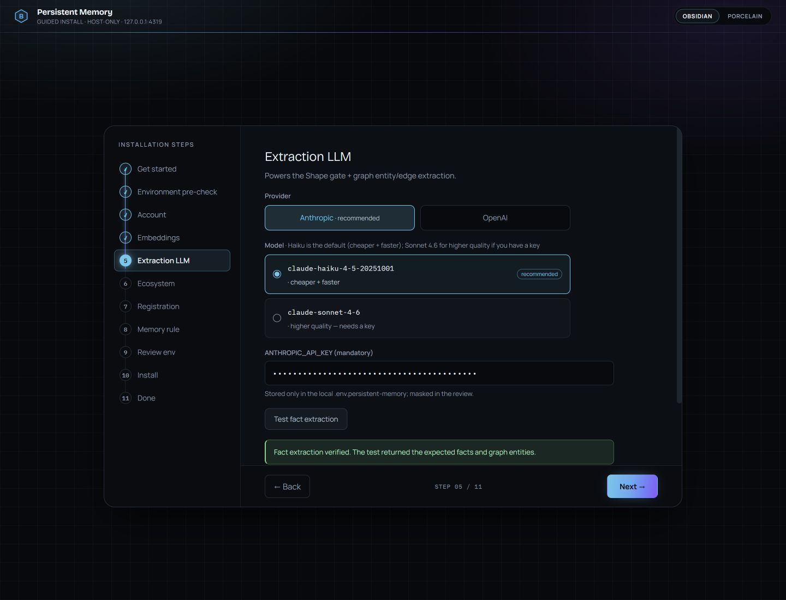

## 6. Select AI tools

Review the detected Claude and Codex tools. Only the tools you choose receive a
Persistent Memory stream-MCP registration.

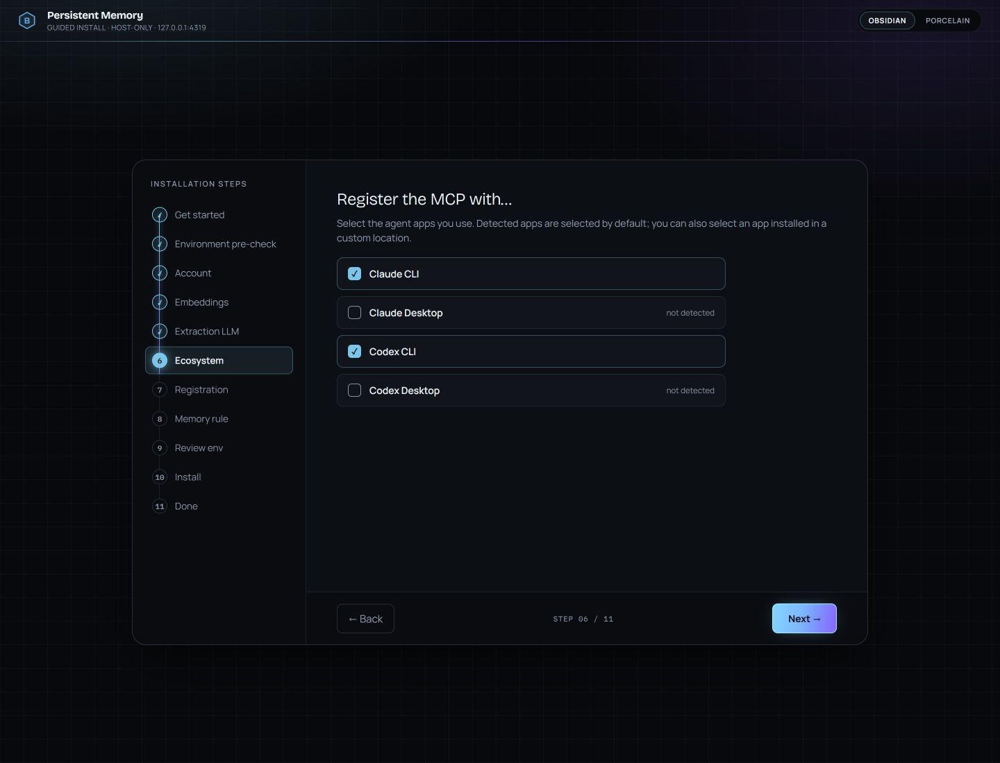

## 7. Choose registration level

**Global Level** is recommended when the selected tool should use Persistent
Memory across projects. Choose Project Level only for a repository-specific
registration.

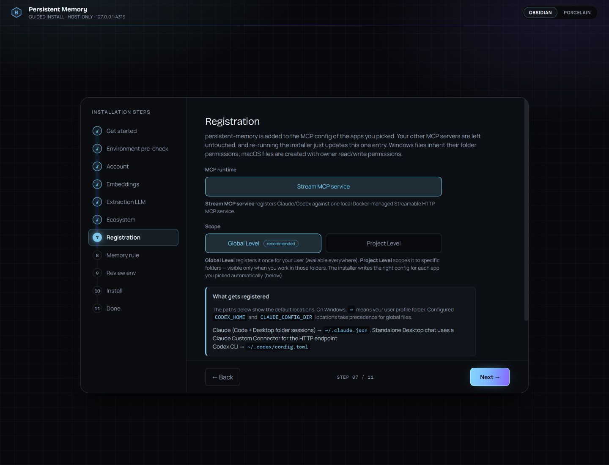

## 8. Review the memory rule

The rule tells selected AI tools how to recall project context and save durable
corrections. Review it before continuing.

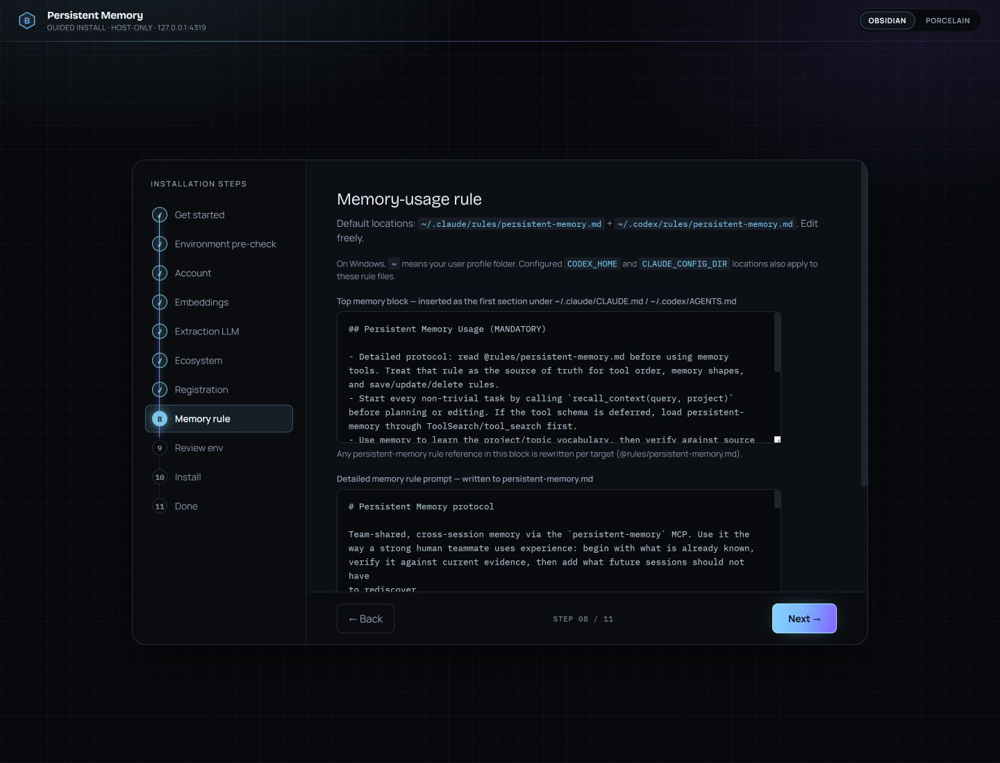

## 9. Review the generated environment

Confirm the local dashboard URL, stream runtime, local embeddings, and selected
integrations. Secrets remain masked.

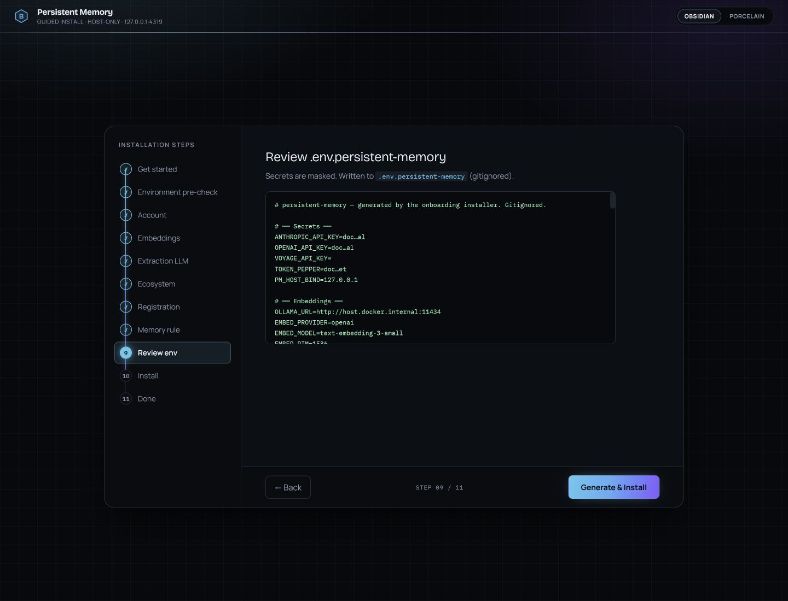

## 10. Shared Memories is optional

Skip this step to finish with Personal Memories only. You can connect a Shared
Memories server later from your local dashboard.

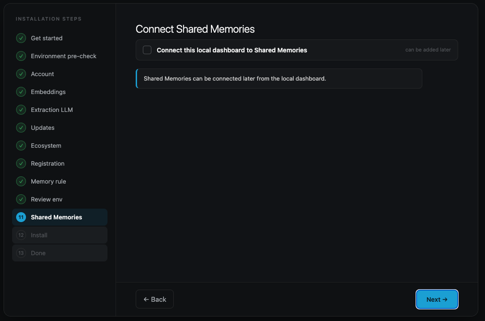

## 11. Install

Choose **Generate & Install** and wait for the local services, registrations,
and dashboard readiness checks to finish.

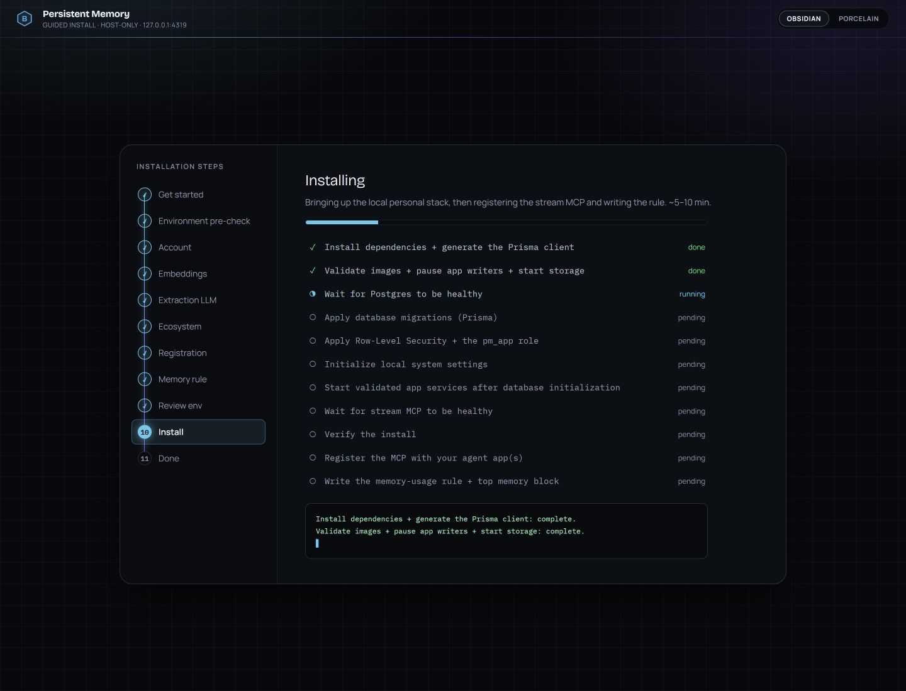

## 12. Open your dashboard

Select **Go to dashboard**. Passwordless installs open Personal Overview
directly; password-protected installs open the local login screen first.

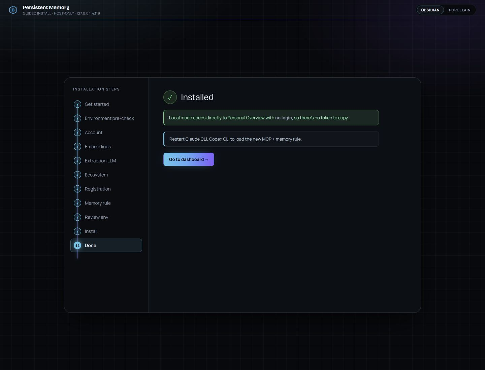

For routine updates, see the dashboard **Releases and updates** guide. For
removal and export, see [Uninstall memory stack](uninstall-memory-stack.md).
