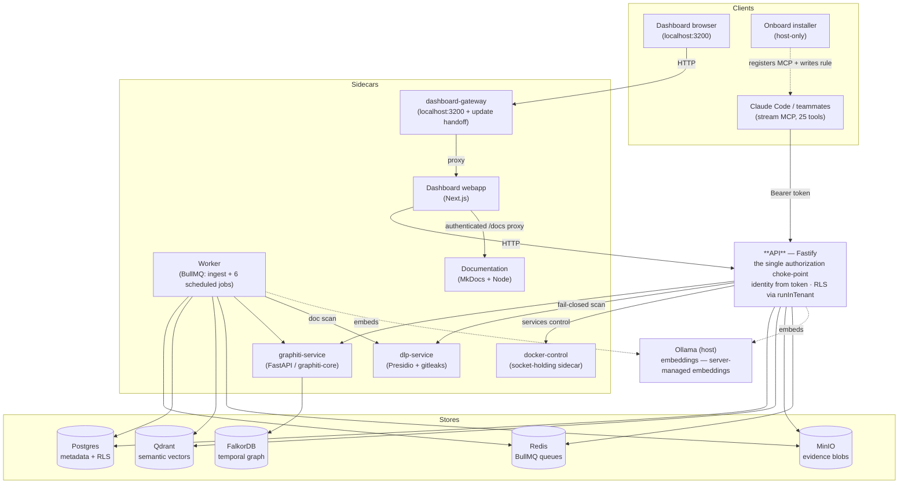

# persistent-memory — documentation

A Dockerized, **TypeScript-primary, team-scoped** memory + evidence platform for the QA team. It stores
**semantic memories** (Qdrant vectors), a **temporal knowledge graph** of entities/relations with
`valid_at`/`invalid_at` (Graphiti over FalkorDB), **canonical metadata** (teams, users, documents, claims,
investigations — Postgres), and **evidence blobs** (MinIO), and exposes all of it to Claude Code and
teammates through a stream **MCP** service (25 tools), a gateway-fronted
**dashboard webapp**, and a one-command **onboarding installer**.

> This `documentation/` tree is the committed source of truth for architecture,
> operations, access rules, and component deep dives. Agent files stay concise and
> link back here instead of carrying long status or gotcha archives.

## System at a glance





## Map of the docs

Start with [Windows preparation](installation/windows-installation.md) for a
manual Windows setup, or [Installation steps](installation/installation-steps.md)
for the shared Windows/macOS wizard.

### Cross-cutting
| Doc | What it covers |
|---|---|
| [stack-architecture/architecture.md](stack-architecture/architecture.md) | The whole system — workspaces, containers, data stores, how they talk. |
| [stack-architecture/access-model.md](stack-architecture/access-model.md) | Team-scoping: token-derived identity, own ∪ mounted vs universal reads, team-bound writes, RLS backstop. |
| [stack-architecture/security.md](stack-architecture/security.md) | Layered defenses: auth → app choke-point → RLS → fail-closed DLP/PII → the docker socket gate. |
| [stack-architecture/ingest.md](stack-architecture/ingest.md) | The document ingestion pipeline (upload → extract → DLP → version → chunk → embed → graph) + the 4-store delete. |
| [stack-architecture/embedding.md](stack-architecture/embedding.md) | Server-managed vs client-managed embeddings, the per-collection model+dim pin, and the no-blackout two-pass model switch. |
| [stack-architecture/memory-protocol.md](stack-architecture/memory-protocol.md) | Graph-first agent recall: `recall_context`, deferred-tool loading, tests, and Claude validation prompt. |
| [stack-architecture/benchmarking.md](stack-architecture/benchmarking.md) | Memory benchmark research, taxonomy, seed truth table, prompts, scoring, and test techniques for graph-first recall. |
| [stack-architecture/operations.md](stack-architecture/operations.md) | Install/update, safe dev redeploys, day-2 ops from the dashboard, migrations, `rls:check`. Owner / on-call. |
| [release-history.md](release-history.md) | Documentation service/source release history and current docs version. |

### Components
| Component | Doc |
|---|---|
| API (Fastify, the choke-point) | [components/api.md](components/api.md) |
| Worker (ingest + scheduled jobs) | [components/worker.md](components/worker.md) |
| MCP (stream service, 25 tools) | [components/mcp.md](components/mcp.md) |
| dashboard-gateway (localhost front door) | [components/dashboard-gateway.md](components/dashboard-gateway.md) |
| Dashboard webapp (Next.js) | [components/dashboard.md](components/dashboard.md) |
| Onboard installer | [components/onboard.md](components/onboard.md) |
| `@pm/shared` (Prisma-free core) | [components/shared.md](components/shared.md) |
| `@pm/db` (Prisma + RLS wrapper) | [components/db.md](components/db.md) |
| docker-control (socket sidecar) | [components/docker-control.md](components/docker-control.md) |
| graphiti-service (temporal graph) | [components/graphiti-service.md](components/graphiti-service.md) |
| dlp-service (PII + secrets) | [components/dlp-service.md](components/dlp-service.md) |

## Build and serve

```bash
npm run docs:install
npm run docs:build
npm run docs:serve
```

Generated HTML stays under `.local/generated-docs/site` and is never committed.
The Compose `documentation` service builds the same source and serves it on its
internal port. Dashboard route handlers proxy `/docs/*` behind normal dashboard
authentication. `/documentation?space=personal` is a separate native dashboard
guide for pages and tools, with a **Stack documentation** action that opens this
MkDocs manual in a new tab.

`npm run docs:serve` opens `http://localhost:3200/docs/index.html` when the
Compose service is running and that dashboard endpoint is reachable. Otherwise,
the command builds the site and starts the dependency-free local Node server on
`http://127.0.0.1:8000`.

## Dashboard visual guides

`spaces/` is the canonical source for user-facing dashboard help. The
Personal Space guide contains one Markdown topic per dashboard workflow and uses
the privacy-safe screenshots in `assets/spaces/personal/`. The native
dashboard documentation page and this MkDocs site both render those files, so
guidance does not drift between the two surfaces.

When updating screenshots, capture the real dashboard at 1920 x 873 and redact
before committing. Every data-derived value on a Memories capture must be
blurred, including memory text, project/tag/badge values and counts, graph and
tab counts, node labels, active-focus chips, accessible-node rows, details,
timestamps, metadata, and author values. A project filter is not a privacy
boundary. Also blur the profile email. Do not retain session IDs, credential fingerprints, private URLs,
UUIDs or absolute home paths in committed assets. Never retain unredacted raw captures
in the repository. Shared Space and the separate hosted
superuser dashboard remain explicitly marked in development.

## The one rule that explains the rest

**Identity is server-derived from the bearer credential; the API is the single authorization choke-point; RLS is the
backstop.** Every data-plane query runs inside `runInTenant(...)`, which sets the per-request GUCs that the
Postgres RLS policies read. Widening access is always a *policy reading a GUC*, never a role bypass. See
[stack-architecture/access-model.md](stack-architecture/access-model.md) and
[stack-architecture/security.md](stack-architecture/security.md).
