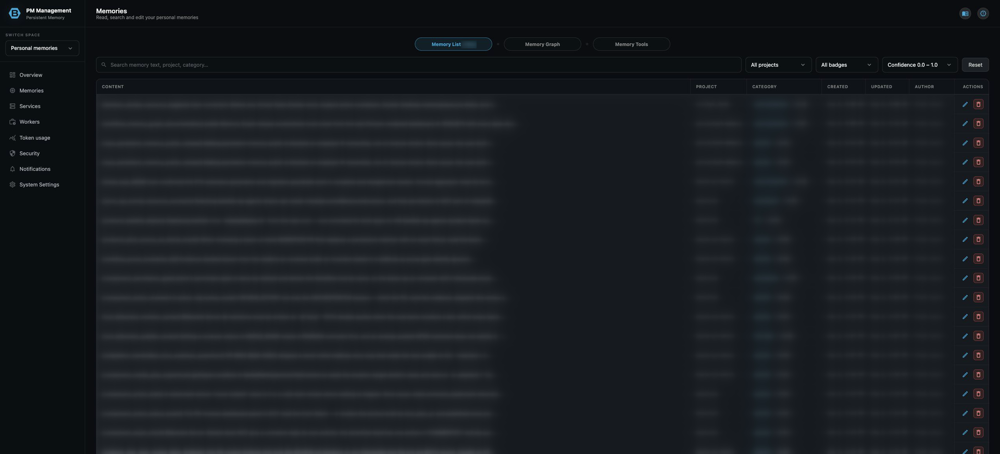
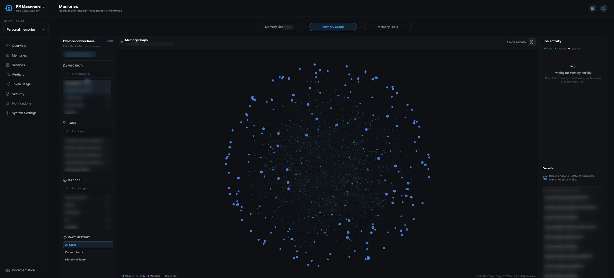
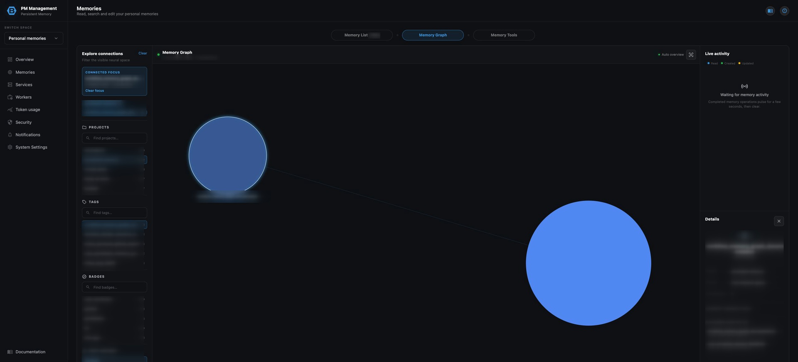
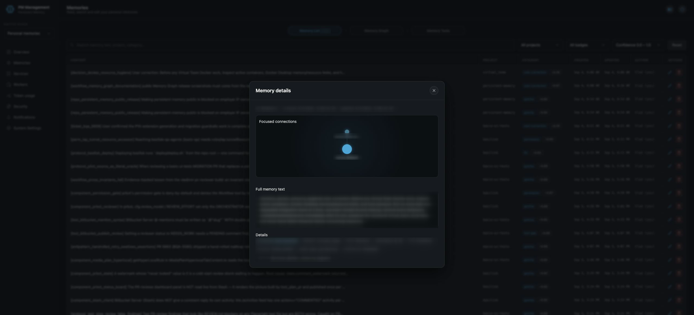
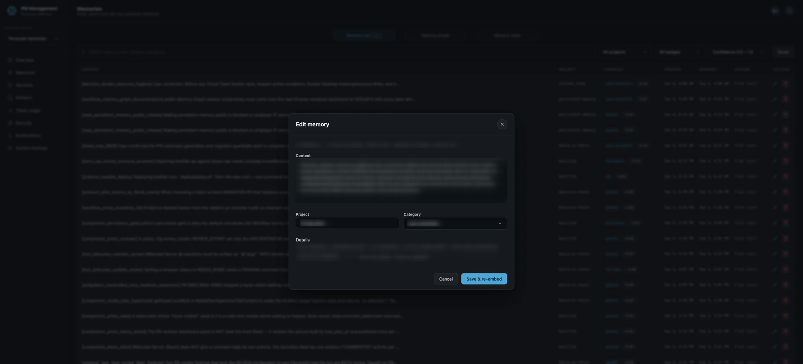
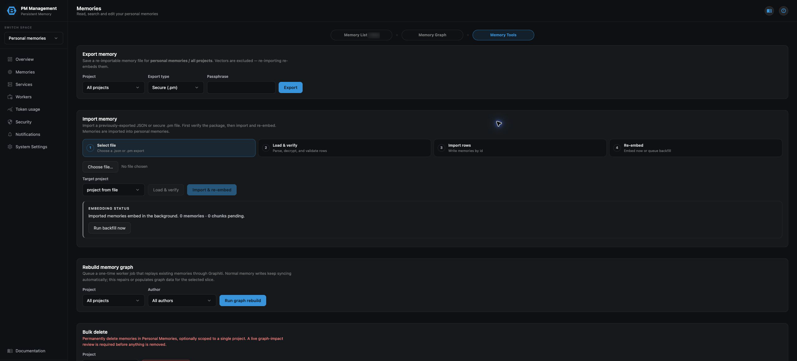

# Memories

## Purpose

Memories is the working area for records stored in your local Personal Space. The list refreshes automatically and supports live text search, project filtering, dynamic category-badge filtering, and a confidence range, record inspection, editing, and deletion. It loads 50 records at a time and continues as you scroll, rather than rendering the full history at once. **Memory Graph** explores the same authorized corpus as a live connection map, while **Memory Tools** contains bulk and file workflows.

## Read the page

The search field fills the available row width while the project, badge, confidence, and Reset controls remain compact on the right. The confidence menu opens upward when needed; choose the minimum and maximum in 0.1 steps, then choose **Apply**. **Reset** clears the current query and filters. Each row shows content, project, category, Created, Updated, author, confidence or embedding badges, and actions. Created is when the record was added; Updated advances only when the memory record itself changes, not when embedding, graph sync, safety bookkeeping, or access reinforcement runs.

### Memory Graph

Open **Memory Graph** to see memories on the outer shell of a rotatable sphere and their entity subnodes inside it. The initial camera fits the full loaded bubble. Drag to rotate and scroll or pinch to zoom. Right-drag moves the bubble up, down, left, or right on screen; rotation keeps pivoting around the center of the sphere rather than the point you dragged to. Rotation keeps automatic framing active; when the corpus grows, automatic framing changes only camera distance and preserves the angle you chose. Zooming in changes to **Manual view**, so newly arriving memories cannot take the camera away. Zoom-out stops as soon as the complete visible graph fits. Fully zoom out or choose **Reset view** to restore **Auto overview** without resetting rotation.

The fitted overview intentionally hides labels. As you zoom, labels are chosen from the nearest nodes currently visible through the camera instead of from a fixed corpus order. A node stays clickable across its whole visible circle at every zoom level. Projects, Tags, and Badges use recent values plus search. Multiple values inside one section are alternatives, while the three sections combine together. Drag the right edge of the filter rail to resize it; the dashboard remembers that width in this browser.

Selecting a node isolates that node and its directly connected memories or entities and shows that focused connection set as a flat 2D map, which is easier to read than a rotating one. The left rail shows the connected focus as an active filter. **Clear focus** or the **Details** close button returns to the 3D bubble at exactly the rotation, zoom, and position it had before the selection. **Reset view** and the rail's **Clear** instead return to the starting frame: both drop the remembered viewpoint, re-center the projection, and fit the corpus again while keeping your rotation. **Clear** does that because it also restores every filtered-out memory, so the narrowed viewport no longer applies. The right rail remains split evenly: **Live activity** stays visible above **Details**, and the accessible node list scrolls through all nodes available in the current corpus or focused connection set.

While the tab is visible, each completed create, update, or read appears briefly in **Live activity** and then expires; cyan means read, green means created, and amber means updated. For a little over three seconds, the touched memory and entity dots emit target-like waves while their connected lines brighten and carry moving particles. This is coalesced visualization telemetry, not an audit log. Project, tag, and badge searches are independent, and **Fact history** can show all, current, or historical relationships. The graph retains its last snapshot if activity or Graphiti facts are temporarily unavailable, and a partial-state message explains renderer or server bounds. A WebGL loss keeps the flat 2D map for the rest of the session with the same data and filters.

Open a record to read its full text and metadata, including category, project, confidence, tier, source, shape, embedding state, and entities.
The focused connection panel shows up to eight of that record's entity links.

Editing supports content, project, and category. **Save & re-embed** updates the record and rebuilds its embedding so search reflects the new text. Expected validation or conflict errors appear in a toast while the editor stays open, so the rejected fields can be corrected without losing the draft.

Memory Tools provides export, verify-first import, graph rebuild, embedding backfill, and bulk deletion. Personal Memories has no team selector: its tools always act in the local personal space.

## Actions

1. Type in search or choose a project; results update without a separate Search button.
2. Open a row to inspect the full record before changing it.
3. Open Memory Graph to rotate the full bubble, zoom for labels, filter by recent or searched facets, or select a node for its flat connection map.
4. Select edit, make the smallest needed change, then choose **Save & re-embed**.
5. Select delete to review its live graph impact, then confirm the removal. A graph-primary record clearly shows its cascade impact.
6. In Memory Tools, choose a secure `.pm` export when the file needs passphrase protection. Standard JSON is readable text.
7. For import, choose a file and run **Load & verify** first. Review the detected format, record count, target project, and errors before **Import & re-embed** becomes available.
8. Use graph rebuild to queue replay of the selected memory slice through the graph service.
9. Choose All projects or one project, then choose **Review bulk delete**. The preview covers every selected memory and recorded graph episode; confirm with the short-lived token only after reviewing the impact.

## States

| State | Meaning |
| --- | --- |
| Confidence | A write-time extraction/provenance value. Retrieval combines it with provenance; it is not the query-specific rank. |
| Access recency | A returned own-team memory refreshes its recency, which can raise its next retrieval rank without changing confidence. |
| Auto overview | The full loaded bubble is fitted and corpus growth may adjust camera distance. Rotation does not leave this state or get reset by automatic fitting. |
| Manual view | The user zoomed in; corpus changes render without moving the camera. Full bounded zoom-out or Reset view restores auto overview while preserving rotation. |
| Graph partial | The current authorized snapshot, Graphiti fact set, or renderer reached a declared bound. Narrow the filters for a more complete local view. |
| Live activity stale | The last graph stays visible while activity polling backs off and retries. It does not emit false pulses. |
| Graph primary | The record is currently primary provenance for one or more graph facts; deletion shows the live cascade impact. |
| Pending embedding | The record exists, but vector work is queued. Use the embedding status or backfill controls to follow up. |
| Import verifying | The file is being parsed, decrypted if needed, and validated; no rows are imported yet. |
| Import ready | Verification passed and the import summary is available for review. |
| Import completed with errors | Valid rows may have imported while row-level failures are listed inline. |

## Cautions

> **Caution**
>
> Single and bulk deletion are irreversible. The dashboard requires a live graph-impact preview before confirmation; a bulk token expires after five minutes and is rejected if its selected records or graph episodes change.

A project is also a graph-history boundary. After a memory has synchronized graph history, its project cannot be moved in place. To correct the project, create and verify an equivalent replacement in the target project, then delete the original only after reviewing its graph cascade preview.

Keep secure-export passphrases outside the export file. A standard JSON export can expose memory content to anyone who can read the file.

## Troubleshooting

| Problem | What to do |
| --- | --- |
| Search returns nothing | Clear the project, badge, and confidence filters, then shorten the query or confirm the record is in this space. |
| Import button stays disabled | Run **Load & verify** successfully first. For `.pm` files, enter the correct passphrase and verify again. |
| Imported memories are pending | Wait for background embedding, run backfill when available, and inspect Workers for the embed-backfill schedule. |
| A project edit says graph history is immutable | Keep the original until an equivalent memory is embedded and verified in the target project. Then review the original memory's graph cascade preview and confirm deletion. |
| Edited text is not found immediately | Confirm **Save & re-embed** succeeded and wait for the embedding state to complete. |
| A graph rebuild has no immediate visual result | It queues a worker job. Follow the job and its logs on Workers. |
| The graph stays flat after clearing a selection | WebGL could not initialize or its context was lost. The fallback keeps the same nodes, filters, and selection for the rest of the session. |
| New activity does not pulse | Keep Memory Graph selected and the browser document visible. Hidden or inactive graph tabs do not poll. |
