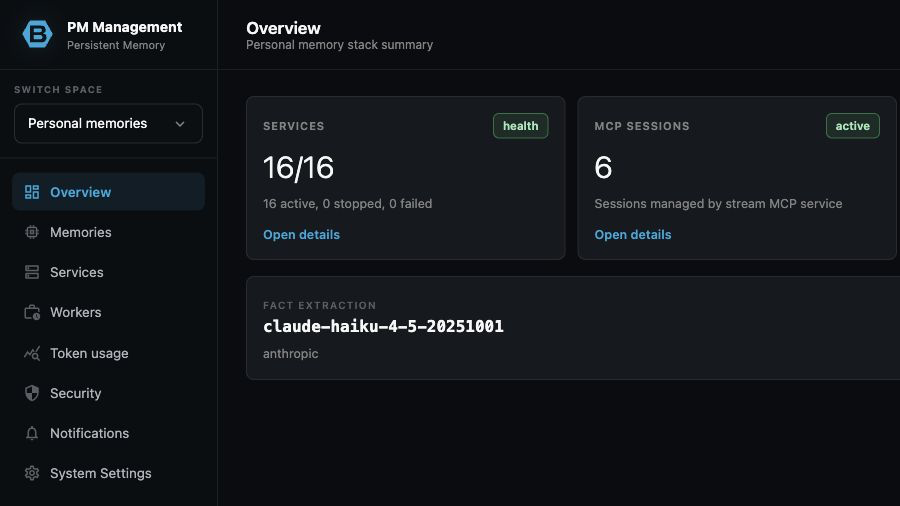
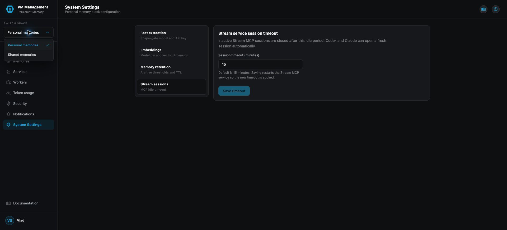
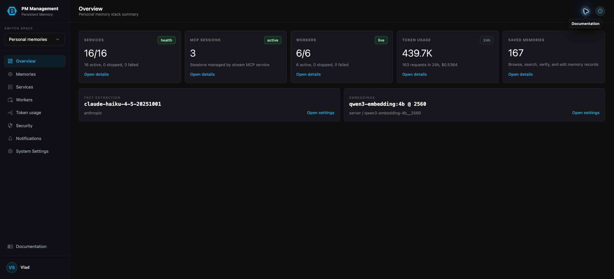

# Navigation and spaces

## Purpose

Use the dashboard navigation to keep actions in the correct data space and to reach help, release information, and your profile from any page.

## Read the page

The space switcher is above the page links. The sidebar below it changes to match the selected space. The highlighted row is the current page. **Documentation** stays near the bottom, while your profile row is always last. This focused view intentionally centers the navigation rather than repeating the Overview guide's page-level image.

When something needs attention, the relevant **Security**, **Services**, or **Workers** row shows a small red **!** at the right. It is a live status signal, not a second queue: open Security findings keep the Security signal visible until the final finding is resolved; an unavailable or stopped service marks Services; an enabled failed worker or missing worker heartbeat marks Workers. A deliberately paused worker does not create an alert.

The top-right book icon opens dashboard documentation. The release icon beside it opens release notes. Hovering an unfamiliar icon shows its tooltip.

The switcher lists **Personal memories** and **Shared memories**. Personal Space operates the local stack. Shared Space is in development and must not be treated as a completed connection or setup flow.

## Actions

1. Open the space switcher and choose **Personal memories** for every workflow in this guide.
2. Select a sidebar page. The selected space is preserved in the destination URL.
3. Hover an icon to read its label before activating it.
4. Open the book icon for page help or the release icon for version history.
5. Select your name or avatar at the bottom-left to open **Your profile**.

## States

| State | What changes |
| --- | --- |
| Personal memories selected | Local Overview, Memories, Services, Workers, Token usage, Security, Notifications, and System Settings are available according to your access. |
| Shared memories selected | The sidebar changes to the Shared Space surface. This space is in development. |
| Active page | Its sidebar row uses the accent highlight. |
| Tooltip visible | The hovered icon's name appears without navigating. |
| Narrow viewport | The same destinations remain available, but the navigation may compress. |

## Cautions

> **Caution**
>
> Always check the space switcher before editing or deleting a memory. Personal and Shared are distinct surfaces even when a page name is the same.

Selecting Shared Space is not a substitute for installing or configuring a shared server. Shared Space is currently in development.

## Troubleshooting

| Problem | What to do |
| --- | --- |
| A link opens the wrong space | Re-select **Personal memories**, then open the destination from the sidebar. |
| A tooltip does not appear | Keep the pointer over the icon briefly, or use the icon's accessible label with keyboard navigation. |
| System Settings is absent | That page is limited to users who can change local system configuration. |
| The profile modal does not open | Close any existing modal, then select the profile row again. |
