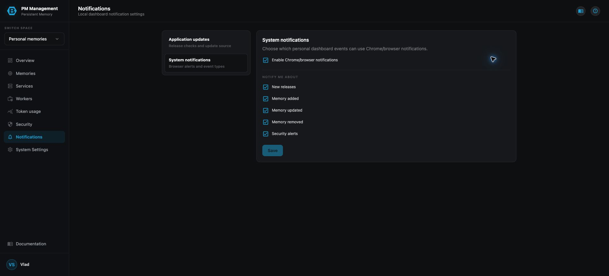

# Notifications

## Purpose

Notifications controls two related Personal Space features: the release source used to detect application updates and the local Chrome or browser notifications used for selected dashboard events.

## Read the page

The left settings menu switches between **Application updates** and **System notifications**. System notifications contains a master browser-notification checkbox followed by event types: new releases, memory added, memory updated, memory removed, and security alerts.

The event checkboxes are unavailable until browser notifications are enabled. **Save** becomes available only after a preference changes.

## Actions

1. Open **System notifications**.
2. Enable Chrome or browser notifications. Approve the browser permission prompt when it appears.
3. Select only the event types you want.
4. Choose **Save** to register the current preferences.
5. Use **Application updates** to enable or disable release checks and configure the repository source used by the local updater. Choose **Test connection** before saving to validate the entered URL, token, repository, and branch without persisting them.

Personal Notifications has no test-send control. Saving preferences does not produce a sample notification.

## States

| State | Meaning |
| --- | --- |
| Browser notifications off | Event types are locked and no local browser alerts are requested. |
| Browser permission pending | The browser has not yet granted notification access. |
| Browser notifications on | Selected event types can create browser notifications. |
| Save disabled | Nothing changed, a save is in progress, or required update-source fields are incomplete. |
| Update checks disabled | The dashboard does not poll the configured source for new releases. |
| Token configured | The stored update-source token is retained when its write-only field is left blank. |
| Connection verified | The entered source can read the configured repository branch; no setting was changed by the test. |

## Cautions

> **Caution**
>
> Browser permission is controlled by the browser as well as the dashboard. Enabling the dashboard checkbox cannot override a browser-level block.

> **Caution**
>
> Repository access tokens are secrets. Leave the token field blank to keep an existing token, and enter a value only when replacing it. Never include the token in screenshots or prose.

## Troubleshooting

| Problem | What to do |
| --- | --- |
| Notifications never appear | Confirm the master checkbox is saved, the event type is selected, and the browser grants notifications for this dashboard. |
| Save is disabled | Change a setting first. For update checks, complete the required source fields without exposing their values. |
| You cannot find Test notification | Personal Space intentionally has no test-send action. Wait for a real selected event. |
| New-release alerts are absent | Run **Test connection** in Application updates, then correct the named setting or check the update-runner log with its request id. |
