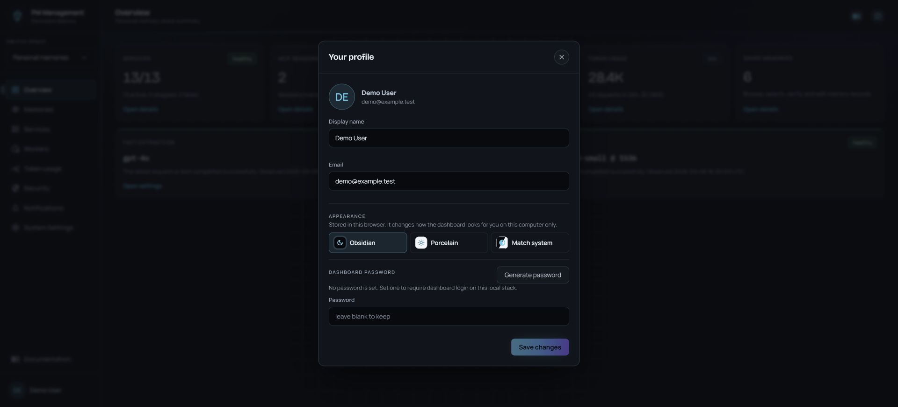

# Profile

## Purpose

Your profile stores the display name and email shown by the local dashboard and manages the password required to open it. Open the modal from your avatar and name at the bottom of the sidebar.

The same modal also lets you change dashboard appearance. You do not need access
to the superuser-only System Settings page to use this control.

## Read the page

The identity area shows your avatar, display name, and email. The form edits those values. The Dashboard password section explains whether a password is currently set and provides password generation and change controls.

**Save changes** is enabled only when a valid value actually changed. Password and recovery values are treated as secrets and can be shown only once in some flows.

## Appearance

Open **Your profile → Appearance** and choose a theme:

| Choice | Appearance |
| --- | --- |
| **Obsidian** | The default dark theme. |
| **Porcelain** | A light theme with the same controls and status meanings. |
| **Match system** | Uses this computer's light or dark preference. |

The choice takes effect immediately; it does not need **Save changes**. It is
stored in this browser profile for the dashboard address, rather than in your
server account. Other browsers, computers and dashboard addresses can have
different choices. Clearing site data resets the preference; blocked browser
storage may prevent it from surviving a reload.

The Memory Graph canvas intentionally stays dark in both themes so nodes,
connections and canvas overlays remain legible. Its surrounding controls and
details follow the page theme. Theme changes do not alter memory data, model
configuration, permissions or service state.

The installer has its own Obsidian/Porcelain control in the header. Its **Go to
dashboard** action carries that selection to the dashboard when setup completes.
The two addresses otherwise keep independent preferences; later changes in the
wizard do not continually synchronize with the dashboard. You can choose Match
system here afterward.

## Actions

1. Select the profile row at the bottom-left of the dashboard.
2. Edit the display name or email as needed.
3. To set or change a password, use **Generate password** or enter a strong password and confirmation. If a password already exists, provide the current password.
4. Copy a generated password immediately from its one-time display and store it securely.
5. On a local dashboard with an existing password, use **Remove the password** only when an open dashboard without login is intentional.
6. Select **Save changes**. If a recovery token is shown, copy and store it immediately; it is shown once.

## States

| State | Meaning |
| --- | --- |
| No password set | The local dashboard can open without password login. |
| Password set | Dashboard login is required; changing it requires the current password. |
| Temporary password | A warning asks you to replace the temporary value. |
| Weak or mismatched password | Save remains disabled and the field explains the problem. |
| Generated password shown once | Copy it before closing or editing the field. |
| Recovery token shown once | Store it for MCP/API setup and emergency dashboard recovery. |

## Cautions

> **Caution**
>
> Removing the local dashboard password allows anyone with access to the dashboard address on this machine to open it without login.

> **Caution**
>
> Generated passwords and recovery tokens are secrets. Do not include them in screenshots, documentation, chat, or source control.

Changing the profile email changes dashboard identity metadata; it does not configure notification delivery by itself.

## Troubleshooting

| Problem | What to do |
| --- | --- |
| Save changes is disabled | Make a real change and resolve password strength, confirmation, or current-password errors. |
| Generated password disappeared | Generate a new one. One-time values cannot be recovered from the modal. |
| Current password is rejected | Re-enter it carefully; do not remove login protection as a workaround unless that is your intended local security model. |
| Profile values look unchanged | Confirm the save success state, close the modal, and reopen it. |
| Appearance reverted after reopening the browser | Check whether site data was cleared or blocked, and whether you opened the same dashboard address and browser profile. |
| System Settings is unavailable | Use **Your profile → Appearance** to change the theme without system-settings access. |
