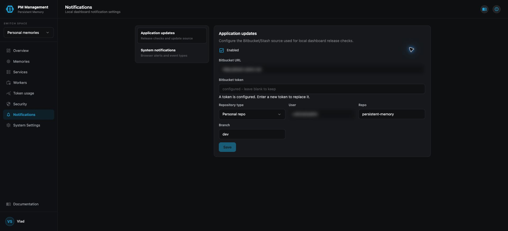
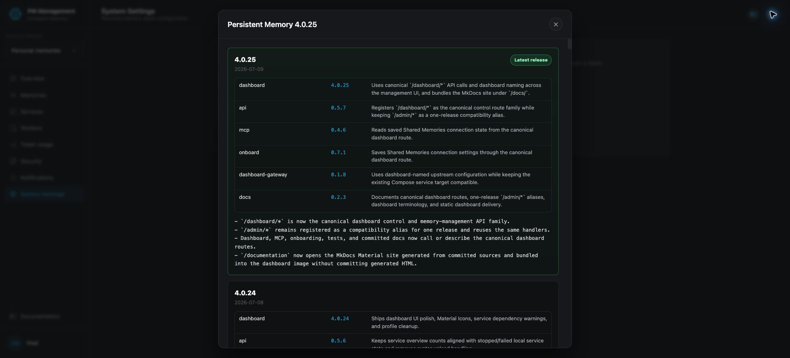
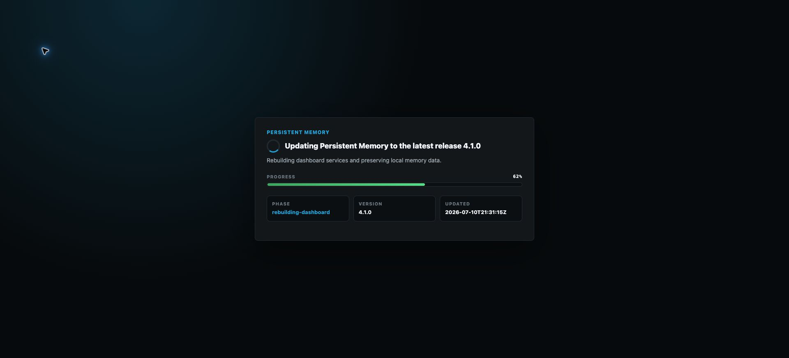

# Releases and updates



## Purpose

Personal Space can check a configured repository source for newer releases, show release notes, provide the supported updater command, and display a blocking progress handoff while local services rebuild.

## Read the page

**Notifications > Application updates** controls only release checks and notifications: the repository, owner, branch, and write-only access token the local dashboard uses to discover updates. Use **Test connection** to verify the currently entered source before saving; it does not change the stored configuration. Leaving a configured token field blank keeps the stored token.



The top-right release icon opens versioned release cards with component versions and user-facing changes. After a successful update, the dashboard can reopen the notes for the installed version automatically.



During an update, the dashboard displays the target version, current phase, timestamp, and progress percentage. Once the update source has been fetched, the displayed version is read from that fetched branch rather than from the release currently running on the machine. This handoff remains blocking while services are being rebuilt and the dashboard is not ready for normal use. It is independent of Application updates notifications: an already-open dashboard switches to the handoff even when release checks are disabled. If the browser is closed, the update continues safely and the next dashboard visit opens the completed release notes.

Long migration phases can also publish a read-only progress observation below the overall percentage. For example, Graph V2 rebuild reports completed, total, and remaining memories approximately once per minute. This is detail about the current phase, not a second completion bar; a failed observation does not interrupt the update or change the migration result.

## Actions

1. Configure **Application updates**, then choose **Test connection** to verify the source without exposing the token or saving a change.
2. Save the configuration after the connection succeeds.
3. When the bottom notification says **Update available**, select **Details**.
4. Review current and latest versions, branch, release notes, and any MCP restart warning.
5. Copy the displayed update command and run it from the repository in a terminal. Opening Details does not start the update.
6. Keep the dashboard open while the progress handoff reports the rebuild. The update first signals the gateway, then begins snapshot and rebuild work after open tabs have had a moment to switch screens. The page reloads when the updated dashboard is ready.
7. Read the release notes after reload. Restart Codex or Claude when the release explicitly says MCP changes require it.

## Update compatibility

Installations on release 4.0.24 or later can use the normal update command
directly. Installations on 4.0.0–4.0.23 first need this one-time bootstrap from
the repository root, then they can use the normal update command:

```bash
git pull --ff-only origin master
```

`--ff-only` only advances the local branch when the trusted remote directly
contains the current commit; it refuses a divergent checkout and does not
overwrite local work.

## States

| State | Meaning |
| --- | --- |
| Update checks disabled | No repository polling or update-available notification is expected. A real terminal update still uses the safety handoff. |
| Up to date | The configured branch has no newer release or commit for this installation. |
| Update available | A newer release or configured-branch revision was detected; Details is available. |
| Details open | The dashboard shows versions, notes, branch context, and the terminal update command. |
| Updating | The handoff overlay shows the active rebuild phase and progress. |
| Ready | The updated dashboard reloads and may open the installed release notes. |
| Failed | The handoff or Details view reports an error; do not assume the new version is active. |

## Cautions

> **Caution**
>
> Use the update command shown by the dashboard. The updater snapshots local data before rebuilds, but you should still avoid interrupting the process or closing the terminal while it is active.

> **Caution**
>
> Repository tokens are secrets. A blank token field keeps the existing value; enter a new token only to replace it, and never expose it in prose or screenshots.

Do not treat the version shown in a screenshot as the current release. Always read the live Current version and Latest version values.

## Troubleshooting

| Problem | What to do |
| --- | --- |
| No update-available notification appears | Use **Test connection**. Its error names the failed setting or Bitbucket response and records a request id in the update-runner service log. |
| Details opens but nothing updates | This is expected until you run the displayed command in a terminal. |
| Progress appears stalled | Keep the terminal and dashboard open, read the current phase and error, and wait for long rebuild steps before retrying. |
| Dashboard reloads but MCP tools are stale | Follow the release warning and restart Codex or Claude so MCP schemas reload. |
| Release history cannot load | Reopen the release icon after the dashboard is healthy; a transient dashboard or asset error can prevent the modal from loading. |
