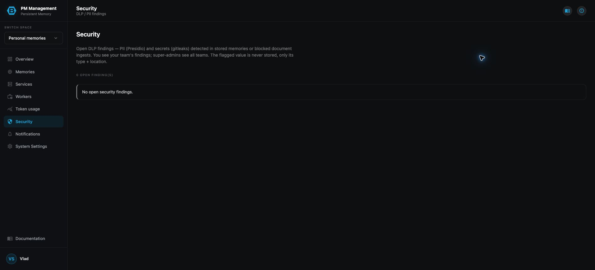
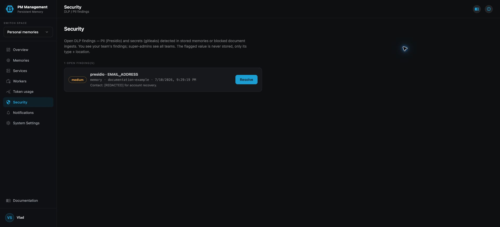

# Security

## Purpose

Security lists open findings produced when the stack detects personally identifiable information or secret-like content in stored memories or blocked document ingests. It is a focused open-findings queue, not a general audit browser.

## Read the page

The page shows the number of open findings. With no findings, it displays a single empty-state message. There are no search, severity, type, project, or date filters on this page.

A finding shows severity, detector and type, source kind, project or location context, time, and a redacted preview. The detected raw value is not displayed.

## Actions

1. Read the detector type, source, location, severity, and redacted context.
2. Investigate the underlying memory or ingest outside the finding card when remediation is needed.
3. Select **Resolve** only when the finding no longer needs to remain in the open queue.

Resolve is immediate. There is no confirmation dialog and no filter needed before it runs.

The sidebar **Security** row shows a red **!** while this queue has one or more open findings. It clears immediately after the final finding is resolved. When Chrome/browser notifications are enabled and **Security alerts** is selected in Notifications, a newly recorded finding also sends the existing browser notification.

## States

| State | Meaning |
| --- | --- |
| No open security findings | The scanner currently reports no unresolved findings for Personal Space. |
| Open finding | A DLP or secret detector produced a record that still needs review. |
| Low, medium, or high | Finding severity used to help prioritize review. |
| Redacted preview | Context is shown without exposing the detected value. |
| Resolved | The finding is removed from this open-findings view. |

## Cautions

> **Caution**
>
> Resolve is immediate and does not confirm. It closes the finding record; it does not edit or delete the underlying memory or document by itself.

Do not paste a suspected secret into notes, search fields, or support messages. Use the finding metadata and redacted location to investigate safely.

## Troubleshooting

| Problem | What to do |
| --- | --- |
| A resolved issue remains visible | Reopen the page after the action completes. If it returns later, a subsequent scan may have detected the condition again. |
| You need filters | The current Personal Security page has no filters. Review the open list directly. |
| A known issue is not listed | Check the `pii-scan` worker status and latest log, then confirm DLP services are healthy. |
| Resolve was selected by mistake | Recheck the underlying source. There is no undo control on the open-findings page. |
