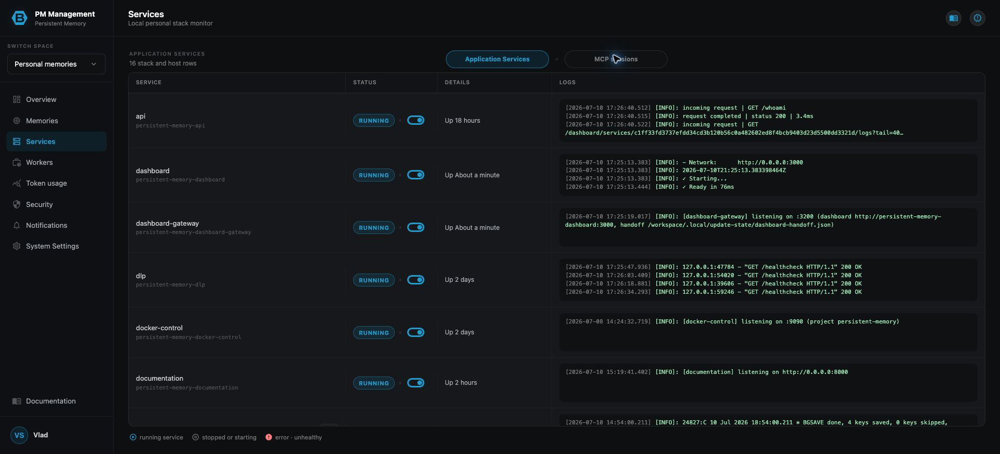
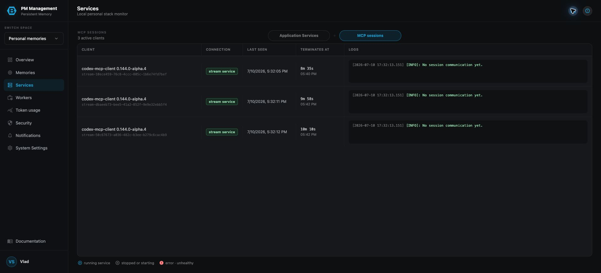
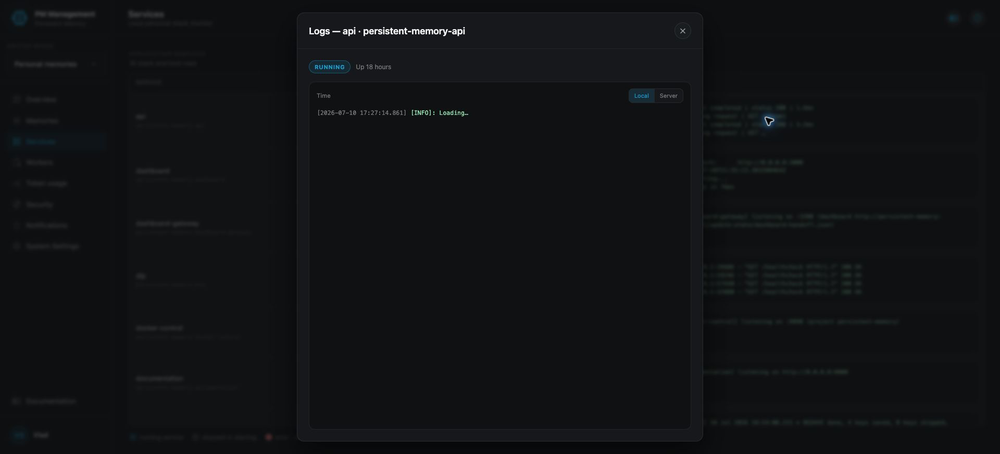

# Services

## Purpose

Services shows whether the local stack and connected Stream MCP clients are available. It refreshes automatically; there is no manual **Refresh** button.

If a service is unavailable or stopped, the sidebar **Services** row also shows a red **!**. Starting and not-yet-observed rows do not raise this signal.

## Read the page

**Application Services** lists each stack or host service, its state, uptime or diagnostic detail, and a live log preview. The legend distinguishes running, stopped or starting, and error or unhealthy rows.

**MCP sessions** lists the client, connection type, last activity, idle-time termination time, and session log preview. A session can disappear after the configured idle timeout and reconnect when the client next uses the MCP.

Opening logs shows a larger tail that refreshes automatically. When both local and server log sources are available, use the source control inside the modal.

## Actions

1. Switch between **Application Services** and **MCP sessions** using the page tabs.
2. Read the status, detail, and inline log preview before changing a service.
3. Select a log preview to open the live log modal.
4. Use a service toggle to start a stopped service or stop an active service. The page refreshes the row after the action.
5. Review any dependency or self-stop warning before confirming a stop.
6. Where available, open the credentials control to view or copy service credentials.

## States

| State | Meaning |
| --- | --- |
| Running | The service is active. Health details may still identify a degraded dependency. |
| Stopped or starting | The service is not ready yet. A recent start can remain transitional briefly. |
| Error or unhealthy | The service failed or its health check is not passing. Inspect logs and dependencies. |
| Active MCP session | A client currently has a Stream MCP session. |
| Termination countdown | Remaining idle time before that session is closed automatically. |
| Docker control unavailable | Service listing and control cannot be completed from this page. |

## Cautions

> **Caution**
>
> Starting or stopping a service is an immediate operational action. Stopping a dependency can break every service that relies on it. Read the warning and affected-service list before confirming.

> **Caution**
>
> The credentials modal reveals real secret values and can copy them to the clipboard. Close it promptly, do not capture it in screenshots, and treat clipboard contents as sensitive.

Stopping the Docker control service disables the Services page control path, including the ability to start that service again from the dashboard. Stopping the dashboard or gateway can interrupt the page you are using.

## Troubleshooting

| Problem | What to do |
| --- | --- |
| Status does not update instantly | Wait for the automatic refresh. There is intentionally no manual Refresh control. |
| A service will not start | Inspect its logs and any stopped dependency called out in the row or warning. |
| Inline logs look old | Open the log modal and wait for its automatic tail refresh. |
| MCP client is missing | Confirm the client is running, then perform an MCP action so it opens a fresh Stream session. |
| Service controls are absent | Your account may have view access without control or credential access. |
