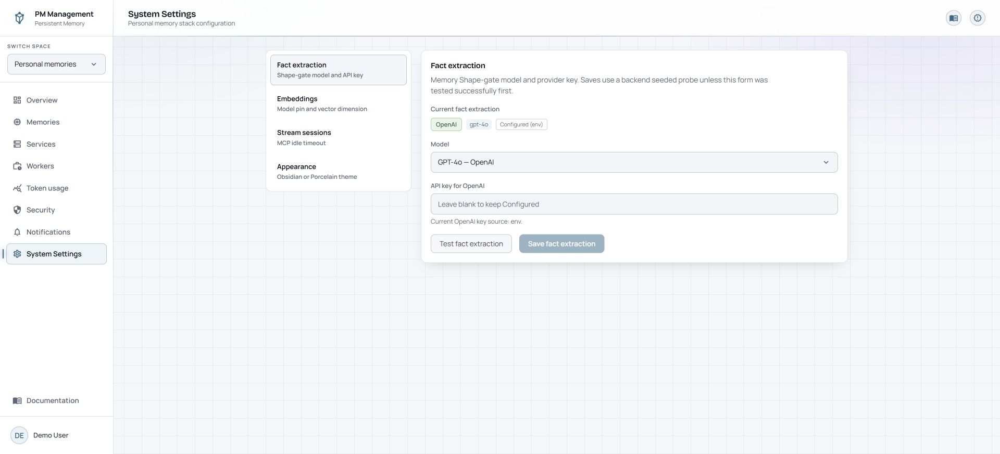
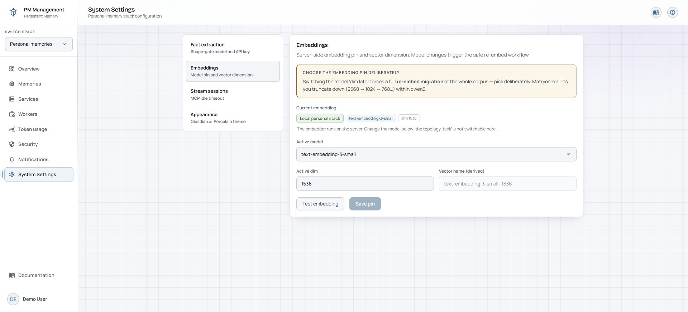
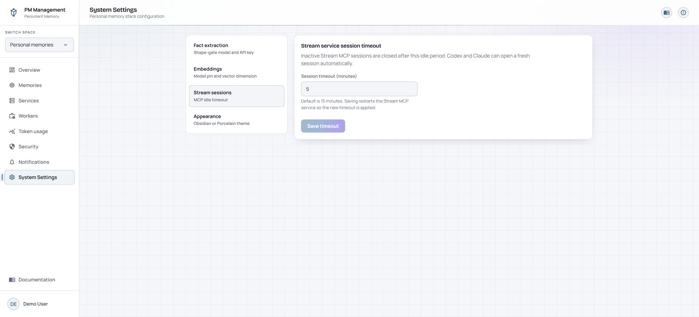
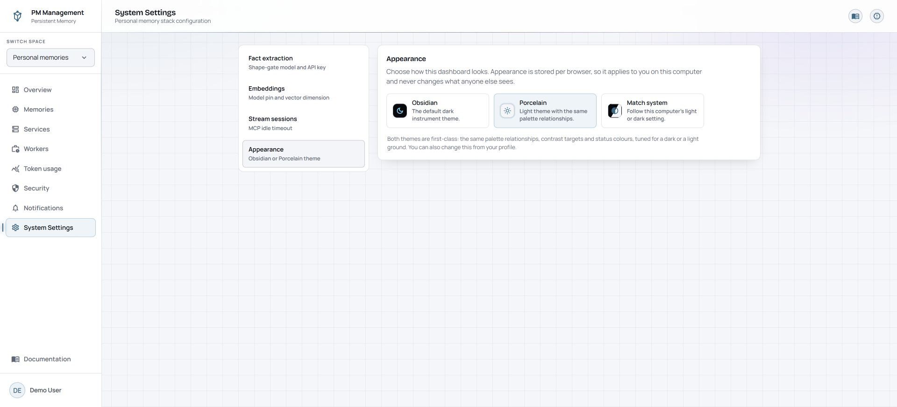

# System Settings

## Purpose

System Settings changes how the local stack validates memories, builds vector search, and closes idle Stream MCP sessions. These controls affect future behavior and, for embeddings, can start substantial background work.

This page is available to superusers. Appearance is also available from
[Your profile](profile.md#appearance), including when System Settings is absent.

## Read the page

The local dashboard's left menu selects **Fact extraction**, **Embeddings**,
**Stream sessions**, or **Appearance**. A shared-server operator console also
has a **Dashboard login** section.

**Fact extraction** shows the active provider, model, and masked key source. You can choose a model, optionally replace its provider key, test the configuration, and save it. A blank key field keeps the stored key.

**Embeddings** shows the fixed install topology, current model and dimension, and derived vector name. The topology is read-only here. A changed model or dimension reveals a re-embed warning and acknowledgement; saving begins the safe re-embed workflow.

**Stream sessions** sets the idle timeout in minutes. Saving restarts the Stream MCP service to apply the new timeout; clients can open fresh sessions automatically.

**Appearance** offers **Obsidian** (the default dark theme), **Porcelain** (light),
and **Match system**. Choosing one changes this browser's dashboard immediately;
there is no save or service restart. The choice belongs to this browser profile
and dashboard address, not the server configuration. The graph canvas remains
dark in both themes. See [Appearance](profile.md#appearance) for persistence and
profile access.

## Actions

1. For fact extraction, choose a model, enter a replacement key only when needed, run **Test fact extraction**, then save. If you save without a successful manual test, the backend performs its seeded validation probe.
2. For embeddings, test the proposed model and dimension. If they changed, read and select **I understand this re-embeds the corpus**, then save the pin.
3. Follow embedding migration status on the page. Search remains on the old pin until the new corpus is ready, then flips automatically.
4. For stream sessions, enter 1 to 1440 minutes and save the timeout.
5. For appearance, choose Obsidian, Porcelain or Match system; the change applies immediately.

## States

| State | Meaning |
| --- | --- |
| Test passed | The proposed provider or embedding configuration responded successfully. |
| Re-embedding running | The new vector corpus is building in the background; the current pin still serves search. |
| Re-embedding failed | The old pin remains active. Correct the cause and submit again. |
| Re-embedding done | Search has flipped to the completed pin. |
| Stream timeout saved | The setting persisted and the Stream MCP restart was requested. |

## Cautions

> **Caution**
>
> Changing the embedding model or dimension requires re-embedding the whole corpus. Choose deliberately, test first, and acknowledge the migration only when you intend to start it.

> **Caution**
>
> Saving the Stream session timeout restarts the Stream MCP service. Active clients may disconnect briefly and then establish fresh sessions.

Credential fields are sensitive and may be write-only. Never place provider keys in documentation, screenshots, or troubleshooting messages.

## Troubleshooting

| Problem | What to do |
| --- | --- |
| Save is disabled | Change a value first. Embedding changes also require the re-embed acknowledgement. |
| Fact extraction test fails | Check the chosen provider, model, and key without exposing the key. Keep the current setting until the test or backend probe succeeds. |
| Embedding migration appears stuck | Refresh its status, inspect the embedding and worker services, and keep the old pin active until the migration completes. |
| MCP clients disconnect after saving timeout | This is expected during the Stream MCP restart. Use the client again to open a fresh session. |
