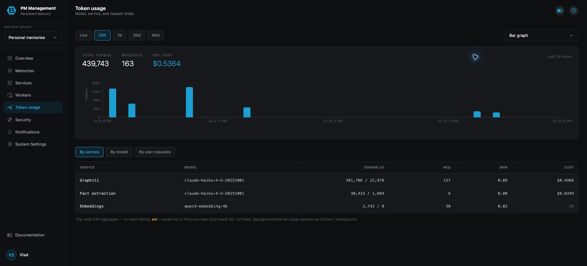

# Token usage

## Purpose

Token usage helps you understand model-backed activity in the local stack. The chart and headline totals can show different time windows, while the lower breakdown tables always remain fixed to the last 24 hours.

## Read the page

Use **Live**, **24h**, **7d**, **30d**, or **90d** to change the chart window. Live covers the recent ten-minute period and is polled regularly. The chart-style menu changes only the visualization, not the underlying usage.

The headline shows tokens, request count, and estimated cost for the selected chart window. The lower tabs show the stable 24-hour aggregate:

| Tab | Breakdown |
| --- | --- |
| By service | Service and model, input/output tokens, requests, rate, and cost |
| By model | Model-centered grouping of the same 24-hour usage |
| By user requests | Request-scoped totals attributed to dashboard users; internal work appears as system or background |

## Actions

1. Select a chart window that matches the question you are investigating.
2. Choose a chart style that makes sparse or dense buckets easy to compare.
3. Hover chart marks to inspect the bucket time and value.
4. Switch the lower table among service, model, and user-request views.
5. Treat the chart and table as separate controls: changing the chart window never changes the lower table from 24 hours.

## States

| State | Meaning |
| --- | --- |
| Live | Recent samples over the last ten minutes, refreshed periodically. |
| 24h to 90d | Bucketed usage over the selected chart period. |
| Empty chart | No usage was recorded in the selected window. |
| Empty table | No usage was recorded in the fixed last-24-hours aggregate. |
| `est` cost | The model is not present in the price map. A displayed zero is an estimate limitation, not proof the usage was free. |
| System or background | Usage originated from a worker or internal process rather than a user-scoped request. |

## Cautions

> **Caution**
>
> The lower tables are always 24-hour tables, even when the chart is set to Live, 7d, 30d, or 90d. Do not compare them as if they use the same window.

Costs are estimates derived from the configured model price map. Use provider billing as the financial source of truth.

## Troubleshooting

| Problem | What to do |
| --- | --- |
| Chart changes but table does not | This is expected. The table window is fixed at 24 hours. |
| Cost is zero for a model with usage | Look for the estimated-cost marker; the model may be missing from the price map. |
| User totals are lower than service totals | Internal and worker activity is attributed to system or background, not a dashboard user. |
| Live looks empty | Generate a model-backed request, wait for polling, and confirm the relevant service is healthy. |
