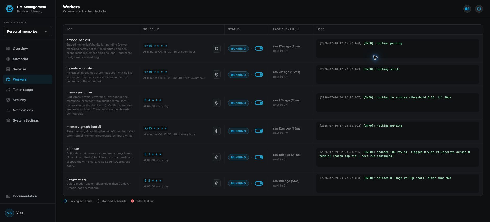
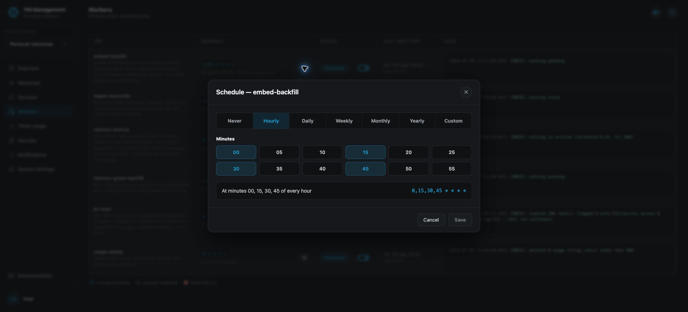
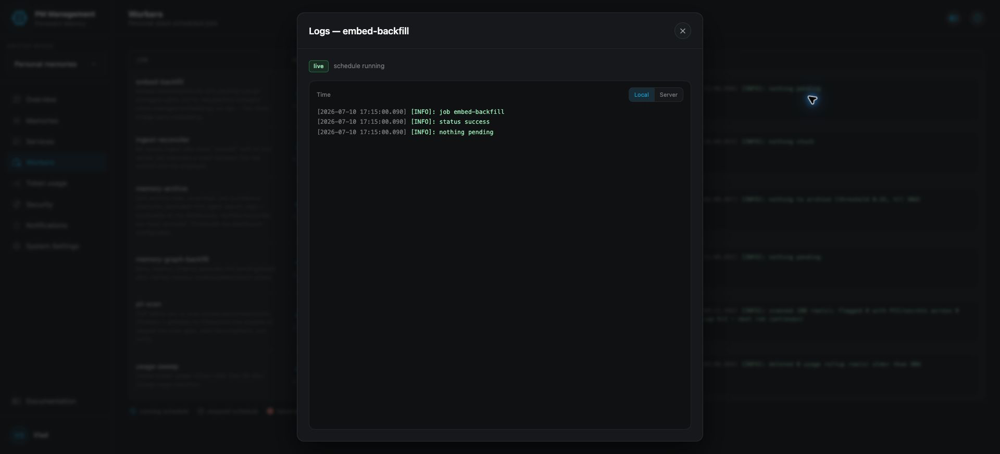

# Workers

## Purpose

Workers manages recurring maintenance jobs such as embedding backfill, ingest reconciliation, retention archiving, graph backfill, security scanning, and usage cleanup. The page refreshes automatically.

The sidebar **Workers** row shows a red **!** for a failed enabled job or when the worker heartbeat is missing. A schedule that an administrator intentionally pauses remains quiet.

## Read the page

Each row shows the job purpose, cron schedule and plain-language interpretation, current schedule state, last and next run, and a preview of the latest run log. The toggle controls whether future scheduled runs are enabled.

The schedule editor supports Never, Hourly, Daily, Weekly, Monthly, Yearly, and Custom patterns. It previews both the readable schedule and generated cron expression before Save is enabled.

The logs modal shows the latest run status and output and refreshes while it remains open.

## Actions

1. Read the last-run result and next-run time for the job you are investigating.
2. Select the schedule control, choose a schedule mode, complete its time fields, verify the preview, and save.
3. Choose **Never** to disable future runs for that job.
4. Use the row toggle to start or stop the schedule immediately.
5. Open the log preview to inspect the latest run in the larger live-log modal.

Workers does not have a **Run now** action. Enabling a schedule does not execute the job immediately; it makes the job eligible for its next scheduled time.

## States

| State | Meaning |
| --- | --- |
| Running or live | The schedule is enabled and worker liveness is available. |
| Stopped | Future scheduled runs are disabled. |
| Failed last run | The most recent execution failed; open its logs. |
| Never | The saved schedule disables the job. |
| Next run | The calculated next eligible execution time. |
| No recent output | The job may not have run yet or had nothing to process. |

## Cautions

> **Caution**
>
> Start and stop toggles take effect immediately for the schedule. Disabling backfill, retention, security scan, or cleanup jobs can allow pending work to accumulate.

> **Caution**
>
> A custom cron expression can run much more often than intended. Check the readable preview before saving.

Because there is no Run now control, do not repeatedly toggle a schedule expecting an immediate execution.

## Troubleshooting

| Problem | What to do |
| --- | --- |
| A job did not run after enabling it | Check its **next run** time. Enabling is not manual execution. |
| Save is disabled in the schedule modal | Complete the required fields and correct any invalid custom cron expression. |
| A job is failing | Open its logs, identify the dependency or data error, then check Services if a required service is unhealthy. |
| The row appears stale | Wait for automatic refresh. Workers has no manual Refresh control. |
