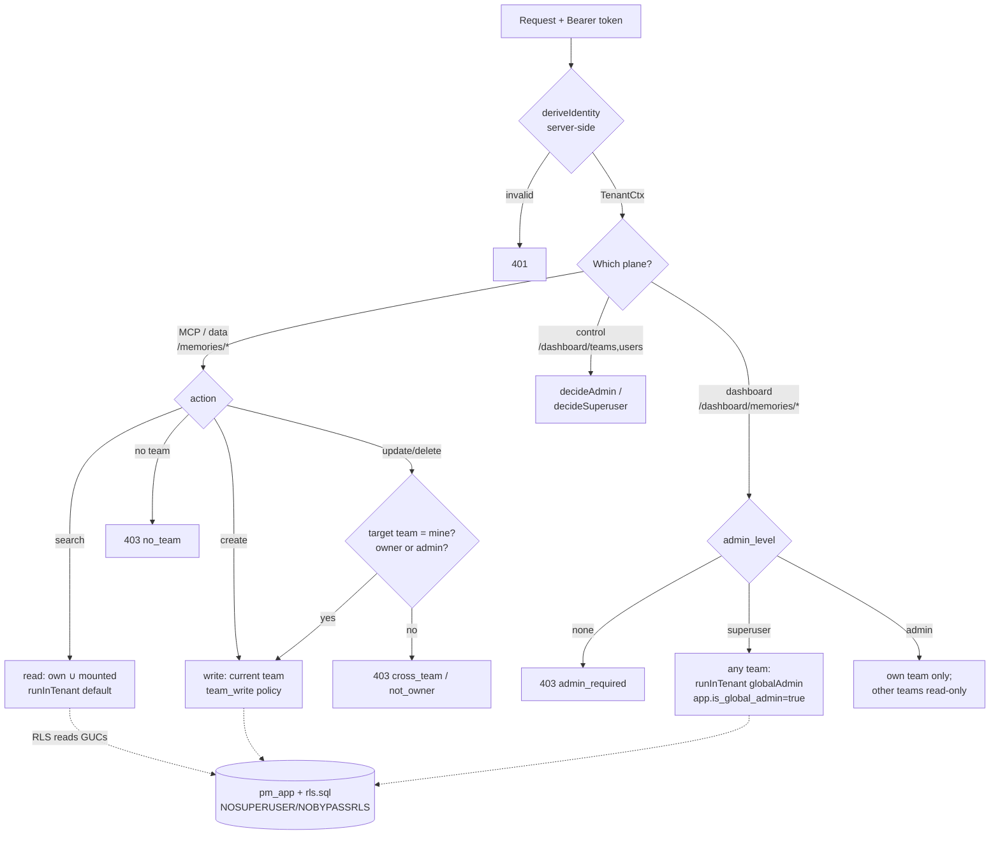

# Access model

How persistent-memory decides who may read and write what: identity is derived server-side from the bearer credential, scope is computed from two orthogonal dimensions, and Postgres RLS is the unbypassable backstop.

> This document is the committed source of truth for the access rules. It supersedes the older "control != data" invariant and cites the matching invariants inline.

## Role in the system

Authorization is concentrated, not scattered. The `api` is the **single authorization choke-point** — every read/write the MCP, dashboard, or worker performs flows through it. Three layers cooperate:

1. **Identity derivation** (`apps/api/src/auth/`) — turn a Bearer PM token or signed dashboard session into a server-derived `TenantCtx`. The client asserts nothing.
2. **Pure guards** (`apps/api/src/authz/guards.ts`) — coarse deny-by-default decisions per plane (data / dashboard / control).
3. **RLS backstop** (`layers/core/schema/rls.sql` + `packages/db/src/tenant-context.ts`) — Postgres policies that still return only permitted rows even if an API filter has a bug. The runtime role `pm_app` is `NOSUPERUSER`/`NOBYPASSRLS`, so it cannot escape the policies.

The fine-grained data decision depends on the **target row's** team + author, which a preHandler can't see, so handlers call the pure guard *after* a `findUnique`, and RLS is the DB-level floor (`apps/api/src/authz/guards.ts`).

## Key pieces

### Identity is server-derived from the bearer credential (invariant 1)

MCP/API clients use the wire token `<tokenId>.<secret>`. The dashboard normally
uses a signed `pm_session...` token after email/password login, or a PM wire token
only for recovery login. `deriveIdentity` (`apps/api/src/auth/token-service.ts`)
verifies the credential (PM token = indexed `tokenId` lookup + one argon2id
verify of `secret + TOKEN_PEPPER`; dashboard session = HMAC signature/expiry and
`passwordChangedAt` invalidation), then reads the user's `teamId`, `adminLevel`,
and mounted teams **from the database** — never from the request. The result is a
`TenantCtx`:

```ts
{ userId, teamId /* nullable */, adminLevel, isTeamMember, isTeamAdmin,
  isGlobalSuperuser, mountedTeamIds, insideTenantTx }
```

The credential lookup hits the **control** table `app_user`, which lives outside RLS and to which `pm_app` has no grant — so it uses `ownerPrisma` (pmuser), not the data-plane client. There is no code path that trusts a team/user/role from the request body, and `guards.ts` documents the rule directly: *"Guards and handlers MUST NEVER read a team/teamId from the request body."*

Identity is then carried for the whole request via `AsyncLocalStorage`. Two `onRequest` hooks do this in order (`apps/api/src/auth/authenticate.ts`): `authenticate` (async — derives identity, stashes on `req.identity`) then `enterTenantScope` (**sync** — `tenantStore.enterWith(ctx)` with no preceding `await`). The split is load-bearing: `enterWith()` after an `await` does not propagate the store to the handler under Fastify+Node.

### Two orthogonal dimensions (invariant 2)

```
admin_level ∈ { none, admin, superuser }      ⟂      team membership (AppUser.team_id, NULLABLE)
```

| | none | admin | superuser |
|---|---|---|---|
| **in a team** | team member | team-admin (admin + member) | super-admin who joined a team |
| **team-less** | (rejected from the data plane) | — (admins are always team-bound) | independent super-admin |

A team-less super-admin manages everything **on the dashboard**, never through the MCP. Assigning `admin_level` is **superuser-only** (`decideSuperuser` — the privilege-escalation guard; admins cannot create or modify super-admins).

### Reads differ by **surface** and **data kind**

This is the heart of the model. The same caller sees different scope depending on *where* and *what* they read:

| Surface / data | Read scope |
|---|---|
| **MEMORY via the MCP** (`/memories/*`) | **own team ∪ MOUNTED teams** — the directional `TeamGrant` "mount" (grantee mounts grantor → reads its memories, read-only). Unmounted teams are invisible. |
| **MEMORY on the dashboard** (`/dashboard/memories/*`) | **universal** — any team, per the role. |
| **Documents / graph / investigations** | **universally shared** everywhere (no point re-processing the same PRD per team). |
| **Security alerts** | **own team OR global super-admin** — NOT universal (a finding reveals a team holds sensitive data). |

Mounts gate **memory only**. `resolveMountedTeams` (`apps/api/src/auth/token-service.ts`) reads `TeamGrant` rows where `granteeTeamId == myTeam` and returns the grantor teams (own team excluded, deduped). The data-plane `POST /memories/search` route can also escalate to a true all-teams fan-out via a body `universal` flag, but `allowUniversalRead` ignores it for plain members (admin+ only); the dashboard's all-teams view goes through `/dashboard/memories`, never the data route.

Memory Graph reads use the same RLS-scoped own-plus-mounted memory boundary. The
API derives Graphiti surface/team/project groups from those readable rows, signs
continuation cursors with the scope and filters, and exposes only bounded metadata.
The browser cannot name a team or raw graph group to widen a snapshot or activity
poll. A Shared graph request is made server-side with the configured remote
connector identity; its credential never enters the client bundle.

### Writes are team-bound + ownership-floored (invariants 2, 4)

Writes never span teams on the data plane — **even for a super-admin**:

- **Plain member** → may create in their current team, and update/delete only **own-created** memories (`createdById === userId`).
- **Team-admin / super-admin** → any author within their **current team** (bypass the owner floor).
- **Cross-team writes** happen **only** through the dashboard global-admin path (`decideDashboard` → `runInTenant(fn, { globalAdmin, teamIdOverride })`). A super-admin's reach therefore differs by **entry point**: cross-team on the dashboard, current-team-only via the MCP.
- A **team-less** caller is rejected by the data plane entirely (`decideDataPlane` / `decideTeamMember` → `no_team`).

Writes stamp `team_id` server-side (and `created_by_id` = the token's user on memory).

### RLS is the backstop (invariant 3)

`runInTenant(fn, opts?)` (`packages/db/src/tenant-context.ts`) opens one interactive transaction and, as its **first** statements, sets per-request GUCs via `set_config(name, value, true)` (the `true` = `SET LOCAL`, injection-proof bind param, auto-reset at COMMIT). The RLS policies in `layers/core/schema/rls.sql` read those GUCs:

| GUC | Set when | RLS use |
|---|---|---|
| `app.user_id` | always | memory ownership floor compares `created_by_id` |
| `app.team_id` | always (`''` if none) | team-bound read/write predicate |
| `app.can_read_all` | team member OR global-admin | universal read of the **shared** tables (documents/graph) |
| `app.mounted_team_ids` | always (CSV) | MCP memory read = `team_id = ANY(mounted)` |
| `app.read_all_memory` | dashboard memory view / global-admin | **universal** memory read |
| `app.is_global_admin` | dashboard super-admin cross-team write only | cross-team write + read path |
| `app.bypass_owner_floor` | team-admin / super-admin / global path | skip the memory owner floor within team |

**Widening is ALWAYS a policy reading a GUC, never a role bypass.** `runInTenant` re-checks `ctx.isGlobalSuperuser` before honoring `globalAdmin`, so a handler cannot self-elevate by passing the flag. A non-global team-scoped write with no team fails closed (throws). `guardedPrisma` throws if a data model is touched outside a tenant scope.

The data plane **never** sets `app.is_global_admin`; only the dashboard control plane does. `ownerPrisma` (pmuser, a Postgres superuser, bypasses RLS) is used **only** for control tables (`team` / `app_user` / `team_grant` / `local_identity` / `system_settings`) + migrate/seed — cross-team admin **data** ops go through `pm_app` + the global-admin policy path, keeping RLS the backstop.

## Read/write decision flow





## Public surface / interfaces

### Pure guard decisions (`apps/api/src/authz/guards.ts`)

| Function | Plane | Rule |
|---|---|---|
| `decideDataPlane` | data (`/memories/*`, MCP) | team-less → `no_team`; search/create → allow; update/delete → current-team only, owner floor unless admin+ |
| `allowUniversalRead` | data search | true only when body `universal` **and** `admin_level !== none` |
| `decideDashboard` | dashboard (`/dashboard/memories/*`) | super-admin → any team CRUD; team-admin → own team, others read-only; member → `admin_required` |
| `decideAdmin` | control | `admin` or `superuser` |
| `decideSuperuser` | control | `superuser` only (manage super-admins / assign `admin_level`) |
| `decideTeamMember` | data membership gate | must belong to a team |

Fastify preHandler adapters: `requireTeamMember`, `requireAdmin`, `requireSuperuser` — all fail closed (no identity → 401).

### Tenant scope (`packages/db/src/tenant-context.ts`)

- `runInTenant(fn, opts?)` — wrap data-plane work; sets the 7 GUCs.
- `TenantRunOpts`: `globalAdmin` (super-admin cross-team write, re-checked), `teamIdOverride` (target team for a cross-team op), `readOnly` (cross-team read without a current team), `readAllMemory` (universal memory read — the dashboard view).
- `getCtx()` — read the current request's ctx; throws if called unscoped.

### Deployment-mode note

In `DEPLOYMENT_MODE=local` (boot-time pin) the api reads a real single super-user who **is a member of one seeded team** from the `local_identity` singleton, so RLS and the data plane run through the normal team-bound paths — no rls.sql change. The local Team/AppUser ids are generated by the database; `/whoami` and MCP `whoami` additionally return the seeded local team name, user display name, and email. Never set local on a shared/networked host; this is a deployment-mode security boundary. See `./security.md`.

## Invariants & gotchas

Load-bearing access invariants:

1. **Identity is server-derived from the bearer credential.** Never trust a team/user/role from the request body (invariant 1).
2. **Two orthogonal dimensions; team membership bounds an admin's reach** (invariant 2). Reads differ by surface + data kind (MCP memory = own ∪ mounted; dashboard memory = universal; documents/graph = universal). Entry point matters for a super-admin's write reach.
3. **RLS is the backstop** (invariant 3). api/worker connect as `pm_app` (`NOSUPERUSER`/`NOBYPASSRLS`); every data query runs inside `runInTenant`; widening is a policy reading a GUC, never a role bypass; `guardedPrisma` enforces tenant scoping.
4. **Writes stamp `team_id` server-side** and `created_by_id` on memory; cross-team writes only via the global-admin path (invariant 4).
5. **`ownerPrisma` bypasses RLS** because pmuser is the Postgres **superuser** — confine it to control tables + migrate/seed; cross-team admin **data** ops go through the global-admin policy path, not `ownerPrisma`.
6. **The data plane never sets `app.is_global_admin`** — only the dashboard control plane does. A handler cannot grant itself the global path; `runInTenant` re-checks `ctx.isGlobalSuperuser`.
7. **Fail-closed everywhere:** unset GUCs COALESCE to false/NULL (zero rows); a team-scoped write with no team throws; no identity → 401. (Invariants 5–7 — one embedder per collection, Graphiti `group_id` = team, `project` required on writes — are scope/data concerns covered in `./embedding.md`, `../components/graphiti-service.md`, and `./ingest.md`.)

## Related docs

- `./README.md` — documentation index
- `./architecture.md` — the whole-system view
- `./security.md` — DLP/PII, deployment mode, threat model
- `../components/api.md` — the authorization choke-point in detail
- `../components/db.md` — `runInTenant`, the Prisma clients, `guardedPrisma`
- `../components/mcp.md` — how the 25 tools map onto the data plane
- `../components/dashboard.md` — the dashboard memory/control planes
- Package READMEs: `apps/api/README.md`, `packages/db/README.md`, `layers/core/schema/README.md`
- Access-model source of truth: this document.
