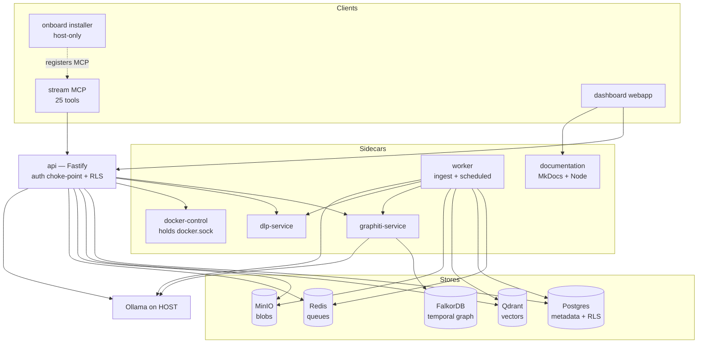

# Architecture

The whole-system map of **persistent-memory**: how clients reach the data through a single API choke-point, and what each store and sidecar holds.

## Role in the system

persistent-memory is a Dockerized, TypeScript-primary, team-scoped memory + evidence platform for the QA team — the successor to the legacy mem0 stack. It stores four kinds of state in four purpose-built backends and exposes all of it to Claude Code (and teammates) through three clients: a containerized **Streamable HTTP MCP** (25 tools), a **local dashboard** ("Web QA Management App"), and a one-command **onboarding installer**.

The defining architectural rule is that **the `api` (Fastify) is the single authorization choke-point**: every read and write — whether from the MCP, the dashboard app, the worker, or the graphiti-service — resolves identity server-side from the bearer token and runs every data-plane query inside an RLS-bounded tenant transaction. No client ever asserts its own team/user/role (see the committed documentation invariants 1–4 and `./access-model.md`).

## Key pieces

### Workspaces (npm workspaces, root `package.json`)

The TypeScript core is one npm-workspaces monorepo. The workspace members are `layers/core/schema`, `layers/core/tools`, `layers/mcp-runtime`, `layers/memory-vector`, `layers/graph`, `layers/evidence-files`, `layers/security-dlp`, `packages/shared`, `packages/db`, `apps/api`, `apps/worker`, `apps/mcp`, `apps/docker-control`, `apps/update-runner`, and `apps/dashboard-gateway`. The dashboard and documentation app shells live in `apps/dashboard` and `apps/documentation` as standalone packages; the host-only installer lives in `apps/onboard`. `apps/graphiti-service` and `apps/dlp-service` are **Python/FastAPI**. The `spaces/` and `layers/` directories are the authoritative ownership map.

| Dir | Package | Role | Deep dive |
|---|---|---|---|
| `layers/core/schema/` | `persistent-memory-prisma` | Postgres schema, `rls.sql`, migrations, `seed.ts`. Generated client → `generated/prisma/` (gitignored). | `../components/db.md` |
| `packages/shared/` | `@pm/shared` | **Prisma-free** reusable core: embedding adapter, Qdrant client + named-vector layer + dimension switch tool, BullMQ queues (ingest, scheduled, one-time memory graph rebuild), and doc extract/chunk. Capability-specific APIs such as DLP and evidence-file persistence now live in `layers/`. | `../components/shared.md` |
| `packages/db/` | `@pm/db` | The two Prisma clients (`prisma`=pm_app data, `ownerPrisma`=pmuser control), `runInTenant()` RLS wrapper, `guardedPrisma` audit guard, tenant ALS. | `../components/db.md` |
| `apps/api/` | `persistent-memory-api` | Fastify HTTP API — the **single authorization choke-point**: auth, memory protocol + DLP gate + provenance rerank, ingest, graph/doc/investigation, and dashboard control/memory planes. `/dashboard/*` is the canonical control route family; `/admin/*` remains a one-release compatibility alias. | `../components/api.md` |
| `apps/worker/` | `persistent-memory-worker` | BullMQ consumer: the document ingestion pipeline, the managed scheduled-worker subsystem (6 jobs), and the one-time Memory Tools graph rebuild queue. | `../components/worker.md` |
| `apps/mcp/` | `persistent-memory-mcp` | The stream MCP service (25 tools) Claude/Codex use; `recall_context` is graph-first task-start recall; client-managed embedding bridge. | `../components/mcp.md` |
| `layers/mcp-runtime/` | `@pm/mcp-runtime` | MCP tool registrars, recall-context orchestration, API client/runtime helpers, stream-session helpers, and the client-managed embedding bridge consumed by `apps/mcp`. | `../layers/mcp-runtime/README.md` |
| `layers/memory-vector/` | `@pm/memory-vector` | Embedding topology compatibility helpers and provenance-aware memory search reranking consumed by `apps/api`. | `../layers/memory-vector/README.md` |
| `layers/graph/` | `@pm/graph` | Graphiti HTTP client, memory graph sync stamping, and worker episode helpers consumed by `apps/api` and `apps/worker`. | `../layers/graph/README.md` |
| `layers/evidence-files/` | `@pm/evidence-files` | MinIO storage singleton and worker chunk persistence helpers consumed by `apps/api` and `apps/worker`. | `../layers/evidence-files/README.md` |
| `layers/security-dlp/` | `@pm/security-dlp` | Fail-closed DLP HTTP client and redaction-safe gate decision consumed by `apps/api` and `apps/worker`. | `../layers/security-dlp/README.md` |
| `layers/dashboard/` | (source layer) | Pure dashboard helpers for update cards, logs, password strength, and release history, consumed by the standalone Next app through compatibility exports. | `../layers/dashboard/README.md` |
| `layers/onboarding/` | (source layer) | Pure onboarding helpers for loopback guard decisions and install-step planning, consumed by the host-only installer through compatibility exports. | `../layers/onboarding/README.md` |
| `layers/core/tools/` | `persistent-memory-tools` | `rls-check.mjs` — the RLS floor verifier (`npm run rls:check`). | — |
| `apps/docker-control/` | `persistent-memory-docker-control` | Tiny security-gated sidecar (zero runtime deps) — the **only** container with the Docker socket; backs the dashboard Services page. | `../components/docker-control.md` |
| `apps/update-runner/` | `persistent-memory-update-runner` | Restricted internal sidecar for dashboard-triggered snapshot-safe updates; separate from `docker-control` so service control keeps its bounded verb surface. | `../apps/update-runner/README.md` |
| `apps/dashboard-gateway/` | `persistent-memory-dashboard-gateway` | Stable localhost front door for the dashboard; owns host port 3200 and serves the update handoff shell while the dashboard is rebuilt. | `../components/dashboard-gateway.md` |
| `apps/dashboard/` | (standalone) | Next.js dashboard webapp: Memories, Services + Workers + Token usage, Security + Notifications, control plane, Mounts, export/import. | `../components/dashboard.md` |
| `apps/documentation/` | `persistent-memory-documentation` | Versioned, dependency-free Node runtime for the MkDocs site built from `documentation/`; internal-only and proxied through the authenticated dashboard. | `../apps/documentation/README.md` |
| `apps/onboard/` | (standalone, host-only) | One-command personal-first installer; installs the local Personal Memories stack, optionally connects Shared Memories, registers stream MCP, and writes the top memory block plus detailed memory rule. Never containerized/shipped. | `../components/onboard.md` |
| `apps/graphiti-service/` | (Python) | FastAPI wrapper over `graphiti-core[falkordb]`; `group_id` = team. | `../components/graphiti-service.md` |
| `apps/dlp-service/` | (Python) | FastAPI DLP sidecar: Presidio (PII) + gitleaks (secrets); `POST /scan` → redaction-safe findings. | `../components/dlp-service.md` |

### Spaces and layers

`spaces/` describes where the product runs and for whom:
`local-personal`, `local-shared-client`, and `shared-server`.
`layers/` describes capability ownership across apps, services, docs, and tests:
`core`, `memory-vector`, `graph`, `evidence-files`, `security-dlp`,
`mcp-runtime`, `dashboard`, `onboarding`, `update-ops`, and `docs-system`.

These folders are now the committed ownership map. Runnable shells live under
`apps/`; cross-app reusable code lives under `packages/`; capability code that
has been extracted lives under `layers/`. External dashboard routes use
canonical `/dashboard/*` names; `/admin/*` remains a compatibility alias for one
release. Space-specific verification lives under
`test/spaces/`; layer-specific verification lives under `test/layers/`. Run the
boundary smoke checks with `npm run test:layers`, `npm run test:spaces`, or the
combined `npm run verify:architecture` script.

### Data stores — what each holds

Defined as upstream-image services in `deploy/compose/docker-compose.yml`:

| Store | Image | Holds | Internal addr |
|---|---|---|---|
| **Qdrant** | `qdrant/qdrant:v1.18.2` | **Semantic memory + document-chunk vectors** (named-vector layer, one model+dim per collection). | `persistent-memory-qdrant:6333` |
| **Postgres** | `postgres:17.10` | **Canonical metadata**: teams, users, documents, chunks, claims, investigations, memories, settings, and owner-only model-dependency health — RLS-enforced where data-plane access applies. | `persistent-memory-postgres:5432` |
| **FalkorDB** | `falkordb/falkordb:v4.18.10` | Graph backend for Graphiti — the **temporal knowledge graph** (entities/relations with `valid_at`/`invalid_at`). Neo4j (`neo4j:5.26.27`) is the profile-gated alternate. | `persistent-memory-falkordb:6379` |
| **MinIO** | `minio/minio:RELEASE.2025-09-07…` | **Evidence blobs** (uploaded files + extraction artifacts), S3-compatible. | `persistent-memory-minio:9000` |
| **Redis** | `redis:8-alpine` | **BullMQ queues** (`pm.ingest`, `pm.scheduled`, `pm.memory-graph-rebuild`) and the worker liveness heartbeat. `maxmemory-policy=noeviction` (BullMQ requires it). | `persistent-memory-redis:6379` |

**Ollama runs on the HOST**, not as a container, reached at `host.docker.internal:11434` (the `extra_hosts: host-gateway` mapping on the api/worker/graphiti services). It is the default embedding (and optional extraction) provider. The API health monitor treats it as a host capability: `/api/tags` must be reachable and, when Ollama is the active embedding provider, must list the configured model. It has no Docker container or Docker logs.

### Application containers and how they talk

All service-to-service wiring uses **container names + internal ports** over the `persistent_memory_network` bridge (`deploy/compose/docker-compose.yml`). Host port mappings (7333, 5433, 9002, 8090, 3200, …) are for the developer only and bind to `PM_HOST_BIND=127.0.0.1` by default.

- **`api`** (`:8090`, host 8090) — the public REST surface and the only authorization gate. Connects to Postgres as the RLS-subject **`pm_app`** for the data plane and as the owner **`pmuser`** only for control tables + migrate/seed. Calls Qdrant, Graphiti, MinIO, the DLP sidecar, and the docker-control sidecar. Holds **no Docker socket**.
- **`worker`** (no host port) — consumes the ingest queue and runs the scheduled jobs. Also data-plane (`pm_app` + RLS), built from the workspace root so it can reach `packages/` + `layers/`. `mem_limit` (default `1g`) bounds container memory.
- **`graphiti`** (`:8100`) — Python/FastAPI; API/docs surface for the temporal graph service, not a separate graph visualization UI. It remains internal-only from an auth perspective (the api is the choke-point), trusts the `group_ids` the api passes, and POSTs extraction token usage back to the api's secret-gated `/internal/usage`. The actual graph records live in FalkorDB/Neo4j.
- **`dlp`** (`:8200`) — Python/FastAPI; internal-only, **no published host port**, no inbound auth. The api (write gate) and worker (doc block + `pii-scan` job) call it fail-closed.
- **`docker-control`** (`:9090`, internal-only) — the lone service-control container mounting `/var/run/docker.sock`; hardened (`no-new-privileges`, `cap_drop: ALL`, `read_only`, non-root `node` user) and gated by the shared-secret `DOCKER_CONTROL_TOKEN`. It lists/logs persistent-memory stack services and legacy project-labeled MCP stdio containers, but only controls real Compose services. Only the `api` calls it; the browser never does.
- **`update-runner`** (`:9092`, internal-only) — the separate update sidecar. It is token-gated by `UPDATE_RUNNER_TOKEN`, automatically reads public GitHub master release metadata for full-local dashboard update cards without source credentials, snapshots local data into `.local/update-backups/<timestamp>/`, and owns the trusted update flow used by operator-triggered updates. It is deliberately not part of `docker-control`.
- **`dashboard-gateway`** (`:3200`, host 3200) — tiny Node front door that normally proxies browser traffic to the dashboard and serves `/api/update/handoff` plus the update progress shell while the dashboard is rebuilt.
- **`dashboard`** (`:3000`, internal-only) — Next.js management shell; talks to the api and documentation services server-side over the container network. The token stays server-side; the browser never calls the api directly.
- **`documentation`** (`:8000`, internal-only) — Node static runtime for the versioned MkDocs stack manual. The dashboard proxies `/docs/*` so the manual inherits dashboard authentication; `/documentation` is a native guide to dashboard pages and tools and opens the manual separately.
- **`mcp`** — the only runtime is the long-lived Compose service `persistent-memory-mcp` behind the `mcp-stream` profile, exposing Streamable HTTP at `http://localhost:8091/mcp`. Codex plus Claude Code / Claude Desktop folder sessions can share that service. After update restarts, stale Streamable HTTP session ids return JSON-RPC `Session not found` with HTTP 404 so clients can reinitialize. The stream URL is not written to Claude Desktop's standalone `claude_desktop_config.json`, which is local command/stdio-shaped. Legacy node inputs are migration aliases only and upgrade to the stream registration.

### Deployment modes

`DEPLOYMENT_MODE` is a boot-time pin. Default **`server`** verifies a bearer token on every request. **`local`** uses a no-token, database-backed local identity; the dashboard opens directly unless the optional local dashboard password soft lock is set. Reinstalls over preserved volumes apply the onboarding password only when the installer's `LOCAL_USER_PASSWORD_CONFIGURED_AT` is newer than the user's `password_changed_at`, so dashboard profile changes remain authoritative. Local mode is for a single-user host only, never a shared/networked one (the committed documentation, `apps/api/src/auth/local-mode.ts`). The local Team/AppUser ids are generated in the database and recorded in `local_identity`; `/whoami` and MCP `whoami` expose those ids plus the seeded local team name, display name, and email for human-readable agent output. It is never runtime-flippable.

## System map

## Public surface / interfaces

| Service | Internal | Host port | Notes |
|---|---|---|---|
| api | 8090 | 8090 loopback | the only public REST surface |
| dashboard-gateway | 3200 | 3200 loopback | stable dashboard URL + update handoff |
| dashboard | 3000 | — | Next.js dashboard behind gateway |
| documentation | 8000 | — | MkDocs site behind authenticated `/docs/*` proxy |
| qdrant | 6333 / 6334 | 7333 / 7334 loopback | REST + gRPC; API key required |
| falkordb | 6379 / 3000 | 6380 / 3100 loopback | Redis-protocol graph + browser UI; password required |
| postgres | 5432 | 5433 | — |
| redis | 6379 | 6381 | — |
| minio | 9000 / 9001 | 9002 / 9003 | S3 API + console |
| graphiti | 8100 | 8100 loopback | API/docs surface; graph records live in FalkorDB/Neo4j |
| dlp | 8200 | — | **no host port** (internal-only) |
| docker-control | 9090 | — | **no host port** (internal-only) |
| update-runner | 9092 | — | **no host port** (internal-only) |

The server stack is `deploy/compose/docker-compose.yml`; the client MCP image is built with plain Docker and launched with project/service labels for Docker Desktop and Services visibility. Stdio MCP containers are per-client processes, so the dashboard shows them as client-owned/loggable rows while start/stop/restart remains limited to real Compose stack services. The two user-facing commands are `npm run install-persistent-memory` and `npm run update-persistent-memory`; deploy/runtime shell helpers live under `deploy/scripts/`. See `./operations.md`.

## Invariants & gotchas

These are load-bearing — breaking them silently breaks security or the build (full list in the committed documentation).

- **Identity is server-derived from the bearer credential; the api is the single choke-point.** Never add a path that trusts a team/user from the request body (the committed documentation invariant 1).
- **RLS is the backstop.** The api/worker connect as `pm_app` (`NOSUPERUSER`/`NOBYPASSRLS`); every data-plane query runs inside `runInTenant(fn, opts?)`, which sets the GUCs the RLS policies read. Widening is always a policy reading a GUC, never a role bypass. `ownerPrisma` (the superuser `pmuser`) is for control tables + migrate/seed only (the committed documentation invariant 3, `./security.md`).
- **The Docker socket is mounted into `docker-control` only — never the `api`.** It is gated by a shared-secret bearer (fails closed when empty), no host port, and a hard verb boundary (list/logs/start/stop/restart for stack services plus exact MCP-session terminate only) (the committed documentation, `../components/docker-control.md`).
- **One embedder model+dim per Qdrant collection** (named vectors); switching is a re-embed migration, never a live meaning-changing toggle (the committed documentation invariant 5, `./embedding.md`).
- **The DLP/PII gate is fail-closed and whole-system** — it blocks the write on any scanner error/timeout/unreachable, never a silent allow; findings are redaction-safe (types/offsets only) (the committed documentation, `./security.md`).
- **Graphiti `group_id` = team**; graphiti-service is API-trusted/no-user-auth (with loopback-only local docs by default) and dlp-service is internal-only. Both trust what the api passes — that trust is sound only because the api is the choke-point (the committed documentation invariant 6).
- **Compose `condition: service_healthy` errors against a no-healthcheck dependency** → the api/worker gate on `qdrant` with `service_started` (the qdrant image ships no http client for a healthcheck) (`deploy/compose/docker-compose.yml`, the committed documentation).
- **`@pm/shared` is Prisma-free**; only `@pm/db` imports `generated/prisma`. Prisma 7 emits TypeScript to `generated/prisma/` and needs a `package.json` with `{"type":"module"}` there (the committed documentation).

## Related docs

- `./README.md` — documentation index and reading order
- `./access-model.md` — the team-scoped read/write model
- `./security.md` — RLS, the choke-point, DLP, the socket sidecar
- `./ingest.md` — the document ingestion pipeline end-to-end
- `./embedding.md` — embedding topology, named vectors, the model switch
- `./operations.md` — install/update/run/verify
- Component deep dives: `../components/api.md`, `../components/worker.md`, `../components/mcp.md`, `../components/dashboard.md`, `../components/onboard.md`, `../components/shared.md`, `../components/db.md`, `../components/docker-control.md`, `../components/graphiti-service.md`, `../components/dlp-service.md`
