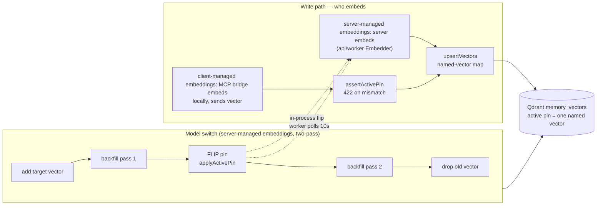

# Embedding & the model switch

How text becomes vectors in persistent-memory: one pinned embedder per Qdrant collection, the two embedding **modes** (server-side vs MCP-bridge), and the dashboard-driven, no-blackout, no-restart **model switch**.

## Role in the system

Every semantic memory and every document chunk is stored as a vector in a **single Qdrant collection** (`memory_vectors`, see `packages/shared/src/qdrant/types.ts`). Search quality and cross-team comparability both depend on one rule: **all vectors in that collection must come from the same embedding model at the same dimension.** This doc covers how that pin is chosen, who produces the vectors, and how the pin can be changed safely while the corpus stays online.

The embedding layer is the reusable, Prisma-free core in `@pm/shared` (`packages/shared/src/embeddings/`, `packages/shared/src/qdrant/`, `packages/shared/src/switch/`); the api and worker resolve config at their own boot and hold the instances (`apps/api/src/services/embedding.ts`, worker boot).

## Key pieces

### The active pin

An `ActivePin` is `{ modelId, dim, vectorName }` — the model id, the produced dimension, and the **named-vector key** derived from them. The key is computed in exactly one place, `vectorName(model, dim)` in `packages/shared/src/embeddings/naming.ts` (e.g. `qwen3-embedding:0.6b @ 1024 → "qwen3-embedding-0.6b__1024"`); embeddings and Qdrant both import it so they never drift. `makeActivePin(model, dim)` (`packages/shared/src/qdrant/collection.ts`) builds the record.

The collection is created with **exactly one** named vector — the active pin — by `ensureCollection` (`packages/shared/src/qdrant/collection.ts`, idempotent on every boot). Adding a second named vector is the switch tool's job, never a recreate.

### The embedder adapter

`makeEmbedder(cfg)` (`packages/shared/src/embeddings/factory.ts`) validates the `(provider, model, dim)` triple against `MODEL_REGISTRY` (`packages/shared/src/embeddings/registry.ts`) and constructs a provider impl. Three providers ship: `ollama` (local), `voyage`, `openai` (`ollama.ts` / `voyage.ts` / `openai.ts`). The `Embedder` interface (`packages/shared/src/embeddings/embedder.ts`) is one method — `embed(texts, kind?) → { vectors, model, dim }`, order-preserving.

- `makeEmbedderFromEnv()` builds from `EMBED_*` env at boot.
- `makeEmbedderForPin(model, dim)` builds an embedder for a **specific** pin (provider resolved from the registry, transport config from env) — used by the live-pin flip and the switch driver's target embedder.

The registry is the single source of truth for which dims a model supports (discrete Matryoshka buckets for qwen3/voyage; open `1..nativeDim` range for OpenAI 3-\*; fixed for nomic). `resolveEmbedConfig` (`packages/shared/src/embeddings/config.ts`) fails fast at boot on an invalid triple or a missing provider key.

### Server-managed vs client-managed embeddings

`EMBEDDING_MODE` (a separate axis from `EMBED_PROVIDER`) selects who computes the vector:

- **server-managed embeddings — `server`:** the api/worker hold a server-side `Embedder` and embed inline on the write path. `apps/api/src/services/embedding.ts` builds it; `embedder` is `null` only in client-managed embeddings.
- **client-managed embeddings — `client-bridge`:** the server runs **no** embedder. The MCP bridge embeds locally (at the server-pinned model, on the user's own Ollama) and sends a **precomputed vector** with a declared `model_id`/`dim`. The api enforces the pin via `assertActivePin` (`packages/shared/src/qdrant/guard.ts`) before upsert — any vector whose declared model/dim ≠ the active pin (or whose length ≠ dim) is rejected `422 embedding_pin_mismatch`. That consistency is what makes every bridge's vectors mutually comparable.

Both modes write through `upsertVectors` (`packages/shared/src/qdrant/upsert.ts`): a named-vector map `{ "<key>": number[] }`, `team_id` server-stamped into the payload (the only tenant boundary in Qdrant), and a deterministic UUIDv5 point id from the row id (re-embed overwrites, never orphans).

### Capability health and recovery

Embedding availability is an observed capability alongside the vector pin. The
control-plane health record exposes four states: `healthy`, `degraded`,
`unhealthy`, and `unknown` (no observation yet). It stores only a canonical safe
diagnosis, retryability, provider/model, counters, and timestamps—never an API
key, provider response body, or embedded source text.

For **server-managed** embeddings, API memory paths, dashboard embedding tests,
the model-switch driver, worker ingest, and worker backfill record real
operations under `embeddings/server`. Quota/token exhaustion and configured-model
unavailable are unhealthy/non-retryable; rate limits and timeouts are degraded
and retryable; an unavailable provider is unhealthy but retryable. Existing
`IngestJob` failure/retry evidence remains unchanged: health is an independent
operator signal, and a failed health write never changes a job result.

For **client-managed** embeddings, the MCP bridge reports successful and failed
local calls through an authenticated API endpoint. The API creates the observer
scope from the caller identity (`client:<user-id>`), so the dashboard projects
only the current configured client scope and a failure on one client does not
mark other clients or server-managed embeddings unhealthy. A successful real
operation—or a green applicable System Settings test—clears the active failure
for the matching scope. Timestamp ordering prevents a stale success from
overwriting a newer failure.

### The model switch (two-pass, no blackout, no restart)

Changing the pinned model/dim is a **re-embed migration**, never a meaning-changing live toggle. The mechanics live in `packages/shared/src/switch/` (`migration.ts` = the 5 Qdrant steps, `run.ts` = `runSwitch` sequencer); the driver is `apps/api/src/services/model-switch.ts`.

A superuser `PUT /dashboard/settings` with a changed model/dim stamps a `running` status and kicks `runModelSwitch(...)` as a **fire-and-forget background task** in the api (server-managed embeddings only — the server must own an embedder to re-embed). A concurrent switch is refused `409 switch_in_progress` (a `running` status older than 30 min is treated as crashed and overridable). The api already holds Qdrant + DB + can build a target embedder, so no BullMQ job type is needed.

No-blackout comes from **two passes**, not a live dual-write path:

1. **add** the target named vector slot (`step1AddVector`, schema only).
2. **backfill pass 1** — scroll every point, re-embed from its Postgres source text (`fetchText` via the global-admin RLS read path, cross-team), write the target vector (`step3Reembed`).
3. **flip** the pin — persist to `SystemSettings`, then `applyActivePin` flips the api's in-process `activePin`/`embedder` (live `let` bindings) with no restart.
4. **backfill pass 2** — re-embed again to reconcile rows written under the old pin during pass 1.
5. **drop** the old vector (`step5DropOld`, the point of no return).

Reads use the old vector until the flip (pass 1 fully populated it), then the new one (also fully populated). Progress + terminal state live in `SystemSettings.embeddingSwitch` JSONB, surfaced on the dashboard Settings page. Each Qdrant step is idempotent/resume-safe; an api crash mid-switch is recovered by re-triggering the `PUT`.

The **worker is a separate process**, so it cannot see the in-process flip. It polls `SystemSettings` every 10s (`apps/worker/src/index.ts`), and when `activeEmbedModel`/`activeEmbedDim` diverge from its cached pin it rebuilds `deps.pin` (and, in server-managed embeddings, `deps.embedder` via `makeEmbedderForPin`).

**client-managed embeddings model change is impossible server-side by design** (no server embedder): the api persists the new pin + `applyActivePin`, but each member must re-pull the model in their local Ollama and **restart the MCP**. The `assertActivePin` 422 gate is what surfaces the stale state until they do.

## Diagram

## Public surface / interfaces

### `@pm/shared` exports (selected)

| Export | Purpose |
|---|---|
| `makeEmbedder` / `makeEmbedderFromEnv` / `makeEmbedderForPin` | Build an `Embedder` (validated triple / from env / for a specific pin) |
| `makeActivePin(model, dim)` | Build the `{ modelId, dim, vectorName }` record |
| `vectorName(model, dim)` | The one canonical named-vector key |
| `MODEL_REGISTRY` / `validateModelDim` | Supported `(provider, model, dim)` truth + boot validation |
| `ensureCollection` / `hasNamedVector` | Idempotent collection setup; schema probe |
| `upsertVectors` / `deleteChunkPointsForDocument` | Named-vector write; payload-filter delete |
| `assertActivePin` (`ModelDimMismatchError`) | client-managed precomputed-vector pin guard |
| `planSwitch` / `runSwitch` / `step3Reembed` / `step5DropOld` | The named-vector switch tool |

### api services

| Symbol | Purpose |
|---|---|
| `embedding.ts` → `activePin`, `embedder` (live `let`s), `applyActivePin`, `qdrant`, `embeddingMode` | Boot singletons + the in-process pin flip |
| `layers/memory-vector/src/api/embedding-topology.ts` → topology helpers | Compatibility view of the active embedding mode/pin |
| `apps/api/src/services/model-switch.ts` → `runModelSwitch`, `isSwitchRunning` | The two-pass switch driver + concurrency guard |
| `settings.ts` → `getEffectiveSettings` | Overlay `SystemSettings` on the env boot pin (with mandatory fallback) |
| `embedding-health.ts` → canonical wrapper | Normalize provider quota/model/unavailable/timeout outcomes and persist best-effort health observations |

### Relevant env

| Var | Meaning |
|---|---|
| `EMBEDDING_MODE` | `server` (server-managed embeddings) \| `client-bridge` (client-managed embeddings) — **who** embeds |
| `EMBED_PROVIDER` | `ollama` \| `voyage` \| `openai` — the concrete backend (distinct axis from mode) |
| `EMBED_MODEL` / `EMBED_DIM` | The boot pin (must be a valid registry triple) |
| `OLLAMA_URL`, `VOYAGE_API_KEY`, `OPENAI_API_KEY` | Provider transport/credentials |
| `EMBED_BATCH_SIZE` / `EMBED_MAX_RETRIES` / `EMBED_TIMEOUT_MS` | Batch + retry + per-request timeout |

`PUT /dashboard/settings` (superuser, canonical dashboard path) is the runtime entry point that triggers a switch; `GET /config` exposes the effective pin/mode read-only.

## Invariants & gotchas

The embedding-switch invariants below are load-bearing:

- **One embedder model+dim per Qdrant collection** (named vectors). Switching is a re-embed migration (`packages/shared/src/switch`), never a meaning-changing live toggle; the api rejects vectors whose model/dim ≠ the active pin.
- **The switch is dashboard-driven, no-blackout, no-restart, TWO-PASS** — add → backfill → flip → backfill pass 2 → drop. There is **no live dual-write path** threaded through write sites; pass 2 reconciles the flip window instead. (Deferred: live dual-write — only needed if the sub-second pass-2 window matters on a large corpus.)
- `activePin` / `embedder` in `embedding.ts` are **live `export let` bindings**, flipped in-process by the driver at the flip step. Single-api-instance assumption (in-driver flip); multi-instance would need the worker's poll on the api too.
- **The worker (separate process) polls `SystemSettings` every 10s** and rebuilds `deps.embedder`/`deps.pin` — it cannot observe the api's in-process flip.
- **client-managed embeddings model change is impossible server-side** (no server embedder): persist + `applyActivePin` + guidance — each member re-pulls the model locally and restarts the MCP; `assertActivePin` 422 `embedding_pin_mismatch` is the gate until they do.
- **Health is an observation, not a synthetic billing probe.** It changes only after a real embedding operation or explicit Settings test, and a successful operation clears the current failure for its own observer scope.
- `EMBED_PROVIDER` (concrete backend) and `EMBEDDING_MODE` (server vs client-bridge) are **different axes** — do not conflate them (`packages/shared/src/embeddings/config.ts`).
- `@pm/shared` is **Prisma-free**; the switch tool takes the pin as args and source text via a `fetchText` callback so the api/worker own the DB and pin persistence.
- An interrupted switch (api crash) leaves a stale `running` status; steps are idempotent/resume-safe, so re-triggering the `PUT` resumes it.

## Related docs

- [Documentation home](../index.md) · [Architecture](./architecture.md) · [Ingest pipeline](./ingest.md) · [Operations](./operations.md)
- [Access model](./access-model.md) · [Security](./security.md)
- Components: [shared](../components/shared.md) · [api](../components/api.md) · [worker](../components/worker.md) · [mcp](../components/mcp.md) · [db](../components/db.md)
- Package READMEs: `packages/shared/README.md`, `apps/api/README.md` (low-level detail)
