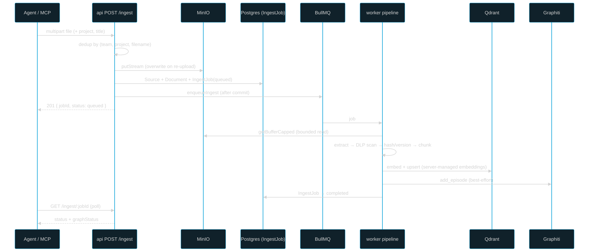
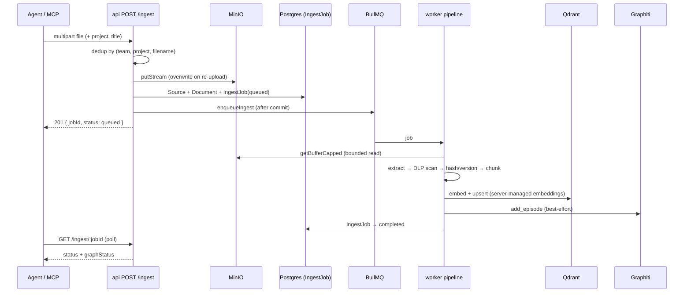

# Document ingestion

How an uploaded file becomes searchable text, vectors, and graph episodes — from the multipart `POST /ingest` to the worker's seven-step pipeline and the safety nets around it.

## Role in the system

Ingestion is the **document** path of the platform (memories take a separate write path). It turns an evidence blob — a PDF, DOCX, or text file a teammate or agent uploads — into:

- **Chunk rows** in Postgres (canonical text + ordinal),
- **named vectors** in Qdrant (semantic document search), and
- a **Graphiti episode** (the temporal knowledge graph).

The work is split across two processes. The **api** (`apps/api/src/routes/ingest.ts`) owns the synchronous, security-critical part: authorize, stream the blob to MinIO, write the canonical rows with a server-stamped `team_id`, and enqueue a BullMQ job. The **worker** (`apps/worker/src/pipeline.ts`) owns the asynchronous, CPU/IO-heavy part: extract, scan, dedup, chunk, embed, upsert, and post to the graph. Documents are **universally readable** across teams but **team-bound for writes** — uploads and deletes are own-team only, RLS backstops the rest.

## Key pieces

### 1. Upload — `POST /ingest` (api)

A multipart, **stream-only** endpoint gated by `requireTeamMember`. Best-effort fields `project` (default `"general"`), `title` (defaults to the filename), and `sessionId` ride alongside the `file` part. The team is **always** `identity.teamId`, never the body (`apps/api/src/routes/ingest.ts`).

Order discipline is load-bearing:

1. **Dedup lookup.** A re-upload is identified by **(teamId, project, filename)** — the *raw* filename, not the user-overridable title. A `findFirst` (most-recent) locates a prior `Document`; if found, its `sourceId` and `minioObjectKey` are **reused**.
2. **Stream to MinIO first**, before any row writes, so a failed upload leaves no orphan rows. On a re-upload this **overwrites** the prior blob at the same key. A `@fastify/multipart` size-limit truncation (or a `RequestFileTooLargeError`) → `413 file_too_large`; the partial blob of a *first* upload is cleaned up (a re-upload's partial already overwrote the prior content).
3. **Canonical rows in one `runInTenant` tx.** First upload → create `Source` + `Document` (with `filename`) + `IngestJob(status='queued')`. Re-upload → keep the prior `Document`/`Source`, apply a title-only update, and create a fresh `IngestJob` on the **same** `documentId`. `team_id` is server-stamped; RLS `WITH CHECK (team_id = pm_current_team_id())` backstops it.
4. **Concurrent-first-upload race.** Two simultaneous first uploads of the same filename both miss the dedup lookup. A `@@unique(teamId, project, filename)` on `Document` rejects the loser with Prisma `P2002` → the api cleans the loser's just-streamed blob and returns **`409 upload_conflict`**; a retry then takes the dedup path.
5. **Enqueue after commit.** `enqueueIngest` runs only after the rows commit, so the worker never races a missing `IngestJob` row. If the enqueue **throws** (queue unreachable), the row is stamped `failed/enqueue_failed` and the call returns `500` — no silent `queued` orphan. The `bullJobId` is correlated back best-effort (`jobId === ingestJobId` anyway).

Response: `201 { jobId, sourceId, documentId, status: "queued" }`.

### 2. The worker pipeline — `apps/worker/src/pipeline.ts`

The entire processor body runs inside `withWorkerTenant(data, …)` so every nested `runInTenant` sets `app.team_id = job.teamId` on its own tx connection. Steps:

1. **Bounded read.** `getBufferCapped(minio, key, deps.maxFileBytes)` streams the blob into a buffer but **aborts + throws `FileTooLargeError`** the moment it exceeds the worker cap (`INGEST_MAX_FILE_BYTES`, default 100 MiB). Too-large is **terminal** — the job is stamped `failed/file_too_large` and *returns* (no retry; re-running won't shrink it). The blob is **not** purged here (unlike the DLP block) because the api already committed rows pointing at it; in the normal config (worker cap == api upload cap) this never fires.
2. **Extract** text (and artifacts back to MinIO) via `extractText` — PDF/DOCX need the whole buffer (pdf-parse / mammoth aren't streamable), which is why the read is bounded rather than streamed.
3. **DLP gate — fail-closed.** If enabled, `dlpGate` scans the extracted text **before anything is persisted**. On detection (or any scanner error/timeout — fail-closed): purge the original blob, raise `SecurityAlert`(s), fire a best-effort notification, stamp `failed/pii_detected`, and **return**. No chunks, vectors, graph, or artifacts are created for a sensitive document. Findings echo TYPES only (redaction-safe).
4. **Content-hash dedup / version decision.** `hashText(doc.text)` (sha256 of normalized text) is compared to the `Document`'s stored `contentHash` via `decideIngestAction`:
   - `unchanged` → **skip** the whole chunk/embed/graph churn, stamp `completed`, return (pure dedup).
   - `first` → proceed; `versionNumber` stays 1.
   - `changed` → proceed and **version in place** (bump `versionNumber`, re-chunk/embed, drop the prior version's Qdrant points after the new ones land).
   Artifacts are written after this decision.
5. **Chunk** (`chunkText`, bounded by `chunkMaxTokens`/`chunkOverlapTokens`).
6. **Persist Chunk rows** (`persistChunks`, idempotent on `(documentId, ordinal)`).
7. **Embed (mode-aware).** Status → `embedding`. **server-managed embeddings (server)**: `embedAndUpsert` embeds and upserts team-stamped named vectors to Qdrant. **client-managed embeddings (client-bridge)**: leave `embedding_status='pending'` — the MCP bridge backfills.
8. **Drop the prior version's points (`changed` + server-managed embeddings only).** `deleteChunkPointsForDocument` filter-deletes by payload `{ document_id = X, row_id NOT IN <new chunk ids> }` **after** the new vectors land — no search blackout. Retry-robust: it removes whatever stale points exist regardless of a prior failed attempt.
9. **Graphiti episode (best-effort).** `add_episode` with an opaque `group_id` derived from the memory surface, team, and project, and `name = doc:<documentId>`. The returned UUID is persisted as current plus append-only provenance. Do **not** send a deterministic episode uuid on create: graphiti-core 0.29.2 treats `uuid` as an existing-episode lookup, not a create/upsert id. Outcome is tracked **independently** in `IngestJob.graphStatus` (`ok`/`failed`/`skipped`) so the "in Qdrant but not the graph" partial state is queryable; a graph failure never fails the job. If `graphitiUrl` is unset → `skipped`.
10. **Finalize lifecycle on success only.** `finalizeDocumentVersion` stamps `contentHash` + `versionNumber` (bumped on `changed`). This happens **after** success so a *failed* ingest re-processes on retry instead of being wrongly skipped as "unchanged". On `changed` it also flags derived memories (`metadata.sourceUpdated`) through the `withSystemTenant` + `globalAdmin` path — a dormant seam today (no doc→memory extraction flow exists).
11. **`IngestJob → completed`.** On any throw earlier: stamp `failed` + attempts + error and re-throw → BullMQ retries; the final attempt stays `failed`.

### 3. Status polling — `GET /ingest/:jobId` (api)

RLS-scoped `findUnique` — a job in an unreadable team returns `null` → `404` (no cross-team existence leak). Returns `status` (`queued`/`extracting`/`embedding`/`completed`/`failed`), the independent `graphStatus`, `attempts`, `error`, and timestamps.

### 4. The ingest-reconciler safety net

The api's fail-closed enqueue covers the queue-unreachable case. It does **not** cover a crash **between** the row commit and the enqueue call, where the catch never runs and the row is left recoverably `queued`. The **`ingest-reconciler`** scheduled job (worker) re-queues `IngestJob`s stuck `status='queued'` with no live Bull job, rebuilding the payload from the `Source`/`Document` rows and re-enqueuing (idempotent — `jobId === ingestJobId`). A 2-minute age floor avoids fighting the api's own enqueue.

### 5. The 4-store DELETE — `DELETE /documents/:id` (api)

Own-team only (a cross-team match → `404`; RLS backstops). It deletes the **`Source`**, so Postgres **cascades** `Document → Chunk` (+ `Claim`/`Entity`) and **SetNulls** `Memory.sourceId` in one DB op. Then the other three stores are cleaned best-effort:

- **Qdrant** — `deleteChunkPointsForDocument` filter-deletes by `document_id` with no keep-set, dropping **all** the doc's points (including orphans from an earlier interrupted re-ingest).
- **MinIO** — `removePrefix(sourcePrefix(...))` sweeps the original + artifacts under the source prefix (artifacts aren't tracked in Postgres).
- **Graphiti** — enqueue every persisted document episode UUID in the durable graph-lifecycle outbox. The worker removes each UUID and verifies it is no longer searchable before marking the command complete; a failure remains retryable.

## Ingestion flow

## Public surface

| Endpoint | Method | Auth | Purpose |
|---|---|---|---|
| `/ingest` | POST (multipart) | team member | Upload → MinIO → rows → enqueue. `201 {jobId,sourceId,documentId,status}`; `409 upload_conflict`; `413 file_too_large` |
| `/ingest/:jobId` | GET | team member | RLS-scoped status (`status`, `graphStatus`, `attempts`, `error`) |
| `/documents/search` | POST | team member | Vector search over chunk points (universal read, own-first), RLS re-read |
| `/documents/:id` | GET | team member | Metadata + presigned MinIO URL minted *after* the RLS read |
| `/documents/:id` | DELETE | team member | 4-store cleanup (own-team only) |

Relevant env: `INGEST_MAX_FILE_BYTES` (api upload cap + worker read cap), `WORKER_MEM_LIMIT` (container cap), `WORKER_CONCURRENCY`, `DOC_URL_EXPIRY_SECONDS` (presigned-URL TTL, clamped to the 604800s S3 cap).

## Invariants & gotchas

(From the committed documentation — the load-bearing rules.)

- **Identity is server-derived.** `team_id` on every write is stamped from `identity.teamId`, never the request body; RLS `WITH CHECK` is the backstop. Status reads are RLS-scoped (unreadable → 404, fail-closed).
- **Order discipline:** MinIO put **before** row writes (no orphan rows); enqueue **after** the commit (worker never races a missing row). The reconciler covers only the crash-between-commit-and-enqueue window.
- **Re-upload identity = (teamId, project, filename)** on the *raw* filename. **Version-in-place, not a baseDocumentId chain** — a search corpus wants the current version only; stale content leaves search. `contentHash`/`versionNumber` are stamped **only on pipeline success** so a failed ingest re-processes on retry.
- **DLP is fail-closed and pre-persist:** sensitive documents are blocked post-extraction, blob purged, `SecurityAlert` raised — no chunks/vectors/graph. A scanner error also blocks.
- **Bounded read, not streaming extraction:** `getBufferCapped` aborts past the cap; `file_too_large` is terminal (no retry, no purge — the api owns the rows). Container `mem_limit` + `WORKER_CONCURRENCY` bound peak memory.
- **Stale Qdrant cleanup is a payload filter-delete** (server-managed embeddings only — client-managed embeddings writes no points yet; the bridge backfills) and is retry-robust (no reliance on collected ids). The DELETE route uses the same helper with no keep-set.
- **Graph status is independent of job status.** `graphStatus` makes the "in Qdrant but not the graph" partial state queryable; a graph failure never fails the job.
- **DELETE cascades via the Source.** Deleting `Source` cascades `Document→Chunk` and SetNulls `Memory.sourceId`; the other three stores are best-effort. Own-team only.

## Related docs

- [Architecture overview](./architecture.md) · [Access model](./access-model.md) · [Security & DLP](./security.md)
- [Embedding & vector search](./embedding.md) · [Operations](./operations.md)
- Components: [api](../components/api.md) · [worker](../components/worker.md) · [mcp](../components/mcp.md) · [shared](../components/shared.md) · [db](../components/db.md) · [graphiti-service](../components/graphiti-service.md) · [dlp-service](../components/dlp-service.md)
- The access-model source of truth is [access-model.md](access-model.md).
