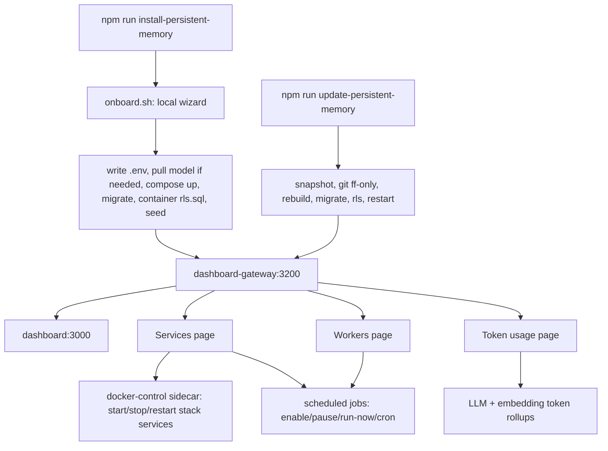

# Operations & runbook

How to install, update, build, test, and run the persistent-memory stack day to day.

**Owner / on-call: vladimir.shcherbukhin + aleksandar.mihajlovski**

---

## Role in the system

persistent-memory is a Dockerized, team-scoped memory + evidence platform. The whole
server stack is one Docker Compose project (`name: persistent-memory`, see
`deploy/compose/docker-compose.yml`); the client-side MCP is one local Streamable HTTP service
(`persistent-memory-mcp`) managed through the `mcp-stream` Compose profile. Normal
teammate lifecycle work uses the npm commands below and, once installed, the local
dashboard. Server operators also have explicit server-managed/client-managed shared
server validation scripts under `scripts/`; those are separate from client
onboarding and never delete volumes or env files.

---

## Normal user-facing commands

Defined in the root `package.json` `scripts`:

| Command | Wraps | What it does |
|---|---|---|
| `npm run install-persistent-memory` | `bash deploy/scripts/onboard.sh` | First-time guided install (local web wizard) |
| `npm run update-persistent-memory` | `bash deploy/scripts/update.sh` | Snapshot → pull → rebuild → migrate → validate Graph V2 → restart |
| `npm run uninstall-persistent-memory` | `bash deploy/scripts/uninstall.sh` | Optional memory export → remove containers, volumes, images, and generated env |

Everything else in the normal install/update path (`install.sh`, `start.sh`,
`stop.sh`, `verify-install.sh`, `onboard.sh`, `update.sh`) is an internal helper.
The exception is the operator-only shared-server scripts documented below.

### Graph V2 update safety

For a Personal installation, the updater runs the Graph V2 migration after the
protected snapshot and database/RLS migration, but before final installation
verification. It rebuilds project partitions from authoritative PostgreSQL
memories, records each run in `graph_migration_run`, and validates current row
provenance plus completed deletion probes before it removes an unread legacy
team-wide group. An interrupted or failed migration is resumed by the next
updater invocation; it never falls back to legacy graph reads or deletes the
legacy group before validation. Correlated `graph_usage_event` rows preserve
Graphiti model tokens and latency by memory/document, project, and stage.

While this rebuild runs, `update.sh` starts a short-lived, read-only progress
probe. At the default 60-second interval (`PM_UPDATE_PROGRESS_PROBE_SECONDS`),
it reports completed/total/remaining memories to the terminal and dashboard
handoff. Invalid or unavailable probe data is a warning only: it neither
changes the migration command nor blocks the update, and the probe exits with
the foreground migration process.

### Install (`deploy/scripts/onboard.sh`)

`onboard.sh` launches a **local web wizard** on `http://127.0.0.1:4319` (host-only,
binds 127.0.0.1; `ONBOARD_PORT` overrides). It compiles the installer server with
`tsc` and runs `node apps/onboard/dist/apps/onboard/server/index.js`, detects prerequisites, generates `.env.persistent-memory`, runs
the install with live progress, then hands off to the dashboard and
self-terminates (`POST /api/shutdown`). It is **never containerized or shipped** — see
`../components/onboard.md`.

On macOS, missing Homebrew is shown as a manual prerequisite rather than an
automatic step, because the official installer may require an Administrator user.
The wizard shows:

```bash
/bin/bash -c "$(curl -fsSL https://raw.githubusercontent.com/Homebrew/install/HEAD/install.sh)"
echo 'eval "$(/opt/homebrew/bin/brew shellenv)"' >> ~/.zprofile
eval "$(/opt/homebrew/bin/brew shellenv)"
```

Intel Macs use `/usr/local/bin/brew` in the two `shellenv` commands. After the
user runs the commands, returning to the Environment pre-check step refreshes the
fixed prerequisite cards and unlocks brew-backed Node/Docker/Ollama install
actions.

`deploy/scripts/install.sh` is the **CLI fallback** the wizard's logic mirrors. Its data-layer
apply order is load-bearing in the `install.sh` schema/RLS step:

1. `prisma migrate deploy` as the **owner** (`pmuser`) — creates tables.
2. `deploy/scripts/apply-rls.sh` runs `psql` inside the `persistent-memory-postgres`
   container as the owner — creates the RLS-subject `pm_app` role, grants, GUC
   helper functions, and the policies. Must run **after** migrate, **before** the
   app connects as `pm_app`. This avoids any host-side `psql` dependency.
3. `seed` as the owner — the bootstrap team-less super-admin + a show-once token.
4. restart `api` + `worker` through `docker compose -f deploy/compose/docker-compose.yml --env-file
   .env.persistent-memory ...` so compose-time interpolation and container runtime
   env use the same `PM_APP_PASSWORD`.

`install.sh` also backfills missing keys from `.env.persistent-memory.example`,
auto-generates machine-owned secrets into `.env.persistent-memory` when blank
(`TOKEN_PEPPER`, Postgres/MinIO passwords, `FALKORDB_PASSWORD`,
`QDRANT_API_KEY`, `DOCKER_CONTROL_TOKEN`, `UPDATE_RUNNER_TOKEN`, and
`USAGE_INGEST_TOKEN`), rebuilds blank database URLs from the generated passwords,
and fails before deployment if mandatory values are still missing.
MinIO buckets + Graphiti graph indices are created at runtime on first use — no
manual step.

### Uninstall (`deploy/scripts/uninstall.sh`)

`npm run uninstall-persistent-memory` is the interactive local uninstall path. It
starts or reuses the Postgres container only long enough to check whether
`memory` rows exist. If records exist, it asks whether to export them before
container removal. Standard exports are written as
`persistent-memory-export-<timestamp>.json` in the repository root. Secure exports
are written as `.pm` files with schema `pm.secure-memory-export/1`, PBKDF2-SHA256,
and AES-GCM, matching the dashboard importer. These are personal-memory exports,
so they omit team flags and restore into the current local personal stack.

After the optional export, the script runs Compose with `.env.persistent-memory`,
the `neo4j` profile, and the `mcp-stream` profile, then executes
`down --remove-orphans --volumes --rmi all`. It removes persistent-memory
containers, the project network, named and anonymous stack volumes, images used
by the Compose stack, leftover `persistent-memory-*` image tags (including old
`:dev` tags), and the generated `.env.persistent-memory`. Existing exports in
the repository root are preserved.

### Shared-server validation scripts

Server validation needs real shared-server installs without reusing the full-local
Docker project. Use these operator scripts from the repo root:

```bash
bash deploy/scripts/install-server-client-managed.sh
bash deploy/scripts/install-server-server-managed.sh
```

Each wrapper compiles `scripts/server-mode-install.ts` with `tsc` before it
runs the emitted `dist/scripts/server-mode-install.js`; it never executes the
TypeScript source directly.

`install-server-client-managed.sh` generates
`.local/client-managed-embeddings/.env.persistent-memory` and
`.local/client-managed-embeddings/docker-compose.override.yml`, then starts the
isolated Docker Compose project `persistent-memory-client-managed` only after
confirmation. It sets `DEPLOYMENT_MODE=server`,
`PM_MEMORY_INSTALL_MODE=shared-only`, and `EMBEDDING_MODE=client-bridge`.
Shared-memory clients connect later from their local dashboard with a connector
token; if the server requires client-managed embeddings, the local stack reuses or
pulls a compatible local embedding model.

`install-server-server-managed.sh` does the same under
`.local/server-managed-embeddings/` and project
`persistent-memory-server-managed`, with `EMBEDDING_MODE=server`. Shared-memory
clients do not need a local embedding model for that shared server because the
server owns the shared vector embedding.

Legacy `install-server-mode-b.sh` and `install-server-mode-a.sh` wrappers remain
as migration aliases only.

Client installs are personal-first. The wizard installs the local Personal Memories
stack, local embeddings, dashboard account, the localhost dashboard
(`http://localhost:3200`), and stream MCP first. After that, the optional Shared Memories step accepts a
connector token, calls remote `/config` and `/whoami`, checks the remote role and
embedding topology/model/dim, saves the connection in the local stack, and restarts
the stream MCP best-effort so it sees the new surface.
The Extraction LLM wizard step probes the selected provider/API key before it
allows the user to continue, matching the dashboard's fact-extraction test path.

Both scripts prompt for the Docker project name, host bind address, optional port
overrides, client-facing API URL, bootstrap super-admin email/display name,
embedding provider/model/dimension, extraction provider/model/key, and graph
backend. Server-side scripts do **not** install or start MCP; each client owns its
local Personal Memories stack and stream MCP registration. The scripts
preserve existing mode env secrets when rerun, use Docker Compose overrides to
replace ports/env files instead of touching `.env.persistent-memory`, and run the
same safe order as the installer: dependency setup, `docker compose up --build`,
Prisma migrate, RLS, seed, API/worker recreate, stream MCP health wait, and API
health check.
`--prepare-only` writes the mode files without starting Docker; `--yes` uses
defaults plus existing env values.
The installer preflights requested host ports before Compose starts so port
conflicts fail before a partial stack is created. Default local ports are:

| Service | Client-managed | Server-managed |
| --- | ---: | ---: |
| Dashboard | 12080 | 22080 |
| API | 12090 | 22090 |
| FalkorDB Browser / Redis | 12100 / 12380 | 22100 / 22380 |
| Graphiti | 12110 | 22110 |
| Qdrant REST / gRPC | 12333 / 12334 | 22333 / 22334 |
| Redis | 12381 | 22381 |
| Postgres | 12433 | 22433 |
| Neo4j HTTP / Bolt | 12775 / 12788 | 22775 / 22788 |
| MinIO API / Console | 12902 / 12903 | 22902 / 22903 |

### Update (`deploy/scripts/update.sh`)

Steps (from the script's `--help`): snapshot `.env.persistent-memory`, a redacted
`update-notification-settings.json` summary, Compose state, Postgres, data volumes,
and MCP report under `.local/update-backups/<timestamp>/`
→ backfill missing env keys from the updated template and generate any missing
machine-owned secrets while preserving existing values
→ `git fetch` + `git merge --ff-only` on the current or selected trusted branch
→ `npm run setup` (install + prisma generate)
→ build and refresh `dashboard-gateway` → build the remaining images →
`docker compose -f deploy/compose/docker-compose.yml --env-file .env.persistent-memory up -d --no-build <services>` → wait for
Postgres healthy → `prisma migrate deploy` → `deploy/scripts/apply-rls.sh` (container
`psql`, idempotent) → restart `api` + `worker` + `docker-control` + `update-runner`
→ `verify-install.sh` → refresh existing persistent-memory Claude/Codex MCP
registrations and generated prompt/rule blocks. It does **not** replace existing
`.env.persistent-memory` values, does **not** create agent files unless a
persistent-memory install artifact already exists, does **not** re-seed, and
does **not** delete data.
`install.sh`, `update.sh`, and `apply-rls.sh` read needed env values with
`deploy/scripts/lib/env.sh` instead of sourcing `.env.persistent-memory` as shell code.

During dependency preparation and image builds, each meaningful browser update
heartbeat advances a bounded numeric percentage within its declared milestone;
the updater never presents Docker's internal task count as overall completion.
The complete BuildKit output remains in Terminal, while the gateway receives
safe heartbeat activity and explicit deployment and verification milestones. On
failure, the updater replaces the progress display with a bounded, human-safe
phase/error summary while Terminal retains full diagnostics.
An open browser is advisory only: a missing or incompatible browser
never delays the terminal update.

By default the updater follows the current checkout branch. Development testing
can explicitly target the integration branch with
`npm run update-persistent-memory -- --dev`, or any trusted branch with
`npm run update-persistent-memory -- --branch <branch>`. A branch-targeted update
switches the checkout before the fast-forward merge and requires a clean worktree
so local work is not mixed into an update run.

To deploy an exact release while preserving the checkout you are currently using,
run `npm run update-persistent-memory -- --release <semver>`. The release path
uses `origin/master` unless you add one trusted `--branch <name>`, resolves the
commit whose root `package.json` has that version, and creates or reuses
`.local/release-worktrees/persistent-memory-<semver>-<commit>`. It copies the initiating
runtime environment only when first creating the release worktree, preserves the
existing Docker volumes, and refuses to reset or replace an existing worktree that
points to another commit.

If the current-branch update sees only generated root/dashboard `package-lock.json`
drift before an incoming fast-forward merge, it preserves that drift in a named
Git stash and continues. Any other tracked local changes still stop the update
with the affected paths listed, because the updater must not mix local work into
code it is about to build and run.

Compatibility bridge for already-installed older releases: old `update.sh` copies
pull first, then execute the newly pulled `npm run setup`. The `setup` script runs
`scripts/pre-update-snapshot.mjs --from-setup`, which detects an existing live
install and writes the same `.local/update-backups/<timestamp>/` snapshot before
dependency install, image rebuild, migrations, or RLS. `setup` also runs the
idempotent agent-artifact refresh so older update scripts still carry prompt,
rule, and MCP-registration migrations forward after the pull. Before the final
refresh, the updater independently recompiles and validates the complete ignored
onboarding `dist/` bundle; an orphaned entry point from a stale or interrupted
older installation therefore repairs itself instead of failing on a missing
imported sibling. It writes a same-commit marker so repeated local `npm run
setup` calls do not create duplicate snapshots.

> **Trust boundary (the committed documentation gotcha).** `update-persistent-memory` **builds and runs
> whatever it pulls** — `npm install`, `docker compose build`, and `rls.sql` executed as
> the Postgres superuser. It is equivalent to "execute `origin/<branch>` on this host".
> `git merge --ff-only` refuses to clobber local commits but does **not** authenticate
> the author — **only point it at a trusted remote.** The incoming commits are printed
> before anything is built.

### Release upgrade coordinator

Every published release includes `release/upgrade.json`: a machine-readable
statement of the minimum supported source release, the direct compatibility
range, and any future bridge requirements. `npm run update-persistent-memory`
first installs the compiled update coordinator outside the repository and any
release worktrees. That private, per-install location holds the atomic update
lock and the active/completed plan, so a checked-out version cannot replace the
update controller while it is running.

An untouched 4.0.24 updater can update directly to 4.0.29. That release retains
thin compatibility adapters for the historical updater while it completes its
first fetch-and-build cycle, then installs the coordinator during setup.
Releases 4.0.0–4.0.23 need one manual `git pull --ff-only origin master`
bootstrap before running the updater because their updater predates the moved
deployment layout. Coordinator-capable updates resolve the actual branch or
exact-release target before planning. The
coordinator starts from the durable `last-successful-update.json` marker, not
the checked-out `package.json`; this makes a manual `git pull` safe because it
cannot be mistaken for an installed update. Older installations without a
marker can identify their running version from the dashboard's served release
history. If neither source is available, the updater stops before changing the
stack and asks the operator to restore a known release state.

Once installed, the coordinator executes every declared direct or bridge hop by
handing control to the established terminal update lifecycle. It loads contracts
only from commits reachable on the selected trusted branch and creates private
detached worktrees for intermediate releases. It takes one durable snapshot
before the first hop, records each verified hop, and resumes at the first
unfinished hop after interruption. It never performs an automatic database
rollback; recovery remains an explicit operator restore. A malformed recovery
record fails closed instead of replaying a path. Exact releases that predate
`release/upgrade.json` remain supported as a coordinator-recorded one-hop legacy
bridge, including `npm run update-persistent-memory -- --release 4.0.27`.
Browser presence and browser compatibility never gate this terminal safety path.

If a trusted branch publishes a corrected revision of the exact same target
while its first hop is still failed, the coordinator adopts that new revision
and retries the unfinished hop using the existing completed snapshot. It never
uses this exception after a verified hop, or when the source version, target
version, or planned path differs; those cases remain fail-closed plan changes.

### Dashboard update notification

The dashboard checks canonical `/dashboard/update` only in `DEPLOYMENT_MODE=local`, for
superusers only. Server/shared installs do not poll or show update prompts; those
deployments should be updated by an operator using the terminal/runtime process for
that host. The API calls the internal `update-runner` sidecar with
`UPDATE_RUNNER_TOKEN`; the browser never talks to the sidecar directly. Status,
logs, and the internal start endpoint are all superuser-only because they expose
host update state and the sidecar can mutate the stack.
`/admin/update` remains available as a one-release compatibility alias.

The dashboard does not expose one-click updating. When a newer release is known,
it shows a persistent update card, release notes, and the copyable
terminal command. For `master` this is `npm run update-persistent-memory`; for
`dev` it is `npm run update-persistent-memory -- --dev`; for other trusted
branches it is `npm run update-persistent-memory -- --branch <branch>`.
Full-local installs can opt into
update detection in the wizard by entering Bitbucket/Stash URL, token, repository
owner scope, repository slug, and branch, then clicking **Test Bitbucket
connection**. Next stays disabled until the connection test succeeds.
For normal teammate release checks this branch should be `master`. For local
integration testing it may be temporarily set to `dev`; switch it back before
validating release behavior for other teammates. Non-`master` update checks are
allowed to surface newer commits even when the product semver intentionally stays
unchanged during dev work. To do that without confusing the bind-mounted checkout
with the running containers, successful updates record the deployed branch and
commit in `.local/update-state/last-successful-update.json`; if that marker is
missing commit data for a non-`master` branch, the dashboard prompts once so the
stack can be rebuilt onto the tracked branch.
`UPDATE_BITBUCKET_SCOPE=project` uses
`/projects/<UPDATE_BITBUCKET_PROJECT>/repos/<UPDATE_BITBUCKET_REPO>`;
`UPDATE_BITBUCKET_SCOPE=user` uses
`/users/<UPDATE_BITBUCKET_USER>/repos/<UPDATE_BITBUCKET_REPO>`. The runner then
uses read-only Bitbucket REST metadata (`UPDATE_CHECK_PROVIDER=bitbucket`) to read
latest commit, `package.json`, and `release-history.md`. If Bitbucket/VPN/auth
metadata is unavailable, status checks stay quiet and the dashboard shows no
update card.

All concrete repository identifiers belong in `.env.persistent-memory` or the
dashboard-managed settings above. Shipping UI placeholders, MCP schemas, prompts,
tests, and documentation use fictional examples. The root
`npm run test:deployment-agnosticism` check is part of `npm test` and rejects known
deployment-, employer-, or author-specific identifiers in tracked paths or text.

For the current installed version, update-runner prefers the deployed dashboard's
served `release-history.md` over the bind-mounted repo `package.json`. That avoids
hiding update prompts after the local checkout has already advanced but the
running containers still need to be rebuilt.

`persistent-memory-dashboard-gateway` owns `http://localhost:3200` permanently and
normally proxies to the internal Next.js dashboard container on `dashboard:3000`. During
`npm run update-persistent-memory`, the coordinator writes its canonical handoff to its
installer-managed state mount before lifecycle changes. The gateway retains one legacy
read fallback to `.local/update-state/dashboard-handoff.json` while older launchers are
within the supported window. Open local dashboard
tabs poll `/api/update/handoff` independently of Application updates notification
settings, show a full-screen blocking overlay, and avoid normal dashboard reloads
until the handoff reaches `complete` and dashboard readiness passes. The updater
confirms the gateway has received the initial event and gives open tabs a short
moment to switch before snapshot and rebuild work begins. If the user closes and
reopens the browser, the gateway serves
a tiny update screen with a spinner, progress bar, phase, target version, and
timestamp at the same dashboard URL instead of exposing a half-ready Next.js app.
Those are two renderers for the same handoff state: already-open tabs use the
dashboard JavaScript bundle they loaded before the update, while reloaded/reopened
tabs use the gateway's self-contained shell. If an older gateway sees an unknown
future handoff protocol, it shows a compatibility page directing the user to the
terminal; that does not delay or fail the update.
After pulling the new code, the terminal updater rebuilds and refreshes only the
gateway container, waits for `/health`, then keeps the gateway out of the main
Compose recreate set while dashboard/API/runtime containers are rebuilt. This lets
reopened tabs use the current gateway shell without putting the gateway through
the longer full-stack recreate.

The two handoff mounts are intentionally distinct: the launcher fallback always
uses the initiating checkout's `.local/update-state`, while the canonical mount
uses the installer-managed coordinator state. Before the updater begins Git or
snapshot work, it checks the running gateway's mounts and performs a targeted
no-build gateway refresh if an earlier lifecycle left either path stale. This
ensures the browser receives the initial update event immediately and prevents
the gateway from switching back to an older 5% launcher record during a later
lifecycle phase.

For one update id, coordinator lifecycle state becomes canonical as soon as it
exists. The gateway shell also persists the highest rendered percentage for the
current browser session, so a stale launcher record or a short gateway restart
cannot make visible progress move backward.

At the end of a successful terminal update, the coordinator-owned handoff reaches
`phase:"complete"` and the lifecycle writes the legacy
`.local/update-state/last-successful-update.json` marker only after final
script output and `/api/update/dashboard-ready` succeed. The browser sets the
post-update release-notes flag from the durable completed handoff, verifies the
stable gateway readiness endpoint, reloads once, and opens the release notes
modal. This modal handoff is not gated by update-notification permissions: if no
browser was open during the update, the first later dashboard visit consumes the
unseen completed event. The legacy `lastSuccessfulUpdate` marker remains a
compatibility fallback and is marked as seen in localStorage.
The browser also records the shown update version, so a later-arriving completion
marker for the same release cannot reopen the modal after the user closes it.

Local super-admins can review and update those Bitbucket notification settings
from Notifications -> Application updates. The card edits `.env.persistent-memory`
through the API and internal `update-runner` only; the browser never receives the
stored token. Leaving the token field blank preserves the current token, and
turning notifications off preserves the repository values for later re-enable.
**Test connection** verifies the entered source without writing it. A failed test
returns a safe remediation message and request id; the update-runner service log
records the same id without storing or printing the token.
Every update snapshot also writes `update-notification-settings.json` so operators
can verify the Bitbucket update-notification settings were captured; the token is
redacted there but preserved in the copied `.env.persistent-memory`. This artifact
backs up the dashboard release-update integration. Per-browser Chrome/browser
notification permission still belongs to the browser profile, while the local
personal stack stores the Push subscription endpoint/keys and durable VAPID keys
in Postgres control-plane tables so notifications survive dashboard/container
rebuilds as long as the browser subscription remains valid.

Personal Chrome/browser notifications use the standard Web Push flow: the
dashboard asks Chrome for permission from the System notifications setting,
registers `/pm-sw.js`, saves the browser Push subscription through
`/dashboard/browser-push/subscription`, and sends a server-pushed test notification.
The service worker handles `push` events with `showNotification()` and focuses or
opens the dashboard when a notification is clicked. In local mode, worker email
and Slack fan-out remains disabled; security-alert browser notifications are sent
through these browser subscriptions instead.

### Personal and shared memory surfaces

Client installs are treated as `PM_MEMORY_INSTALL_MODE=personal-only` until a
Shared Memories connection is saved. The wizard installs the local Personal
Memories stack first, including the dashboard account, local embedding setup, and
stream MCP. The optional Shared Memories step then saves the remote API URL,
server-issued connector token, remote identity, and embedding compatibility
snapshot in the local `SystemSettings` row.

The MCP memory tools accept `surface: "personal" | "shared"` and resolve the
selected surface's runtime before embedding/searching. The stream MCP reads the
saved shared connection from the local stack at startup; saving, rotating, or
disconnecting Shared Memories from the dashboard restarts the `mcp` service
best-effort so active clients can reconnect with the new surface configuration.

The env backfill helper reconciles missing surface keys from `DEPLOYMENT_MODE`:
existing `DEPLOYMENT_MODE=local` installs become personal-only. Server stacks
remain shared-only because they host Shared Memories but do not install client MCP.

### Safe development redeploys

For repo-development changes, use `deploy/scripts/dev-redeploy.sh` instead of raw Compose.
It always passes `.env.persistent-memory` to Compose interpolation, creates a
`.local/backups/*.dump` Postgres backup before stateful runtime redeploys, and verifies
service health plus `/whoami`, `/local/auth`, `/memories`, and the `memory` row count.
`redeploy-dashboard` writes the blocking gateway handoff before rebuilding and
force-recreates only the dashboard service; it never recreates the gateway that
owns port 3200. For an isolated source worktree, set `PM_RUNTIME_ROOT` to the
live stack root and `PM_DASHBOARD_SOURCE_ROOT` to that worktree. The helper then
writes the handoff into the live gateway mount and builds the dashboard from the
isolated source without copying files into the runtime checkout.

| Change | Command |
|---|---|
| UI/dashboard only | `bash deploy/scripts/dev-redeploy.sh redeploy-dashboard` (`redeploy-admin` remains an alias) |
| Documentation only | `bash deploy/scripts/dev-redeploy.sh redeploy-documentation` |
| API/shared/db runtime change | `bash deploy/scripts/dev-redeploy.sh redeploy-api` |
| Worker/ingest/scheduled-job change | `bash deploy/scripts/dev-redeploy.sh redeploy-worker` |
| Broad stack change | `bash deploy/scripts/dev-redeploy.sh redeploy-stack` |
| Just check current state | `bash deploy/scripts/dev-redeploy.sh verify` |
| Preserve a DB snapshot | `bash deploy/scripts/dev-redeploy.sh backup-db` |
| Clear lost local dashboard password | `bash deploy/scripts/dev-redeploy.sh clear-local-password` |
| Set a new local dashboard password | `bash deploy/scripts/dev-redeploy.sh set-local-password 'new password'` |
| Repair DB role passwords after env/volume drift | `bash deploy/scripts/dev-redeploy.sh repair-db-roles` |

### Documentation runtime

The `documentation` Compose service is always started with the normal stack. It
builds committed Markdown through MkDocs Material and serves the generated site
on internal port 8000. The dashboard proxies `/docs/*` to that service behind
normal dashboard authentication. The native `/documentation?space=personal`
dashboard guide explains product pages and tools and opens the stack manual in a
separate tab.

```bash
npm run docs:install  # install pinned MkDocs + Mermaid dependencies
npm run docs:build    # build into .local/generated-docs/site
npm run docs:serve    # open Compose docs, or build/start the local Node fallback
```

When the Compose service is running and the dashboard endpoint is reachable,
`docs:serve` opens `http://localhost:3200/docs/index.html` and exits without
starting a duplicate process. Otherwise it serves the local build at
`http://127.0.0.1:8000`.

**Do not reinstall to pick up code.** The data lives in Docker named volumes. Never run
`docker compose down -v`, `docker volume rm`, or a fresh installer to fix a UI/API/MCP
change unless the user explicitly approves a data wipe. If the dashboard shows a
server-mode login screen on a local install, first check `/whoami` and recreate
with:

```bash
docker compose -f deploy/compose/docker-compose.yml --env-file .env.persistent-memory up -d --build api dashboard documentation worker minio
```

If `/whoami` reports `deploymentMode:"local"` and `/login` says **Unlock dashboard**,
that is the optional local dashboard password soft lock. Clear or reset it with the
helper above; memories are unaffected. During reinstall over preserved volumes, the
password entered in the onboarding wizard is applied only when its
`LOCAL_USER_PASSWORD_CONFIGURED_AT` stamp is newer than the dashboard profile's
`password_changed_at`, so later profile changes are not overwritten.

Server-mode human dashboard login uses email/password, or the SSO login card when
enabled in System Settings. The first server seed prints a temporary super-admin
password and a recovery/MCP token once. PM tokens remain valid for MCP/API
automation and dashboard recovery login; the Tokens page is super-admin-only.

---

## Build / run / test

From the workspace root (root `package.json`):

```bash
npm install                 # hoisted lockfile across the workspaces
npm run prisma:generate     # regenerate the Prisma 7 client (before any build)
npm run build               # build:shared → db → api → worker → mcp (tsc -b)
npm run typecheck           # shared + db + api + worker + mcp + docker-control + update-runner + dashboard-gateway
npm test                    # shared + api + worker + docker-control + update-runner + dashboard-gateway vitest
npm run test:integration    # vitest against live containers (test/integration)
npm run rls:check           # the RLS floor verifier (layers/core/tools/rls-check.mjs)
```

`npm run setup` = `npm install && npm run prisma:generate` (the prerequisite for any
build, run by `update.sh`).

### Server stack and MCP runtime

- **Server stack** — `deploy/compose/docker-compose.yml`. All storage + application services. Started
  by `deploy/scripts/start.sh` (`docker compose -f deploy/compose/docker-compose.yml --env-file .env.persistent-memory up -d`), stopped by `deploy/scripts/stop.sh` (`docker compose
  -f deploy/compose/docker-compose.yml --env-file .env.persistent-memory --profile neo4j --profile mcp-stream down`, preserving volumes).
- **Stream MCP** — `.env.persistent-memory` renders `PM_MCP_RUNTIME=stream`.
  `deploy/scripts/start.sh`, `deploy/scripts/update.sh`, `deploy/scripts/verify-install.sh`, and `deploy/scripts/dev-redeploy.sh`
  automatically add the `mcp-stream` Compose profile. The stack includes one
  Docker-managed `persistent-memory-mcp` service serving Streamable HTTP at
  `http://localhost:8091/mcp`. It appears with Application services and uses
  normal start/stop/restart/log controls. Legacy node runtime inputs are accepted
  only as migration aliases and upgrade to the stream registration. Because
  Streamable HTTP transport sessions are process-local, an update restart makes
  old `Mcp-Session-Id` values stale; the MCP returns JSON-RPC `Session not found`
  with HTTP 404 so clients can reinitialize without a manual registration change.

Fresh laptop installs intentionally build conservatively. The onboarding/update
helpers set `COMPOSE_PARALLEL_LIMIT=1` so Docker Compose does not launch every
Node image build at once, and API/worker/MCP runtime images reuse the dependency
stage then run `npm prune --omit=dev` locally instead of performing a second
registry-backed production `npm ci`. Docker `npm ci` steps also use retry/timeout
hardening. This avoids transient npm/OpenSSL failures such as
`ERR_SSL_CIPHER_OPERATION_FAILED` during concurrent first installs.

Legacy project-labeled Docker stdio client containers, if present from older
installs, still appear under MCP sessions as client-owned/loggable rows with a
shared log tail. They are live stdio client processes, not duplicate
registrations or one container per tool call, and the dashboard no longer exposes
session lifecycle controls in that table. See `../components/mcp.md`.

For the stream MCP service, Services separates daemon logs from session traffic:
the Application services row filters out MCP/API request records, while MCP
session rows show session-scoped agent communication logs.

### Ollama on the host

Embeddings are served by **Ollama running on the HOST**, not a container — containers
reach it at `host.docker.internal:11434` (default `OLLAMA_URL`). `start.sh` /
`verify-install.sh` probe it from the host at `localhost:11434` and warn if the
configured `EMBED_MODEL` (default `qwen3-embedding:4b`) is not pulled.

The dashboard's host-Ollama row is a separate runtime check, not a Docker-service
row: it calls `OLLAMA_URL/api/tags`, verifies reachability, and when Ollama is the
active embedding provider verifies that the configured model is listed. The row
is deliberately non-loggable (`Logs unavailable`) because this host process is
not a Compose container. A reachable host with a missing configured model is
unhealthy; a successful later check clears the active host failure.

### Secrets — `.env.persistent-memory`

`install.sh` copies the committed `.env.persistent-memory.example` (safe non-secret
defaults + empty placeholders) to the gitignored `.env.persistent-memory`. Real secrets
(`ANTHROPIC_API_KEY`, `TOKEN_PEPPER`, `VOYAGE_API_KEY`, …) start blank — fill them
before production. Compose loads this via `env_file:`; an `environment:` `${VAR:-}`
override silently blanks a secret, which is why `api`/`worker`/`dashboard` deliberately
null `DOCKER_CONTROL_TOKEN`/`UPDATE_RUNNER_TOKEN`/`USAGE_INGEST_TOKEN` rather than re-declare the keys.
Shell lifecycle scripts must never source this file directly; use
`deploy/scripts/lib/env.sh` to parse individual keys literally.

Compose lifecycle commands must pass the same file as `--env-file`. `env_file:` feeds
container runtime env only; it does not feed compose-time `${VAR:-default}`
interpolation for build args or passwords. Raw `docker compose up --build` can
therefore fall back to `DEPLOYMENT_MODE=server` and default DB/service passwords while
preserving old volumes.

Host-published developer ports bind to loopback by default via
`PM_HOST_BIND=127.0.0.1`. Do not set `PM_HOST_BIND=0.0.0.0` unless the host is behind
a trusted firewall/reverse proxy. Qdrant and FalkorDB also require
`QDRANT_API_KEY` / `FALKORDB_PASSWORD`; the Services page shows those values only to
admin/super-admin sessions through the masked credentials modal.

---

## Lifecycle & day-2 flow





### Services page → the docker-control sidecar

Service control is fronted by the dashboard **Services** page → API `/dashboard/services` route →
the **`docker-control`** sidecar (`deploy/compose/docker-compose.yml`). The sidecar is the **only**
container with the Docker socket; it is gated by a shared-secret bearer
(`DOCKER_CONTROL_TOKEN`, fails closed when empty), bound to no host port, and limited to
list/logs/start/stop/restart/terminate scoped to this compose project. Reads are
any-authenticated user; stack start/stop/restart is superuser-only. The dashboard
renders service, MCP-session, and worker logs through one shared viewer: table
cells show the latest log tail, while the modal can switch timestamps between local
and server time.
Sidecar down / token empty → 503
`docker_unavailable` (the UI degrades, no crash). On native Linux, set `DOCKER_GID` to
the host docker-group gid or the sidecar can't read the socket. See
`../components/docker-control.md`.

### Workers page → scheduled jobs

The dashboard **Workers** page → API `/dashboard/workers` route manages the 6 scheduled jobs
(`usage-sweep`, `embed-backfill`, `memory-graph-backfill`, `graph-lifecycle`,
`ingest-reconciler`, `pii-scan`):
enable/pause, edit cron (validated → `400 invalid_cron`), and force a run-now. Reads are
any-auth; mutations are superuser. Status and log detail are row-level in the table,
with full output available from the live log modal. See `../components/worker.md`.

The scheduled `memory-graph-backfill` job only retries Memory rows left
`graph_status=pending|failed` by normal create/update/import Graphiti sync. The
Memories → Memory Tools **Rebuild memory graph** card remains a separate one-time
`pm.memory-graph-rebuild` worker job with team/project/author filters; use it to
populate or repair Graphiti/FalkorDB for existing Memory rows. `graph-lifecycle`
drains deletion commands from the durable outbox, removes each persisted episode
UUID, and verifies it is absent before marking the command complete.

### Token usage page

The dashboard **Token usage** page → API `/dashboard/usage` route surfaces LLM + embedding token
rollups (`model_usage_rollup`) by service/model and by user request totals. Request-
scoped usage records the current user id; worker/internal/background usage is grouped
as `system`. Graphiti reports extraction-LLM usage via the secret-gated
`POST /internal/usage`, and the `usage-sweep` job prunes rows older than 90 days.

Usage is not a liveness signal. The same response carries companion capability
health for Fact extraction and Embeddings, so a current outage appears even with
zero usage. The service table renders an accessible, keyboard-focusable error
indicator and a safe tooltip with the canonical diagnosis, observed time, and
whether recovery is expected after the next successful operation.

### System Settings probes

The dashboard **System Settings** page keeps the embedding pin and fact-extraction model
in the `system_settings` singleton. Superusers can run backend probes from the UI:
`POST /dashboard/settings/embedding/test` embeds seeded text with the selected model/dim,
and `POST /dashboard/settings/fact-extraction/test` sends seeded memory text through the
selected model/API key. Fact-extraction saves auto-run the seeded test if the user did
not manually test the current model/key first.

The fact-extraction probe is bounded to **15 seconds** and passes an abort signal to
the provider call. It always returns a settled inline result; it does not write the
seeded content as a memory. If a model has no usable token/credit quota, the MCP
write outcome is exactly `Fact extraction is out of tokens. The memory was not saved.`
Restore quota before retrying. This is a non-retryable quota condition, unlike
overload/rate-limit/provider-unavailable conditions that can be retried later.

## Model dependency health response

The dashboard tracks Fact extraction, Embeddings, and host Ollama as separate
observed capabilities. Each record is `healthy`, `degraded`, `unhealthy`, or
`unknown` and contains only a canonical safe code/message, retryability,
provider/model, failure count, and timestamps. It does not contain provider
response text, prompts, memory content, or credentials.

- A **successful real request** clears the active health failure for its scope.
  A green applicable System Settings test does the same. No periodic paid probe is
  sent solely to make a capability green.
- API and worker embeddings write the server scope. Client-managed bridge outcomes
  are scoped to the authenticated client, so another user's local Ollama failure is
  not a stack-wide outage.
- Fact extraction, Embeddings, and host Ollama have read-only Services rows. They
  cannot be container-controlled or log-tailed. Host Ollama specifically verifies
  `/api/tags` and the configured model rather than relying on `(logs unavailable)`.

When triaging, use the safe dashboard state to choose the boundary: restore provider
quota/availability, pull or select the configured embedding model, or restore host
Ollama reachability. Preserve normal memory and ingest evidence; do not delete,
reinstall, or wipe volumes to clear a health record.

### Application version and release history

The dashboard header info button shows release notes for the application version from
`apps/dashboard/src/lib/version.ts`, mirrored in the root/dashboard package metadata. Keep it as three-part semver. Add
release notes with the newest entry first in `release-history.md`, and mirror the
same content to `apps/dashboard/public/release-history.md` so the standalone dashboard image can
serve the version modal without widening its Docker build context. Each release
entry should include the main Persistent Memory product version plus a service
version table (`Service`, `Version`, `Change`). The newest release renders as a
green latest-release card in the dashboard. For backfilled
entries, cite the local git commits or ranges used as evidence.

Release tables list every service/layer changed by that release; unchanged
service/layer versions are inherited from the latest prior release table entry for
that service/layer.

| Service/layer | Increment when |
| --- | --- |
| dashboard | Dashboard UI, dashboard client logic, visual release presentation, or visible app version changes. |
| api | Fastify API routes, auth/RLS entry points, dashboard control-plane endpoints, or API service contracts change. |
| worker | Ingest, scheduled jobs, Graphiti sync, archive/scan/retry workers, or worker runtime behavior changes. |
| mcp | MCP tools, transports, registration-facing contracts, launcher behavior, or agent-facing memory rules change. |
| graph | Graphiti wrapper, FalkorDB/Neo4j graph write/read behavior, graph extraction bindings, or graph schema assumptions change. |
| database | Prisma schema, migrations, RLS policy, seed/control data shape, or DB credential/role setup changes. |
| vector | Embedding provider/dimension rules, Qdrant collection/vector behavior, or re-embedding migration behavior changes. |
| evidence/files | MinIO/file storage, document extraction, evidence lifecycle, or file cleanup behavior changes. |
| docs | Product docs, internal plans, release policy, visual docs, or operator/user documentation changes. |
| update/ops | Install/update scripts, Compose/runtime operations, verification scripts, backup/snapshot behavior, or safe redeploy helpers change. |
| update-runner | Restricted update-runner sidecar API, state machine, snapshot execution, logs, or update security boundary changes. |
| onboard installer | Guided wizard, setup detection, generated env, MCP registration, or installer UX changes. |

---

## Public surface — host ports & key env

Host port mappings (from `deploy/compose/docker-compose.yml`) bind to `PM_HOST_BIND=127.0.0.1`
by default; internal service-to-service wiring uses container names + internal ports:

| Service | Host | Internal | Healthcheck |
|---|---|---|---|
| api | 8090 | 8090 | `GET /health` |
| dashboard-gateway | 3200 | 3200 | `GET /health` |
| dashboard | — (behind dashboard-gateway) | 3000 | `GET /api/health` |
| documentation | — (behind authenticated `/docs/*`) | 8000 | `GET /health` |
| qdrant | 7333 (REST) / 7334 (gRPC), loopback | 6333 / 6334 | **none** (image has no HTTP client); API key required |
| graphiti | 8100 | 8100 | `GET /healthcheck` |
| dlp | — (no host port) | 8200 | `GET /healthcheck` |
| docker-control | — (no host port) | 9090 | `GET /health` |
| update-runner | — (no host port) | 9092 | `GET /health` |
| postgres | 5433 | 5432 | `pg_isready` |
| redis | 6381 | 6379 | `redis-cli ping` |
| falkordb | 6380 (redis) / 3100 (UI), loopback | 6379 / 3000 | `redis-cli -a … ping` |
| minio | 9002 (S3) / 9003 (console) | 9000 / 9001 | `mc ready local` |
| neo4j (profile `neo4j`, off) | 7475 / 7688 | 7474 / 7687 | `cypher-shell RETURN 1` |
| worker | — (background) | — | Redis heartbeat key probe |

Selected operational env (defaults in `deploy/compose/docker-compose.yml` / the `.example`):
`DEPLOYMENT_MODE` (`server` default; `local` = single-user no-auth, a boot-time pin),
`WORKER_MEM_LIMIT` (`1g`), `WORKER_CONCURRENCY` (`2`), `INGEST_MAX_FILE_BYTES`,
`PII_GATE_ENABLED` / `PII_INGEST_GATE_ENABLED`, `GRAPH_BACKEND` (`falkordb`),
`DOCKER_GID` (native-Linux socket gid), `DOCKER_CONTROL_TOKEN`,
`UPDATE_RUNNER_TOKEN`, `USAGE_INGEST_TOKEN`, and optional Bitbucket update-check
keys (`UPDATE_CHECK_PROVIDER`, `UPDATE_BITBUCKET_SCOPE`,
`UPDATE_BITBUCKET_PROJECT` or `UPDATE_BITBUCKET_USER`, `UPDATE_BITBUCKET_*`).

---

## Migrations and RLS

The installer/updater run `prisma migrate deploy` on the host against the
published Postgres port (`localhost:5433`) as the **owner** role (`pmuser` /
`DATABASE_MIGRATE_URL`, host-rewritten from the container name).

`rls.sql` is then applied by `deploy/scripts/apply-rls.sh` through the running
`persistent-memory-postgres` container's `psql`, so the laptop does **not** need a
host PostgreSQL client. The RLS file is idempotent (DROP/CREATE). Note the
psql-18 gotcha (the committed documentation): the `pm.app_password` must be passed as a
**server GUC** via `PGOPTIONS="-c pm.app_password=…"`, never psql's `-v` dotted
client var. `install.sh`, `update.sh`, and `deploy/scripts/apply-rls.sh` preserve that
contract.

After any schema/RLS change, run `npm run rls:check` — **every check must pass** — to prove the
RLS floor still holds (the verifier connects as `pm_app` and asserts read/write isolation + the
ownership floor across the data tables).

> **New control table → REVOKE in `rls.sql`, not the migration (the committed documentation gotcha).**
> `rls.sql` carries `ALTER DEFAULT PRIVILEGES FOR ROLE pmuser … GRANT … TO pm_app`, so
> any owner-created table is auto-granted to `pm_app`. A new owner-only **control** table
> (e.g. `model_usage_rollup`, `scheduled_job`, `notify_settings`) must therefore get a
> guarded `REVOKE ALL ON public.<table> FROM pm_app` **in `rls.sql`** — NOT in the
> migration, because on a fresh install `migrate deploy` runs before `pm_app` exists. A
> new **data** table instead keeps the grant and gets an RLS policy.

---

## Verification

- `deploy/scripts/verify-install.sh` — audits prerequisites, the env file + required keys,
  every default container Up (+ healthy where a healthcheck is defined; qdrant has none
  by design), `pm_app` login with `PM_APP_PASSWORD`, API/worker `DATABASE_URL`
  alignment, host port reachability, and host Ollama + the embedding model. Exit
  0 = all passed. Containers that are running while their healthchecks are still
  starting are reported as neutral `WAIT` progress, not warnings. `update.sh` runs
  it as its final step.
- `npm run rls:check` — the RLS floor verifier.
- `npm test` / `npm run test:integration` — unit + live-container integration suites.

---

## Invariants & gotchas

- **Lifecycle commands.** `install-persistent-memory`, `update-persistent-memory`,
  and `uninstall-persistent-memory` are the user-facing lifecycle entry points;
  the remaining `.sh` files are internal (the committed documentation, "Build / run / test").
- **`update` runs what it pulls** — trusted-remote-only, `--ff-only`, author NOT
  authenticated (the committed documentation gotcha; `update.sh` trust-boundary header).
- **The Docker socket is mounted into `docker-control` ONLY**, never the api; the gate
  fails closed on an empty token (the committed documentation gotcha; `deploy/compose/docker-compose.yml`).
- **Ollama on the host**, reached at `host.docker.internal:11434`; one embedder model+dim
  per Qdrant collection — switching is a re-embed migration, not a live toggle
  (the committed documentation Invariant 5; see `./embedding.md`).
- **`DEPLOYMENT_MODE=local` is a boot/deploy-time pin, never runtime-flippable**, and
  must NEVER be set on a shared/networked host (the committed documentation gotcha; `../components/dashboard.md`).
- **Compose must use `--env-file .env.persistent-memory`** for build/recreate commands;
  `env_file:` does not drive `${VAR:-default}` interpolation.
- **psql-18 + GUC**: `pm.app_password` via `PGOPTIONS`, not `-v` (the committed documentation gotcha).
- **New control table → REVOKE in `rls.sql`** (the committed documentation gotcha; above).
- **`condition: service_healthy` on a no-healthcheck dependency ERRORS `compose up`** →
  api/worker gate on qdrant with `service_started` (the committed documentation gotcha; `deploy/compose/docker-compose.yml`).

---

## Related docs

- [Documentation home](../index.md) — documentation index
- [Architecture](./architecture.md) — the whole-system view
- [Access model](./access-model.md) · [Security](./security.md)
- [Ingest pipeline](./ingest.md) · [Embedding](./embedding.md)
- Components: [api](../components/api.md) · [worker](../components/worker.md) ·
  [dashboard](../components/dashboard.md) · [onboard](../components/onboard.md) ·
  [docker-control](../components/docker-control.md) · [mcp](../components/mcp.md) ·
  [shared](../components/shared.md) · [db](../components/db.md) ·
  [graphiti-service](../components/graphiti-service.md) ·
  [dlp-service](../components/dlp-service.md)
- The access-model source of truth is [access-model.md](access-model.md).
