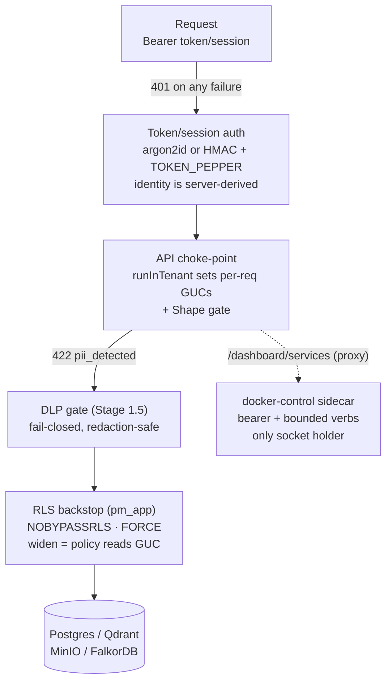

# Security

The layered, defense-in-depth security posture of persistent-memory: server-derived identity, the API as the single authorization choke-point, RLS as the database backstop, a fail-closed DLP/PII gate, and a tightly-boxed Docker-socket sidecar.

## Role in the system

Every read or write — whether it arrives over the stream MCP service, the dashboard webapp, or an internal sidecar callback — passes through the **Fastify API**, which is the **single authorization choke-point**. The API derives identity from a bearer credential (PM wire token, connector token, or signed dashboard session; the client never asserts its team/user/role), scopes every data query with `runInTenant(...)`, and Postgres **Row-Level Security (RLS)** enforces the same boundary independently as a backstop. Sensitive content is caught by a **fail-closed DLP gate** before it is ever persisted. Container management — the one capability that touches the host Docker socket — is isolated in a single hardened sidecar behind a shared-secret gate. No single layer is trusted alone.

These rules are load-bearing: breaking any of them silently breaks the security model. The committed access-model source of truth is `documentation/stack-architecture/access-model.md`; agent prompt files intentionally stay concise and link to the docs instead of carrying long security archives.

## Key pieces

### 1. Token/session auth — identity is server-derived

MCP/API clients send `Authorization: Bearer <tokenId>.<secret>`. The dashboard normally sends a signed `pm_session...` token after email/password login, or a PM wire token only for recovery login. The API resolves the team/user/role **from the bearer credential**, never from the request body (Invariant 1). Verification is in `apps/api/src/auth/token-service.ts`:

- `parseToken` splits on the **first** `.` → `{ tokenId, secret }`.
- `verifyToken` looks the user up by the indexed `@unique` tokenId (O(1) — no row scan, which would be a DoS + timing oracle), then runs a **single argon2id verify** of `secret + TOKEN_PEPPER` against the stored `tokenHash`.
- `verifyDashboardSession` validates the HMAC signature and expiry with `TOKEN_PEPPER`, loads the user row, and rejects sessions issued before the user's latest `passwordChangedAt`.
- Denials (missing/malformed header, unknown tokenId, revoked = NULL hash, expired, or a failed/garbage-hash verify) all return `null` → the auth hook throws a `401`. A malformed stored hash is treated as a denial, never surfaced as a 500.
- `TOKEN_PEPPER` (a server secret, `apps/api/src/config.ts`) is mixed into every hash; the plaintext wire token is returned **once** at mint time and never persisted (only `tokenId` + `tokenHash` live in the DB). `issueToken`/`rotateToken`/`revokeToken` all write the control table via `ownerPrisma`.
- Server-mode password login (`POST /auth/login/password`) is for human dashboard sessions. PM wire tokens remain for MCP/API automation and recovery login. Super-admin password resets set a temporary password and update `passwordChangedAt`, invalidating older dashboard sessions. When a super-admin changes their first temporary password, the server rotates and returns a recovery/MCP token once.
- Shared Memories connector secrets are local-dashboard credentials. `/dashboard/shared-connection` is the canonical local-mode dashboard connector route, and raw connector tokens are never readable from the shared server dashboard.

`deriveIdentity` (in the same file) builds the full `TenantCtx`: `userId`, `teamId` (nullable — a team-less super-admin), `adminLevel`, and `mountedTeamIds` (the cross-team MEMORY read links from `TeamGrant`). The auth flow is split across two Fastify `onRequest` hooks for a load-bearing async-context reason (`apps/api/src/auth/authenticate.ts`):

1. `authenticate` (async) — `await deriveIdentity(...)`, stash on `req.identity`, throw `401` on null.
2. `enterTenantScope` (sync, no preceding `await`) — `tenantStore.enterWith(req.identity)` so the AsyncLocalStorage store survives to the route handler. (Calling `enterWith()` after an `await` does **not** propagate under Fastify+Node — see the gotcha in the committed documentation.)

### 2. The API as the single authorization choke-point

`apps/api/src/app.ts` registers all authenticated routes inside an **encapsulated plugin scope** whose `onRequest` hooks are `authenticate` + `enterTenantScope`; `/health` and `/config` stay outside (no auth). The dashboard control plane is a second encapsulated scope reusing the same two hooks, mounted under canonical `/dashboard/*` routes with `/admin/*` as a one-release compatibility alias, with `requireAdmin` applied to the inner routes (a few reads — Services, Usage, Workers — are deliberately registered *outside* `requireAdmin` so any authenticated user can view monitors, while mutations stay superuser-only).

Authorization decisions (own ∪ mounted vs universal reads, team-bound writes, the cross-team global-admin path) are all made here. See `access-model.md` for the full model. The choke-point is also where the **DLP gate** and the memory **Shape gate** run before anything is persisted.

### 3. RLS — the defense-in-depth backstop

The api/worker connect to Postgres as **`pm_app`**, a dedicated `LOGIN NOSUPERUSER NOBYPASSRLS NOCREATEDB NOCREATEROLE` role (`layers/core/schema/rls.sql` §1) that **owns nothing**. The 11 DATA tables are `ENABLE`d **and `FORCE`d** for RLS (FORCE is required because the owner `pmuser` would otherwise bypass; ENABLE alone ships a silently-inert net). Even if an API filter has a bug, RLS returns only permitted rows.

The central rule (Invariant 3, `rls.sql` §29–33): **widening access is ALWAYS a policy reading a GUC, never a role bypass.** Each request sets per-request GUCs via `runInTenant` (`SET LOCAL` inside a tx) which the policies read through helper functions — all using the `current_setting(..., true)` missing-ok form so an **unset GUC fails closed** (NULL/false → zero rows):

| GUC | Helper | Purpose |
|---|---|---|
| `app.user_id` | `pm_current_user_id()` | author — the memory ownership floor |
| `app.team_id` | `pm_current_team_id()` | current team — write target |
| `app.can_read_all` | `pm_can_read_all()` | universal read of the 9 shared tables |
| `app.mounted_team_ids` | `pm_mounted_team_ids()` | cross-team MEMORY reads (MCP) |
| `app.read_all_memory` | `pm_read_all_memory()` | universal memory read (dashboard only) |
| `app.is_global_admin` | `pm_is_global_admin()` | super-admin cross-team WRITE path |
| `app.bypass_owner_floor` | `pm_bypass_owner_floor()` | team-admin/super-admin owner-floor bypass |

Policies layer PERMISSIVE-OR for reach + RESTRICTIVE-AND for floors. The 9 shared tables (`source`/`document`/`chunk`/…/`ingest_job`) get **universal read** + team-bound write + a global-admin write path + a RESTRICTIVE `write_floor`. `memory` (§5) instead reads **own ∪ mounted ∪ (dashboard-universal) ∪ (global-admin)** and adds an **ownership floor** (split FOR UPDATE / FOR DELETE) so a plain member can only modify rows they created. `security_alert` (§5b) is deliberately **NOT universal** — own-team OR global-admin only, because a finding reveals a team holds sensitive data.

`ownerPrisma` (the `pmuser` Postgres **superuser**, which therefore bypasses RLS) is used **only** for control tables (`team`/`app_user`/`team_grant`/`local_identity`/`system_settings`/the owner-only metric+schedule+notify tables) and migrate/seed — never for cross-team data ops (those go through `pm_app` + the global-admin GUC path). New control tables must `REVOKE ALL … FROM pm_app` in `rls.sql` (the `ALTER DEFAULT PRIVILEGES` auto-grant would otherwise leak them). `npm run rls:check` (`layers/core/tools/rls-check.mjs`) proves the floor live; `rls.sql` §6 carries a drift canary expecting 11 FORCE'd tables.

### 4. The DLP / PII gate — fail-closed and redaction-safe

A Python **`dlp-service`** sidecar wraps the official Presidio analyzer (PII) + the gitleaks binary (secrets) behind `POST /scan`. The api + worker share one client + decision function in `layers/security-dlp/src/dlp-gate/index.ts`:

- **Fail-closed is the whole point.** `dlpGate()` blocks the write on **any** scanner error/timeout/unreachable — it returns `{ blocked: true, failClosed: true }` with a synthetic `scanner_unavailable` finding, never a silent allow.
- **Redaction-safe.** The raw secret/PII value is never stored or returned: Presidio returns `type@start-end` (no value), gitleaks runs `--redact`, and `GateFinding.redactedExcerpt` carries only the type/offset or the rule + description.
- **Deny-list = structured PII only** (`DEFAULT_PII_ENTITIES`: `US_SSN`, `CREDIT_CARD`, `EMAIL_ADDRESS`, `IBAN_CODE`, `CRYPTO`, `PHONE_NUMBER`, `IP_ADDRESS`, `US_PASSPORT`, `US_ITIN`) — deliberately excludes the noisy `PERSON`/`LOCATION`/`DATE_TIME` NER entities. Env-tunable via `PII_ENTITIES`.

The gate covers the whole system. On the **memory write path** it is **Stage 1.5** of `validateAndRoute` (`apps/api/src/protocol/validation.ts` `assertNoPii`) — between the cheap deterministic pre-gate (Stage 1) and the Haiku Shape verdict (Stage 2): cheap-first ordering, throwing a `422 pii_detected` whose payload echoes detector + finding-type + severity only (the MCP render in `layers/mcp-runtime/src/errors.ts` echoes types only too). The same gate runs on the dashboard memory edit + import (`apps/api/src/routes/memories.ts`). On the **document ingest path** the worker scans **post-extract, before persist**; on detection the job goes `failed`/`pii_detected`, the blob is purged, no chunks/vectors/graph are written, and a `SecurityAlert` is raised. The periodic `pii-scan` scheduled job is the safety net behind the gate (scanner-down → abort the run, never false-flag).

### 5. The Docker-socket gate

The host Docker socket is host-root-equivalent, so it is mounted into the **`docker-control` sidecar only — never the api** (`deploy/compose/docker-compose.yml`). The sidecar has zero runtime dependencies, compiles its TypeScript before its image is produced, and runs emitted JavaScript behind a layered gate:

- **Shared-secret bearer**, `timingSafeEqual` constant-time compare, **fails closed when the token is empty** (all requests `401`; it logs a loud warning on boot).
- **Hard verb boundary**: the route dispatch only allows `GET /services`, `GET /services/:svc/logs` (tail-bounded), `POST /services/:svc/{start|stop|restart}` (`ACTIONS = {start, stop, restart}`), and the separate `POST /services/:container/terminate` MCP-session escape hatch for legacy client-owned MCP rows. `terminate` only accepts an exact project-labeled MCP container id/name; unknown verbs are `400 bad_action` before they can touch the socket — no path can create/exec/mount.
- **No published host port** (internal compose network only); the browser never talks to the sidecar — the api proxies via the dashboard Services route (`/dashboard/services`; reads any-auth, mutations superuser).
- **Credential boundary**: `/dashboard/services` may add service UI links and Qdrant/FalkorDB/MinIO/Neo4j login credentials after the sidecar response, but credentials are included only for server-derived `admin`/`superuser` identities and rendered behind a masked read-only modal; plain members still see service state/logs without secrets. Developer-facing host ports bind to loopback by default through `PM_HOST_BIND=127.0.0.1`; exposing them on `0.0.0.0` is an explicit operator choice for a trusted firewall/proxy.
- **Token scope**: `worker` + the dashboard service (which also load the env file) explicitly null `DOCKER_CONTROL_TOKEN` in their compose `environment:` block, so only the api (caller) and the sidecar (verifier) hold it — a worker/dashboard compromise cannot drive the sidecar.
- **Container hardening**: `no-new-privileges`, `cap_drop: [ALL]`, `read_only: true`, runs as non-root `node`, joins `group_add` for socket access (native Linux must set `DOCKER_GID`). Sidecar down / token empty / unreachable → `503 docker_unavailable` (UI degrades, no crash).

### 6. Fail-closed enqueue + boot-pinned deployment mode

- **Fail-closed ingest enqueue** (`apps/api/src/routes/ingest.ts`): the BullMQ enqueue happens **after** the DB rows commit; if `enqueueIngest` throws, the row is stamped `failed/enqueue_failed` + a 500 is returned — no silent `queued` orphan. (The `ingest-reconciler` job covers the narrower crash-between-commit-and-enqueue window.)
- **`DEPLOYMENT_MODE=local` is a boot/deploy-time pin, never runtime-flippable.** It is a `config.ts` Zod boot-const (`z.enum(['server','local']).default('server')`), **not** a `SystemSettings` row — an auth-gating flag must never be DB-flippable. `app.ts` chooses the auth hook **once at boot** (`authenticateLocal` vs `authenticate`) for both scopes; a request cannot influence it, and server mode is byte-identical. In local mode `authenticateLocal` reads a real team-bound super-user from the `local_identity` singleton (`apps/api/src/auth/local-mode.ts`), creating generated Team/AppUser rows on first boot via `ensureLocalIdentity()`, so the data plane, RLS, and dashboard all work through normal paths — no RLS change. `/whoami` and MCP `whoami` surface the stored DB ids plus the seeded `LOCAL_TEAM_NAME`, `LOCAL_USER_DISPLAY_NAME`, and `LOCAL_USER_EMAIL` profile fields so agents display the human local identity. `/config` + `/whoami` surface the mode read-only. The optional local dashboard password is only a UI soft lock, stored as `app_user.password_hash`, and can be cleared through the local API without deleting memories. Reinstalls over preserved volumes sync the onboarding password only when `LOCAL_USER_PASSWORD_CONFIGURED_AT` is newer than `app_user.password_changed_at`; dashboard profile password changes stay authoritative. **Never set `local` on a shared/networked host.**
- **Dashboard login mode is not deployment mode.** `SystemSettings.dashboardLoginMode` switches the server-mode dashboard between password and SSO login cards. It does not disable PM wire tokens for MCP/API or recovery, and it never changes the boot-time `DEPLOYMENT_MODE` auth hook.

## Layered defenses

## Public surface / interfaces

| Surface | Auth | Notes |
|---|---|---|
| Data plane (`/memories`, `/ingest`, `/graph`, `/documents`, …) | Bearer token (server mode) / synthetic super-user (local) | encapsulated scope; `runInTenant` per request |
| Dashboard control plane (`/dashboard/*` canonical routes; `/admin/*` compatibility alias) | Bearer + `requireAdmin` | a few reads (Services/Usage/Workers) outside `requireAdmin` |
| `/dashboard/services` → `docker-control` | api holds `DOCKER_CONTROL_TOKEN` | reads any-auth, mutations superuser; sidecar proxied; UI credentials admin/superuser only |
| `/dashboard/update` → `update-runner` | api holds `UPDATE_RUNNER_TOKEN`; public release checks send no GitHub credentials | status/log/start are superuser-only; sidecar is internal-only, source checks are read-only, and snapshots run before trusted update execution |
| `/health`, `/config` | none | open; `/config` exposes `deploymentMode` read-only |
| `dlp-service` `POST /scan` | none (internal-only) | api + worker call fail-closed |

Key security env (`apps/api/src/config.ts`): `TOKEN_PEPPER`, `ARGON2_MEMORY_KIB`/`ARGON2_TIME_COST`/`ARGON2_PARALLELISM`, `DEPLOYMENT_MODE`, `PII_GATE_ENABLED`, `PII_ENTITIES`, `PII_SCORE_THRESHOLD`. The `pm_app` password is passed to `rls.sql` as a **server GUC** (`PGOPTIONS="-c pm.app_password=…"`), `DOCKER_CONTROL_TOKEN` (auto-generated) lives only with the api + the sidecar.

## Invariants & gotchas

Load-bearing security invariants:

- **Identity is server-derived from the bearer credential** — never trust a team/user/role from the request body (Invariant 1).
- **RLS is the backstop; widening is always a POLICY reading a GUC, never a role bypass.** `pm_app` is `NOSUPERUSER`/`NOBYPASSRLS`; every data query runs inside `runInTenant` (Invariant 3). Use `ownerPrisma` only for control tables + migrate/seed.
- **A super-admin's write reach differs by entry point**: cross-team on the dashboard memory route (`/dashboard/memories/*` canonical path), current-team only via the MCP (`/memories/*`). The data plane never sets `app.is_global_admin`; only the dashboard control plane does (Invariant 4 + gotcha).
- **The DLP gate is fail-closed and redaction-safe, whole-system.** A scanner error blocks the write; raw PII/secret values are never stored or echoed.
- **Service control and updates are separated.** The Docker service-control socket lives in `docker-control`; dashboard update metadata lives in `update-runner`. Both are bearer-gated, fail closed when their token is empty, and publish no host port. `worker`/the dashboard service null both control tokens explicitly. The dashboard shows release notes plus the terminal update command; it does not mount host SSH credentials or expose one-click updating.
- **`DEPLOYMENT_MODE=local` is a boot-time pin, never runtime-flippable**, and must never run on a shared/networked host.
- **MCP `structuredContent` is validated `additionalProperties:false`** (`apps/mcp/src/schemas.ts`): any field the api returns must be declared in the MCP schema or the tool errors — a coupling to keep in sync when adding result fields.

### Follow-ups

Extraction runs on **Haiku by deliberate decision** (`claude-haiku-4-5-20251001` — no Sonnet/cloud key needed). Graphiti uses the same extraction provider/model/token as fact extraction, including the Anthropic OAT Bearer path.

## Related docs

- [Documentation home](../index.md) — documentation index
- [architecture.md](architecture.md) — the whole system
- [access-model.md](access-model.md) — token-derived identity, own ∪ mounted vs universal reads, team-bound writes, the RLS backstop in depth
- [ingest.md](ingest.md) — where the DLP block sits in the ingest pipeline + the 4-store delete
- [embedding.md](embedding.md) · [operations.md](operations.md) — `rls:check`, install/update
- Components: [api](../components/api.md) · [db](../components/db.md) · [dlp-service](../components/dlp-service.md) · [docker-control](../components/docker-control.md) · [worker](../components/worker.md) · [mcp](../components/mcp.md)
- Access-model source of truth: [access-model.md](access-model.md)
